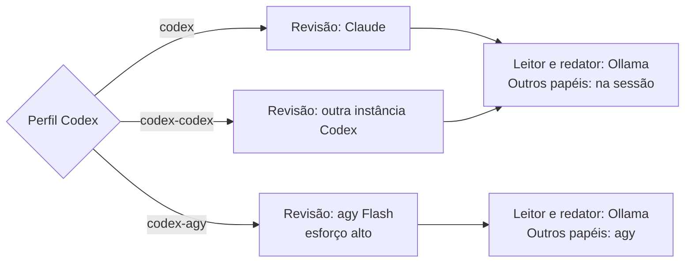

# jangada

[](https://github.com/felipintoslv/jangada/actions/workflows/verificar.yml)

Camada de configuração para Arch Linux com Hyprland puro, organizada para o trabalho com agentes de IA. Reúne a estrutura de repositório e de atualização do Omarchy, a geração de cores a partir do papel de parede usada pelo Noctalia e uma camada própria para lançar, acompanhar e encerrar sessões de agentes.

## Princípios

1. **Isolamento.** O jangada roda numa sessão própria (`jangada` no gerenciador de login) e guarda tudo em `~/.config/jangada` e `~/.local/share/jangada`. A configuração atual do Hyprland em `~/.config/hypr`, o Noctalia e qualquer outra sessão continuam intactos e disponíveis como alternativa.
2. **Nada é sobrescrito sem cópia.** Os arquivos de usuário são criados só quando ainda não existem. Arquivos de sistema alterados (`/etc/...`) recebem cópia de segurança com data antes da mudança.
3. **Tudo pode ser repetido.** Cada etapa de instalação pode rodar de novo sem efeito colateral.
4. **Simulação antes de aplicar.** `JANGADA_SIMULAR=1 ./install.sh` mostra cada comando que seria executado, sem executar.
5. **Padrões no repositório, ajustes no usuário.** Os padrões ficam em `default/` e são atualizados com `git pull`. Os ajustes pessoais ficam em `~/.config/jangada` e são carregados depois dos padrões.

## Estrutura

```
jangada/
├── install.sh             ponto de entrada da instalação
├── install/               etapas numeradas, executadas em ordem
│   └── pacotes/           listas de pacotes por grupo
├── bin/                   comandos jangada-* (entram no PATH)
├── default/               padrões atualizáveis (hypr em Lua, waybar, matugen, tmux, hooks e skills dos agentes)
├── config/                modelos copiados uma única vez para ~/.config/jangada
├── shell/                 integração com bash e zsh
├── migrations/            ajustes aplicados em ordem a cada atualização
├── docs/                  processos com fluxogramas, registros e boas práticas
├── testes/                verificar.sh (estático + os demais testes) e aninhado.sh
├── estudos/               auditorias do funcionamento atual, com data e commit
├── benchmarking/          comparação de módulos e repositórios de Waybar
├── mapeamento/            inventários do jangada-mapear (fora do git)
└── revisao/               pareceres, avaliações e comparações; índice em revisao/README.md
```

## Documentação dos processos

Cada processo tem um documento em `docs/`, com fluxograma, passos por
arquivo e função, falhas e os testes que o cobrem:

| Documento | Processo |
|---|---|
| [docs/ciclo-da-tarefa.md](docs/ciclo-da-tarefa.md) | abertura da sessão, `jangada-validar` e `jangada-agente-fim` |
| [docs/isolamento.md](docs/isolamento.md) | o que o `jangada-isolar` deixa gravável, somente leitura e oculto, e a restauração |
| [docs/subagentes-e-delegacao.md](docs/subagentes-e-delegacao.md) | papéis, destino da delegação, `jangada-delegar`, fila de tarefas e saúde dos provedores |
| [docs/codex.md](docs/codex.md) | Codex como executor e revisor, isolamento e retomada |
| [docs/atualizacao-e-migracoes.md](docs/atualizacao-e-migracoes.md) | instalação, `jangada-update` e `jangada-migrar` |
| [docs/painel.md](docs/painel.md) | coletor, cache, app e módulo da barra |
| [docs/registros.md](docs/registros.md) | campos de cada registro usado pelo painel |
| [docs/boas-praticas.md](docs/boas-praticas.md) | regras de código, testes, textos e commits |
| [docs/analise-painel-20260930.md](docs/analise-painel-20260930.md) | leitura do painel com os dados de 30/09/2026 |
| [docs/proposta-atualizacao-painel.md](docs/proposta-atualizacao-painel.md) | proposta de atualização do painel, com implementação parcial |

## Antes de instalar: mapear a máquina

Em cada máquina, rode primeiro `bin/jangada-mapear`. Ele registra a configuração atual, inclusive as personalizações do Noctalia, em `mapeamento/` (fora do git). Chaves, tokens, senhas, blocos de chave privada e senhas em URL são mascarados nas cópias; `bin/jangada-mapear --mascarar <arquivo` aplica a mesma máscara a qualquer texto, para conferir antes de compartilhar. O roteiro de resgate está em `revisao/RESGATE.md`.

Quem vem do niri converte a configuração com `jangada-importar`, que lê `~/.config/niri/config.kdl` (ou uma pasta de mapeamento) e grava, sem sobrescrever nada:

| Arquivo gerado | Conteúdo |
|---|---|
| `~/.config/jangada/hypr/usuario.lua.importado` | teclado, variáveis de ambiente, programas ao iniciar e atalhos; os que batem com um padrão do jangada saem comentados, e as ações sem equivalente (colunas, overview) ficam listadas |
| `~/.config/jangada/hypr/monitores.lua.importado` | nome, modo, posição, escala e rotação de cada tela |
| `~/.config/jangada/jangada.conf.importado` | o terminal do `Mod+Return` |

Compare com `diff -u` e copie o que quiser para os arquivos sem a extensão.

## Interface

| Interface | Componentes | Condição |
|---|---|---|
| `JANGADA_INTERFACE=componentes` | waybar, fuzzel e mako, com cores do matugen | configuração padrão |
| `JANGADA_INTERFACE=noctalia` | Noctalia já instalado, preservando suas personalizações | exige a interface antiga `qs -c noctalia-shell` |

A escolha fica em `~/.config/jangada/jangada.conf`. A integração ainda usa
Quickshell; a incompatibilidade registrada com o Noctalia 5.x permanece
pendente em [revisao/PENDENCIAS.md](revisao/PENDENCIAS.md#o-que-só-pode-ser-confirmado-no-desktop).
Até essa adaptação, use `componentes` se a instalação não oferecer a
interface antiga.

## Instalação

```sh
git clone <url> ~/.local/share/jangada
cd ~/.local/share/jangada
JANGADA_SIMULAR=1 ./install.sh   # confere o que será feito
./install.sh                     # aplica
```

O `install.sh` recusa rodar da cópia de trabalho (`JANGADA_REPO`), de um
worktree ou de `JANGADA_WORKTREES`: essas pastas são graváveis de dentro do
isolamento, e a pasta da instalação vira o `JANGADA_PATH` dos hooks e da
sessão. Nelas só a simulação roda.

Depois, encerre a sessão atual e escolha **jangada** no gerenciador de login.

### Máquinas com duas GPUs

O `jangada-sessao` define `AQ_DRM_DEVICES` antes de o compositor subir, escolhendo a placa que tem monitor ligado. Sem isso, o aquamarine pode pegar a outra e a sessão sobe sem imagem, sem terminal para consertar. Quando a placa escolhida é NVIDIA, a sessão também define `LIBVA_DRIVER_NAME`, `__GLX_VENDOR_LIBRARY_NAME` e `NVD_BACKEND`; `GBM_BACKEND` fica de fora de propósito, porque quebra Firefox e Electron. Para forçar outra placa, preencha `JANGADA_GPU` no `jangada.conf` com um caminho de `/dev/dri/by-path`. O caminho escolhido é sempre resolvido para o `/dev/dri/cardN` correspondente antes de virar `AQ_DRM_DEVICES`: o aquamarine separa essa lista por `:`, e o endereço PCI de `/dev/dri/by-path` também tem `:`, então o caminho cru vira três caminhos inválidos e o compositor aborta antes de abrir a tela. O `jangada-verificar` mostra qual placa foi escolhida, o valor resolvido e reclama se ela não tiver monitor ligado.

## Cores e papel de parede

`jangada-tema imagem` gera com o matugen as cores de bordas de janela, barra, notificações, menu, bloqueio, terminal e tela de login. A cor-fonte é escolhida pelo `prefer` do `default/matugen/config.toml`, e o esquema vem de `JANGADA_TEMA_ESQUEMA` (padrão `scheme-fidelity`, que mantém a cor da imagem; o `scheme-tonal-spot` do matugen satura imagens quase monocromáticas até virarem outra cor).

O papel de parede aparece inteiro em todas as telas. Numa tela de proporção diferente da imagem, como um monitor 21:9 com uma figura 16:9, o `jangada-tema` gera uma versão com as medidas da tela (em `~/.cache/jangada/papel`) e a entrega ao swaybg e ao hyprlock; o tema de login faz a mesma conta em cada tela. `JANGADA_PAPEL_AJUSTE` escolhe como completar o espaço que sobra: `espelho` (padrão, reflete a borda da figura), `desfoque`, `cor` ou `cobrir` (o comportamento antigo, que corta a figura).

## Tela de login (SDDM)

`jangada-sddm aplicar` instala o tema `jangada` em `/usr/share/sddm/themes/jangada` e faz o SDDM ler as sessões de `/usr/local/share/jangada/sessoes`, que só contém o jangada. Os arquivos de sessão dos outros pacotes (Hyprland, niri, Plasma) não são movidos nem apagados; `jangada-sddm restaurar` remove `/etc/sddm.conf.d/zz-jangada.conf` e todas voltam a aparecer. O prefixo `zz-` faz o arquivo ser lido depois do `kde_settings.conf`, que de outro modo imporia o tema escolhido no Plasma.

O tema imita o menu do `SUPER + Esc`: caixa centralizada com as mesmas medidas do fuzzel, linhas `usuário >` e `senha >` e a lista **Entrar**, **Suspender**, **Reiniciar** e **Desligar**. Setas escolhem a ação e Enter executa; digitar a senha volta a seleção para Entrar. As cores vêm de um modelo próprio do matugen (`default/matugen/modelos/sddm.conf`, gerado em `~/.config/jangada/sddm/theme.conf.user`), com os mesmos papéis de cor do fuzzel, e o fundo é o papel de parede atual, copiados no momento do `aplicar`. O SDDM fica numa pasta do sistema, então o `jangada-tema` não consegue atualizá-lo sozinho: quando as cores ou o papel de parede mudam, ele avisa que é preciso rodar `jangada-sddm aplicar` de novo. `jangada-sddm testar` abre o tema numa janela, sem alterar o sistema.

A instalação pergunta se deve aplicar a exclusividade; a resposta padrão é não.

## Comandos

| Comando | Função |
|---|---|
| `jangada-update` | busca o ramo de `JANGADA_CANAL`, mostra os commits novos, o resumo por arquivo e um aviso quando mudam `migrations/`, `install/` ou `bin/`, e só os aplica se a resposta for `s` (sem terminal não aplica); mostra se o conjunto do Hyprland mudou, atualiza o sistema, aplica migrações, confere initramfs e driver NVIDIA e roda o gancho `pos-update`. Se o pacman ou o AUR falhar, a conferência da imagem de boot roda mesmo assim, e as migrações e a recarga do Hyprland ficam para depois do conserto |
| `jangada-verificar` | confere pacotes, snapshots, sessão, hooks e erros de configuração do Hyprland; `--diagnostico` grava um relatório e `--agente` abre um agente com ele no repositório do jangada; do `hyprland.log` entram só erros e avisos, e o log e o relatório de falha vão marcados como dados |
| `jangada-versao` | mostra a versão da cópia (`0.1.0`, ou `0.1.0-3-gabc1234` com commits depois da tag); `--novidades [DE [ATE]]` lista as mudanças, `--registro` imprime o registro completo e `--lancar X.Y.Z` grava o `CHANGELOG.md`, faz o commit e cria a tag `vX.Y.Z` (sem push); `-C DIR` opera em outro repositório |
| `jangada-assinar` | assina com a chave SSH (`JANGADA_ASSINATURA_CHAVE`) os commits da cópia de trabalho ainda não enviados e sem assinatura válida, depois da confirmação; roda num terminal comum, porque o isolamento oculta o `~/.ssh` |
| `jangada-migrar` | aplica as migrações pendentes (o `jangada-update` já chama) |
| `jangada-snapshot "descrição"` | cria um snapshot manual do sistema; com `--agente`, o do `jangada-agente --snapshot`, fora da limpeza do snapper e limitado aos `JANGADA_SNAPSHOTS_AGENTE` mais recentes |
| `jangada-tema [imagem]` | gera as cores a partir de um papel de parede e recarrega a interface |
| `jangada-tarefas` | central gráfica de tarefas (`--nova`, `--waybar`, `--simular`) |
| `jangada-agente` | escolhe o agente (Claude ou Codex; o agy fica só de suporte), o projeto e cria um worktree, e abre o agente numa sessão tmux, isolado pelo `jangada-isolar` (`--prompt`, `--prompt-arquivo`, `--perfil`, `--sem-isolar`) |
| `jangada-isolar` | roda um comando no bubblewrap, com o sistema somente leitura e a pasta atual gravável; `--mostrar` imprime a chamada ao `bwrap` |
| `jangada-delegar PAPEL "pedido"` | delega ao Ollama (`--destino local --arquivos ARQUIVOS`, só leitor e redator) ou ao agy (`--destino agy`, modelos de `JANGADA_DELEGAR_MODELOS`); `--capacidade` permite seleção documental para leitor, com autorização remota explícita e referências verificadas; `--json` explica a decisão (ver [delegação](docs/subagentes-e-delegacao.md)) |
| `jangada-conversa` | Conversa de Pescador, a janela de conversa direta com o modelo local do Ollama: resposta progressiva, escolha do modelo e parada; sem histórico, ferramentas ou verificação, e com a trava e as proteções de jogo e memória de vídeo do destino local |
| `jangada-avaliar-ollama` | repete três casos de leitura com fontes sintéticas, compara fatos e referências com um gabarito e registra recusas, tempo e variação; não promove o modelo nem chama provedores remotos |
| `jangada-fila` | mostra a fila persistente do projeto; `--importar PLANO.json` acrescenta tarefas, `--json` detalha o estado, `--revisao` lista o que aguarda revisão e `--metricas` resume consumo, revisões e custo estimado pelos preços de `precos.json` (ver [fila](docs/subagentes-e-delegacao.md#fila-persistente-de-projetos)) |
| `jangada-executar` | executa tarefas elegíveis da fila pelo `jangada-delegar`, sem aprovar o conteúdo (`--limite`, `--perfil balanced\|quality\|offline`, `--permitir-remoto`, `--permitir-codex`, `--supervisionar`, `--amostrar`, `--paralelo`); `--acompanhar` mantém a fila em primeiro plano até o prazo |
| `jangada-retomar` | recoloca na fila tarefas que esperavam cota ou provedor, quando há executor, orçamento e tentativas (`--atualizar`, `--executar`) |
| `jangada-task ID AÇÃO` | controla uma tarefa: `pausar`, `retomar`, `cancelar`, `repetir`, `revisar --aprovar\|--reprovar --parecer` (aceita `ID1,ID2` no mesmo parecer), e `assumir`, `entregar` e `executar-principal` para os agentes principais |
| `jangada-router status` | estado, cota e espera dos provedores (`--atualizar`, `--atualizar-codex`) |
| `jangada-provedor pausar\|ativar ID` | tira um provedor da execução da fila ou o devolve |
| `jangada-subagentes` | indicadores de subagentes e delegações (`--json`), o resumo de uma entrega (`--entrega PASTA`) e os registros por subagente (`--registros`) |
| `jangada-filtrar` | roda um comando e condensa a saída para o agente (`-m`, `-e`, `-p`); prefira `jangada-filtrar -- COMANDO` ao modo cano, que não vê o código de saída |
| `jangada-mapa [PASTA]` | mapa compacto do repositório (arquivos e assinaturas de funções) para dar contexto a um agente |
| `jangada-worktree-preparar` | leva para um worktree novo os arquivos ignorados que o projeto precisa (chamado pelo `jangada-agente`) |
| `jangada-validar` | confere a entrega localmente e manda o diff ao revisor configurado (Claude, agy ou Codex) e devolve `STATUS: APROVADO` ou `REVISAR`; o agente chama antes de entregar |
| `jangada-shell` | inicia subshell enriquecida com comandos diretos de agentes e projetos |
| `jangada-agentes` | lista as sessões de agentes, com estado, e permite abrir, integrar ou encerrar (`--proximo`, `--anterior`, `--restaurar`) |
| `jangada-agente-fim` | encerra uma sessão e remove o worktree, com conferência de alterações pendentes; `--integrar` revisa fora do isolamento, faz o merge na base e apaga o ramo; no repositório do jangada, chama o `jangada-assinar` quando há `allowed_signers` e avisa para rodar `jangada-update`, que atualiza a cópia instalada |
| `jangada-consumo` | tokens do Claude Code no bloco de 5 horas em andamento (também na dica da barra) |
| `jangada-painel` | painel de indicadores do uso de IA num app Shiny local; `--json` imprime os do dia, `--parar` encerra o app, `--conferir` lista o que falta |
| `jangada-gancho` | roda os ganchos do usuário de um evento (chamado pelos outros comandos) |
| `jangada-importar` | converte a configuração do niri em arquivos `.importado` |
| `jangada-atalhos` | mostra todos os atalhos ativos, lidos do próprio Hyprland (`--lista` para o terminal) |
| `jangada-sddm aplicar` | deixa o jangada como única sessão no SDDM, com o tema de login do jangada (`restaurar`, `status`, `testar`) |
| `jangada-barra` | sobe ou reinicia a waybar do jangada; `--posicao topo\|base\|esquerda\|direita\|ciclo` troca a borda |
| `jangada-recarregar` | recarrega o Hyprland e mostra os erros de configuração |
| `jangada-rede`, `jangada-bluetooth`, `jangada-audio`, `jangada-energia` | menus no fuzzel para Wi-Fi e cabo, dispositivos Bluetooth, saída e entrada de áudio, e perfil de energia e bateria (abertos pela barra) |
| `jangada-calendario`, `jangada-captura`, `jangada-monitor`, `jangada-atualizacoes` | calendário com eventos, captura de tela (`regiao\|tela`), monitor do sistema e atualizações pendentes (abertos pela barra e pelos atalhos) |
| `jangada-menu` | menu central com as ações acima, mais bloquear, suspender, reiniciar, desligar e sair |
| `jangada-logo` | mostra o símbolo do jangada com as informações do sistema (fastfetch; neofetch como alternativa) |
| `jangada-mapear` | inventário da configuração atual da máquina (Hyprland, Noctalia, terminal, agentes), sem alterar nada |

## Atalhos principais

| Atalho | Ação |
|---|---|
| `SUPER + Enter` | terminal |
| `SUPER + Espaço` | lançador de aplicativos |
| `SUPER + A` | novo agente |
| `SUPER + SHIFT + A` | lista de agentes |
| `SUPER + CTRL + A` | painel de agentes (workspace especial) |
| `SUPER + N` | próximo agente que espera resposta; repetir percorre a fila |
| `SUPER + SHIFT + N` | volta ao agente focado antes do atual |
| `SUPER + Esc` | menu jangada |
| `SUPER + CTRL + R` | recarregar e mostrar erros de configuração |
| `SUPER + /` | mostra todos os atalhos ativos, pesquisáveis |

A lista completa aparece no `SUPER + /`, que lê os atalhos do próprio Hyprland
e por isso inclui também os que você definiu em
`~/.config/jangada/hypr/usuario.lua`. Os padrões estão em
`default/hypr/atalhos.lua`.

## Worktrees dos agentes

O `jangada-agente` cria cada worktree a partir do último
commit, então arquivos fora do git (`.Renviron`, `.env`, dados locais) ficam
para trás. Ao criar um worktree novo, o `jangada-worktree-preparar` lê três
arquivos opcionais na raiz do projeto:

| Arquivo | Efeito |
|---|---|
| `.worktreeinclude` | padrões no formato do `.gitignore`; o que casar e for ignorado pelo git é copiado (mesmo formato do `--worktree` do Claude Code) |
| `.jangada/links` | um caminho por linha; vira link simbólico para a pasta da raiz, sem cópia |
| `.jangada/preparar.sh` | roda dentro do worktree por último, com `JANGADA_RAIZ` e `JANGADA_WORKTREE` no ambiente |

A cópia usa `--reflink=auto`: em btrfs, na mesma partição, não ocupa espaço.
Fora disso, uma cópia maior que `JANGADA_WORKTREE_COPIA_MAX` megabytes (padrão
500) é recusada com aviso. Um link só é mantido se o git do worktree o ignorar;
para pastas, escreva `/dados` no `.gitignore`, sem a barra final, porque o
padrão `dados/` não cobre um link. Um worktree reaproveitado não é preparado de
novo.

## Skills do Claude Code e do agy

A etapa de agentes liga cada pasta de `default/claude/skills` em
`~/.claude/skills/<nome>` e, se o agy estiver instalado, em
`~/.gemini/config/skills/<nome>`. Os dois agentes carregam a skill quando a
tarefa combina com a descrição dela, mesmo abertos em outro projeto:

- `jangada`: regras do projeto e pegadinhas já resolvidas (`hyprctl dispatch`
  só com Lua, hypridle que ignora `-c`, on-click da waybar com `setsid -f`,
  agy sem terminal).
- `relatorio-tecnico`: investigação, postmortem, RFC, ADR e relatório formal
  (NBR 10719), com a estrutura de cada tipo e o checklist de entrega.
- `relatorio-academico`: artigo, monografia e tese, com o que levantar antes
  de redigir, `[FALTA: ...]` no lugar de dado ou citação sem origem e o
  checklist de entrega.
- `revisao-academica`: revisão de TCC, artigo ou dissertação como orientador,
  com comentários curtos inseridos no PDF ou DOCX. Conduz as etapas do projeto
  `jangada-academic-review` (revisores, critical gate, anotação e QA) e
  mantém o estado e a rastreabilidade.
- `graficos`: gráfico para relatório em R (ggplot2) ou Python (matplotlib),
  com a escolha do tipo pela relação a mostrar, o tema padrão (`tema_dv.R` e
  `tema_dv.py`, copiados para o projeto), título e fonte em comentário fora
  da imagem e a checklist de 41 itens.

O agy lê o mesmo `SKILL.md`, sem ajuste no frontmatter. Uma pasta ou link
alheio com o mesmo nome nas duas pastas fica como está, com aviso.

## Ciclo de uma tarefa com agentes

O fluxo completo, com fluxogramas, está em
[docs/ciclo-da-tarefa.md](docs/ciclo-da-tarefa.md).

1. `SUPER + A` (ou `jangada-agente --prompt "..."`) pergunta o agente e abre
   num worktree `agente/<nome>`. Cada opção diz entre parênteses quem
   implementa, quem revisa, para onde delega e se roda isolada. Os valores
   refletem a configuração global, o perfil e as opções do comando.
2. O estado aparece na barra e no painel (`SUPER + CTRL + A`) pelos hooks do
   Claude Code: trabalhando, aguardando (notificação com botão que foca a
   janela) ou turno encerrado. `SUPER + N` pula para quem espera.
3. Antes de entregar, o agente roda `jangada-validar` e o revisor configurado avalia
   o diff (veja abaixo). O último parecer aparece na prévia do seletor.
4. Para fechar: `jangada-agente-fim --integrar SESSAO` (ou `Alt+I` no seletor)
   faz o merge na base, remove o worktree e apaga o ramo. `Ctrl+X` encerra sem
   integrar e mantém o ramo.
5. Depois de reiniciar, as sessões que ficaram sem tmux aparecem como
   interrompidas: `Enter` no seletor ou `jangada-agentes --restaurar` reabre
   cada uma na mesma pasta e na mesma conversa (`claude --resume`). Sem o id
   da conversa, o worktree usa `--continue`; direto no repositório abre uma
   conversa nova, porque a mais recente da pasta pode ser de outro agente. O
   comando é recomposto de campos conferidos (agente, pasta, perfil, conversa
   e revisor) e da configuração atual, nunca copiado do estado, que o agente
   isolado consegue gravar.

### Quem implementa e quem revisa

| No seletor | Implementa | Revisa | Delegação padrão |
|---|---|---|---|
| `padrão` (Claude na configuração inicial) | Claude | Codex | agy, com alternativa no Claude |
| `claude-claude` | Claude | Claude | subagentes do Claude |
| `claude-agy` | Claude | agy Flash, esforço alto | agy, com alternativa no Claude |
| `codex` | Codex | Claude | leitor e redator no Ollama |
| `codex-codex` | Codex | outra instância do Codex | leitor e redator no Ollama |
| `codex-agy` | Codex | agy Flash, esforço alto | leitor e redator no Ollama, demais papéis no agy |

O agy não abre sessão principal: o `jangada-agente` recusa `--agente agy` e
todo perfil com `COMANDO=agy`. Ele atende as delegações e a revisão, ao lado
do Ollama. Uma sessão antiga do agy aberta sem perfil ainda é restaurada.

O seletor identifica autorrevisão quando executor e revisor usam o mesmo
provedor. Ele informa programas ausentes e recusa um executor indisponível
antes de criar a sessão. Sem o revisor, mantém o protocolo, o isolamento
configurado e os testes obrigatórios; a entrega continua sem aprovação.
Esses perfis abrem sessões interativas. Fila e orçamento são configurados
separadamente. As descrições são calculadas; `DESCRICAO` em perfis antigos
continua sendo lida, mas não substitui os valores efetivos no seletor.

O Codex usa os worktrees e o tmux da Jangada, sem criar worktree próprio
nem conectar ao servidor compartilhado do CLI. Todos os perfis Codex usam
primeiro Ollama para leitor e redator. Os demais papéis ficam na sessão nos
perfis `codex` e `codex-codex`; no `codex-agy`, são delegados ao agy.



O revisor Codex recebe o pedido completo, sem terminal ou ferramentas
externas. Veja
[a preparação, os hooks e as limitações](docs/codex.md).

1. O agente abre interativo, no worktree, com o protocolo de
   `default/agentes/protocolo.md` (trabalhar só no worktree, commits sem
   `Co-Authored-By`, validar antes de entregar, regras de escrita). Num
   projeto com arquivos R até dois níveis abaixo da raiz, vão também as
   regras de `default/agentes/protocolo-r.md` (sem `cat()` como mensagem,
   sem código comentado, `seq_along()`). No Claude ele vai por
   `--append-system-prompt`; no Codex, pelo `jangada-codex`.
   `JANGADA_AGENTE_PROTOCOLO=0` desliga. Sem o revisor instalado, o agente
   recebe o protocolo e um aviso de que a revisão está indisponível.
2. Prefira fazer o commit antes de `jangada-validar`, para revisar uma
   entrega limpa. O comando também aceita alterações sem commit e arquivos
   novos; nesse caso, a aprovação recebe a marca `sujo`.
   O revisor recebe o diff desde a base, sem alterar nada, e responde. Com
   `REVISAR`, o agente confere cada apontamento, corrige o que proceder e roda
   de novo com `--resposta`, até 3 rodadas (`JANGADA_VALIDAR_RODADAS`) por
   entrega. Depois de um `APROVADO`, a próxima chamada revisa só o que veio
   depois do commit aprovado e recomeça a contagem.
   `--revisor` escolhe o revisor à mão. O Claude revisa com o Sonnet
   (`JANGADA_VALIDAR_MODELO`), só com Read, Grep e Glob; o agy revisa com o
   agente `revisor` (`default/agy/agents/revisor`), só com ferramentas de
   leitura e em `--sandbox`. Sem esse agente, o agy não é chamado.
   Se o revisor falha (sem cota, fora do ar), a revisão passa aos outros
   modelos instalados e, por último, ao do autor; com `--revisor`, não passa.
   Antes do revisor, uma verificação local procura conflitos do git, reprova
   script com byte nulo (o revisor o receberia como binário), confere
   a sintaxe de shell e Lua e roda o `lintr` nos arquivos R, só nas linhas
   que o agente alterou (`cat()` e `print()` fora de métodos `print`, código
   comentado, `1:length()`, variável sem uso dentro de função). Do
   `object_usage_linter` só vale a variável sem uso; o aviso de variável
   global, que dispara em toda coluna do dplyr, é descartado. Com `.lintr` na base do projeto, um
   achado reprova sem chamar o revisor; sem ele, vale `default/r/lintr` e o
   achado só aparece como aviso. Sem R ou sem o pacote `lintr`, a etapa é
   pulada. O `gitleaks` procura segredos nas linhas acrescentadas; um achado
   reprova sem mostrar o segredo no parecer, e `gitleaks:allow` num comentário
   da linha libera um falso positivo. Sem o `gitleaks`, ou com ele falhando,
   a entrega reprova; `JANGADA_VALIDAR_SEM_GITLEAKS=1` aceita o risco e só
   avisa. O `.gitleaks.toml` e o `.gitleaksignore` valem como estão na base,
   e não como a entrega os deixou; o `.lintr` também, e um que só a entrega
   traz não é lido. O R roda sem o `.lintr`, o `.Rprofile` e o `.Renviron` do worktree:
   os três são código do repositório avaliado, e o `jangada-validar` também
   roda fora do isolamento. O `AGENTS.md` e o `CLAUDE.md` vão ao revisor lidos da base,
   e uma entrega que muda o `.jangada/validar.sh` pede ao revisor que confira
   se a validação ficou mais fraca. O `.jangada/validar.sh` roda pelo
   `jangada-isolar`: grava no projeto, mas não fora dele, e sem o bwrap a
   validação reprova. Commit com `Co-Authored-By` gera aviso.
   Na escrita, o revisor aponta só casos objetivos nas linhas novas: código
   comentado, comentário que narra a mudança, repete o código ou fala com o
   revisor, enchimento ("vale ressaltar", "basicamente"), documentação que
   contradiz o código, arquivo de resumo que ninguém pediu e corpo de commit
   que repete o diff em vez de dar o porquê.
3. Os pareceres ficam em `~/.local/state/jangada/agentes/validacao-*`. O
   jangada-validar roda no processo do agente, que pode gravar nessa pasta;
   por isso a prévia do `jangada-agentes` avisa que o parecer foi gravado pela
   própria sessão, e não serve de prova de revisão. A prova é a revisão que o
   `jangada-agente-fim --integrar` roda fora do isolamento, gravada em
   `~/.local/state/jangada/revisoes/`, que o agente isolado não alcança: sem
   uma aprovação dali para o commit atual do ramo, o `--integrar` pede
   confirmação para mesclar (`--sem-revisao` pula a revisão). No
   jangada shell, `revisar` roda o mesmo comando no diretório atual. Cada
   rodada acrescenta uma linha a `~/.local/state/jangada/validar.jsonl`
   (resultado, etapa, revisor, rodada, linhas alteradas, apontamentos e
   segundos), e `jangada-validar --metricas` resume por projeto e revisor:
   quantas rodadas uma entrega leva até o `APROVADO` e quanto cada revisor
   aprova.
4. Cada mudança de estado de uma sessão (início, trabalhando, aguardando,
   concluído, fim e cada foco pelo jangada) vira uma linha em
   `~/.local/state/jangada/eventos-agentes.jsonl`. É o histórico de onde saem
   o tempo em espera e as sessões simultâneas; `docs/registros.md` descreve
   este e os outros registros.
5. Numa sessão antiga do agy restaurada, a barra o acompanha pelo hook
   `jangada-hook-agy`, instalado em
   `~/.gemini/config/hooks.json`: trabalhando e concluído. O agy não tem
   evento de pedido de permissão, então não há "aguardando". `Enter` restaura
   com `agy --conversation`.
6. O leitor do agy passa pelo `jangada-hook-leitor --agy`, no `PreToolUse`
   do `run_command` do mesmo `hooks.json`: só roda comandos de leitura,
   mesmo que o `permissions.allow` libere outros. O `jangada-delegar` recusa
   o leitor sem esse hook (`jangada-migrar` instala).
7. Em cada worktree novo o agy pergunta se confia na pasta; responda na
   janela. A confiança é por caminho exato. O `jangada-worktree-preparar`
   confia no worktree que cria só se você já confiou no repositório
   principal, e o fim da sessão tira; a primeira alteração guarda o original
   em `settings.json.jangada-orig`.

Detalhes que valem para o dia a dia:

- O `--integrar` recusa mesclar se o repositório principal tiver alterações
  sem commit.
- Os arquivos de estado são alterados sob uma trava (`flock` na própria pasta
  `~/.local/state/jangada/agentes`, aberta só para leitura), porque os hooks
  do Claude Code rodam em paralelo. Um arquivo de trava aberto para escrita
  seguiria um link posto pelo agente e truncaria o alvo fora do isolamento.
- O `jangada-agente` sem terminal exige `--nome`, `--prompt` ou `--direto`.

Perfis de agente (outra conta, outro modelo, outro programa) ficam em
`~/.config/jangada/agentes/NOME.conf`; veja `default/agentes/exemplo.conf`.
O seletor calcula a descrição a partir do comando, revisor e delegação efetivos.
Quem pode abrir sessão principal e quem pode revisar vem do registro de
provedores; veja `docs/provedores.md`.
Ganchos do usuário ficam em `~/.config/jangada/ganchos/EVENTO` ou
`EVENTO.d/`, para os eventos `pos-update`, `pos-tema`, `pos-agente-fim`
(recebe sessão, raiz e se houve integração) e `pos-validar` (sessão e status). Um exemplo útil: `pos-tema` rodando `jangada-sddm aplicar`.

### Subagentes

Fluxogramas em
[docs/subagentes-e-delegacao.md](docs/subagentes-e-delegacao.md).

Nove papéis, com o mesmo nome e o mesmo texto no Claude Code
(`default/claude/agents/`, ligados em `~/.claude/agents/`) e no agy
(`default/agy/agents/`, registrados em `~/.gemini/config/agents.json`). O agy
tem mais um, fora da delegação: `revisor`, do `jangada-validar`. Nenhum
edita arquivos, e todos citam caminho e linha, página, célula ou URL em cada
afirmação. O explorador, o pesquisador, o auditor, o arquiteto, o otimizador e o
redator não têm terminal; o leitor e o verificador têm, e o "só leitura" deles
vale pela instrução e, no agy, pelo `permissions.allow`.

| Papel | Faz | Claude |
|---|---|---|
| `explorador` | mapeia código, dados e registros; até ~300 palavras | haiku |
| `leitor` | trechos pedidos de PDF, planilha ou relatório | haiku |
| `pesquisador` | documentação, normas e dados públicos na web | haiku |
| `verificador` | testes, lint e regras do AGENTS.md antes do `jangada-validar` | sonnet |
| `auditor` | auditoria de segurança (injeções, caminhos, permissões, CWEs) | sonnet |
| `arquiteto` | estrutura de módulos, contratos de API e impacto de mudanças | sonnet |
| `otimizador` | gargalos de desempenho, complexidade e uso de memória | sonnet |
| `redator` | conformidade textual, clareza e regras de escrita do AGENTS.md | haiku |
| `supervisor` | fidelidade de relatório intermediário às fontes, sem aprovação de entrega final | haiku |

No agy, todo papel usa o primeiro modelo de `JANGADA_DELEGAR_MODELOS` com
cota (padrão `gemini-3.8-flash-high`).

O item 8 do protocolo diz a quem delegar, conforme `JANGADA_DELEGAR` do
perfil (ou global), e o seletor mostra o destino:

| `JANGADA_DELEGAR` | Perfis | Efeito |
|---|---|---|
| `agy` | `padrão` (Claude), `claude-agy`, `codex-agy` | `jangada-delegar PAPEL` manda ao agy; o subagente do Claude só se ele recusar |
| `claude` | `claude-claude` | subagentes do Claude dos papéis, nunca `general-purpose` |
| `local` | `codex`, `codex-codex` (padrão do Codex) | leitor e redator no Ollama; os demais papéis na própria sessão |

`jangada-delegar PAPEL "pedido" [--arquivo SAIDA]` roda o agente do papel
no agy, com `--sandbox`,
na raiz do repositório atual, e imprime só o relatório. A pasta precisa ser confiável para o agy (o worktree da sessão
é, e as outras só se você já respondeu à pergunta do agy nelas): o
`jangada-delegar` não confia por conta própria, porque a confiança libera
agentes, regras e MCP da própria pasta. Acima de 600 palavras
(`JANGADA_DELEGAR_PALAVRAS`), o relatório sai cortado, com o caminho do
texto completo.

O modelo sai de `JANGADA_DELEGAR_MODELOS`, lista em ordem de preferência
(padrão `gemini-3.8-flash-high claude-sonnet-5-5-high gpt-oss-120b-medium`).
Antes de cada chamada, o comando lê a cota do agy (`agy -p /usage`, guardada
por 5 minutos, no máximo uma consulta por execução). O agy separa a cota em
dois grupos: o dos modelos Gemini, que Flash e Pro dividem, e o dos modelos
Claude e GPT. Cada grupo tem limite semanal e de 5 horas, e vale o menor dos
dois. O modelo cujo grupo está abaixo de 20% (`JANGADA_DELEGAR_COTA_MIN`) ou
sem cota legível é pulado, e o seguinte da lista é tentado. Se o agy responder
que a cota acabou no meio da chamada, o comando também passa ao seguinte. Por
isso o padrão põe depois do Flash dois modelos do outro grupo.

O comando recusa, com código 4 e uma linha indicando o subagente do Claude
do mesmo papel, quando nenhum modelo da lista tem cota, quando a
pasta não é confiável, quando o `agy agents` não lista o papel, quando o
agy falha ou passa de 300 segundos (`JANGADA_DELEGAR_TEMPO`) e quando o
perfil não delega ao agy. Sem terminal, o agy só roda os comandos listados
em `permissions.allow` de `~/.gemini/antigravity-cli/settings.json`; os
outros ele nega, e o `jangada-delegar` mostra quais. Cada chamada,
atendida ou recusada, vira uma linha de `delegacoes.jsonl`, com tempo,
tamanho do retorno, passos do agy e a cota antes e depois.

`jangada-subagentes --entrega PASTA` resume os subagentes do Claude, os do
agy e as delegações que rodaram na pasta: quantos, tokens, tamanho do
retorno, edições e autorrevisões. O `jangada-validar` grava esse resumo no
campo `subagentes` do `validar.jsonl`; se a leitura falhar, grava o motivo
em `subagentes_erro` e avisa. Os registros estão em `docs/registros.md`.

`jangada-subagentes [--json]` calcula os indicadores: tokens do Claude por
entrega aprovada com e sem agy (por tamanho do diff), fração ao agy e
recusas, compressão, cota gasta, aprovação na primeira rodada com e sem
verificador, afirmações sem fonte, desvios do protocolo e a árvore de
subagentes. A aba Autonomia de agentes do painel mostra os mesmos números; um `*`
marca grupo com menos de 15 entregas.

Regras de decisão:

- Depois de 30 entregas com delegação ao agy, se os tokens do Claude por
  entrega aprovada não caírem, sai a preferência pelo agy no protocolo.
- Se a aprovação na primeira rodada cair nas entregas com delegação, os
  papéis são revistos.
- Se o verificador não subir a aprovação na primeira rodada em 30
  entregas, ele sai.

Sem o agy instalado, `agy` vira `claude`. Subagente não revisa a entrega: o
`verificador` confere regras e testes, não o mérito, e o `jangada-validar`
continua com o revisor de sempre.

Para observar o Ollama antes de ampliar a delegação, rode
`jangada-avaliar-ollama` (três repetições por caso) ou
`jangada-avaliar-ollama --repeticoes 1` para uma conferência inicial.
O comando usa o modelo local configurado e salva fontes, respostas, erros e
`resultado.json` em `$JANGADA_ESTADO/avaliacoes-ollama/`, numa pasta por execução.
Os casos medem extração, informação ausente e consolidação de documento
dividido. Uma resposta conforme ao gabarito não aprova o modelo para outros
documentos. Veja [a avaliação controlada](docs/subagentes-e-delegacao.md#avaliação-controlada-do-ollama).

Extrações locais podem declarar campos com `--extrair campo:tipo`, usando
`texto`, `inteiro` ou `booleano`, junto de `--destino local --capacidade leitura_documental`.
Cada campo devolve valor e referência; ausência usa `null` nos dois.
A união das partes preserva fatos encontrados e recusa valores conflitantes,
sem nova chamada ao modelo. A conferência estrutural não aprova os fatos.

### Isolamento

Fluxogramas e a tabela das camadas em
[docs/isolamento.md](docs/isolamento.md).

O agente roda no bubblewrap, pelo `jangada-isolar`. Ele grava só na pasta da
tarefa (o worktree, ou o repositório com `--direto`), em `~/.claude`, em
`~/.gemini/antigravity-cli`, em `~/.local/state/jangada/agentes`, no
`validar.jsonl`, no `eventos-agentes.jsonl` e no `delegacoes.jsonl`. O resto
do sistema e da pasta pessoal fica somente leitura, inclusive `~/.claude.json`
(perdê-lo só perde contadores), `~/.local/share/claude` (o Claude não se
atualiza de dentro), os hooks do agy em `~/.gemini/config` e o resto do estado
do jangada (barra, migrações), que alimenta código que roda fora.

O que o git, o Claude ou o agy leem como configuração, e que valeria fora do
isolamento, fica somente leitura mesmo dentro dos graváveis:

- Git, num worktree: o `.git` comum inteiro, menos `objects`, `refs`, `logs`
  e a pasta do próprio worktree em `worktrees/`, cujos `commondir` e `gitdir`
  também ficam somente leitura. Commit, ramo novo, `checkout -b`, `reset` e
  `stash` funcionam; apagar ramo ou tag e `git gc` falham, porque regravam o
  `packed-refs` na raiz do `.git`.
- Git, com `--direto`: a raiz do `.git` segue gravável (o `HEAD` e o `index`
  ficam nela), menos `config`, `hooks`, `worktrees`, `modules` e `commondir`.
  Como um bind sobre arquivo ausente criaria um arquivo vazio, o
  `jangada-isolar` cria antes um `commondir` com `.` (o próprio `.git`), que o
  git trata como se não existisse. O arquivo `.git` do worktree também é
  somente leitura.
- Claude: `settings.json`, `settings.local.json`, `CLAUDE.md`, `commands`,
  `agents`, `skills`, `hooks`, `plugins`, `output-styles`, `backups` e os
  scripts soltos em `~/.claude`. Os ausentes são criados vazios (`{}` nos
  JSON). Mudar configuração de dentro (`/model`, `/config`) não persiste.
- agy: os executáveis em `~/.gemini/antigravity-cli/bin`.

O `~/.cache`, os retratos do shell (`~/.claude/shell-snapshots`), o ambiente
das sessões (`~/.claude/session-env`) e `~/.claude/ide` aparecem com o
conteúdo de fora, mas o que o agente grava neles fica numa camada em memória
que some no fim: o `~/.cache` guarda os clones do AUR que o `yay` compila com
sudo, e os retratos são carregados antes de cada comando de toda sessão do
Claude, inclusive das abertas fora. Os clones do yay e do paru ficam, além
disso, somente leitura.

O `/tmp` e o `XDG_RUNTIME_DIR` são próprios da sessão e somem no fim; com
eles ficam de fora os sockets do tmux, do Hyprland, do Wayland, do gpg-agent
e do systemd do usuário, e `TMUX`, `TMUX_PANE`, `SSH_AUTH_SOCK`,
`HYPRLAND_INSTANCE_SIGNATURE`, `WAYLAND_DISPLAY` e `DISPLAY` saem do
ambiente. Colar imagem no Claude isolado não funciona. O D-Bus da sessão
passa pelo `xdg-dbus-proxy`, que só deixa falar com `org.freedesktop.secrets`
(o agy lê o login do chaveiro; `JANGADA_ISOLAR_KEYRING_ITEM` limita a leitura
a um item) e `org.freedesktop.Notifications` (os avisos
dos hooks); sem o proxy, o agente fica sem D-Bus. O D-Bus do sistema e os
sockets do Docker, do containerd, do podman e do tailscale ficam ocultos, e o
agente tem namespace de PID próprio: não vê nem mata os processos de fora. A
notificação de uma sessão isolada vem sem o botão Abrir. Ficam ocultos
`~/.ssh`, `~/.gnupg`, `~/.password-store`, `~/.aws`, `~/.azure`, `~/.kube`,
`~/.docker`, `~/.netrc`, `~/.git-credentials`, `~/.config/gh`,
`~/.config/rclone`, os perfis do Chromium, do Chrome e do Firefox,
`~/.local/share/keyrings` e o histórico da área de transferência
(`~/.cache/cliphist`, que guarda as 100 últimas cópias, senhas inclusive);
por isso o `git push` fica com o usuário, fora da sessão. Dentro dela,
`JANGADA_ISOLADO=1`, e um `jangada-isolar` chamado ali no perfil `agente` roda
o comando direto. Os perfis `verificacao` e `verificacao-rede` criam outro
isolamento para retirar as credenciais, mesmo com `JANGADA_AGENTE_ISOLAR=0`.
A variável sozinha não basta: vale só com a marca
`/tmp/.jangada-isolado` montada pelo bwrap, que um processo de fora cria
como arquivo mas não como ponto de montagem. A função `revisar` do jangada shell e o
`.jangada/preparar.sh` do worktree também rodam isolados.

Limites conhecidos: o agente lê todo o chaveiro pelo D-Bus; as conversas e a
memória de outros projetos em `~/.claude/projects` e o `settings.json` do agy
(permissões e pastas confiáveis) seguem graváveis; e um repositório aninhado
criado no worktree e registrado no índice leva sua própria configuração, que
um `git status` de fora carregaria. Por isso os scripts do jangada rodam o
git sobre pastas de agentes com `jangada_git_seguro`.

`JANGADA_ISOLAR_ESCRITA` no `jangada.conf` acrescenta pastas graváveis,
separadas por `:` (`~/dados:~/R`). `JANGADA_ISOLAR_OCULTAR` substitui a lista
de ocultos, com caminhos relativos à pasta pessoal ou absolutos; definida
vazia, não oculta nada. Para acrescentar sem perder a lista padrão, use
`JANGADA_ISOLAR_OCULTAR_EXTRA`. A pasta do token do `jangada-painel` fica oculta
sempre. Para o Claude, `jangada-agente --sem-isolar` desliga o isolamento
numa sessão; `JANGADA_AGENTE_ISOLAR=0` desliga num perfil ou no `jangada.conf`.
O Codex exige isolamento mesmo com essas opções.
O estado guarda o comando e o campo `isolar` só para consulta: a restauração
ignora os dois e volta sempre isolada, a menos que `JANGADA_AGENTE_ISOLAR=0`
esteja no `jangada.conf` ou no ambiente, para Claude e agy. O Codex sempre
volta isolado. Uma sessão aberta com `--sem-isolar` ou com um perfil que
desliga o isolamento volta isolada se a configuração global o mantiver ligado.
Sem o pacote `bubblewrap`, o `jangada-isolar` recusa e o agente não abre; a
mensagem fica no terminal da sessão. As opções para desligar não liberam o
Codex.

## Central de tarefas v0.1

`jangada-tarefas`, `SUPER + SHIFT + A` e `SUPER + CTRL + A` abrem a central.
Cada sessão representa uma tarefa. Pendências aparecem primeiro, seguidas
por interrupções, trabalho em andamento e turnos encerrados.

A consulta automática roda a cada dois segundos, preservando a seleção.
Uma falha preserva os últimos dados e o histórico, com aviso de erro; as ações
sobre sessões ficam desabilitadas até a próxima consulta bem-sucedida.
O detalhe mostra última atividade, saída recente do terminal e até 50 mudanças
observadas nesta janela. O histórico começa ao abrir a central, fica em memória
e recomeça quando a execução da sessão muda. Sessões que saem da lista deixam
de ser acompanhadas. A coluna Atualização usa a data
publicada pelo agente, sem tratar uma consulta recente como atividade recente.

**Pronto para conferir** corresponde ao estado `concluido` dos hooks.
Ele não confirma conclusão da tarefa nem aprovação da entrega.
Os hooks não registram falha da tarefa nem integração. Por isso, a Central
não deriva os estados Falhou e Integrada; encerramentos removem a sessão da lista.
Perguntas e permissões são atendidas pelo botão **Abrir terminal**.
Sessões interrompidas podem ser retomadas pelo mesmo botão.
Na tarefa selecionada, **Conferir e integrar** (`Alt+I`) consulta
`jangada-agentes --integracao-json` e mostra arquivos, linhas, revisão e SHA.
A confirmação gráfica vincula base e candidato; `jangada-agente-fim`
exige aprovação independente e reconfere a marca sob a trava.
A Central não aprova entregas; a indicação local informa o registro disponível,
sem certificar uma passagem quando falta dado.
**Integrar pelo terminal** preserva o diagnóstico e as confirmações originais.
**Encerrar sem integrar** (`Ctrl+X`) chama
`jangada-agente-fim` sem integração. As ações pelo terminal mantêm as conferências, a revisão e a confirmação
de descarte quando há alterações sem commit. A integração gráfica mostra
seu resultado na aba Entrega e impede fechar a Central enquanto está em curso.
A lista acompanha automaticamente o encerramento. Terminais abertos pela
Central permanecem abertos quando ela fecha. Enquanto a ação está em andamento, outra ação de
encerramento para a mesma sessão fica bloqueada, inclusive ao reabrir a central.
Se o terminal sair antes de iniciar a ação, o bloqueio é liberado após dez segundos.
Cada tentativa usa uma pasta própria; um terminal atrasado não inicia a tentativa anterior após a liberação.
Se o terminal for morto à força depois de iniciar a ação, sem executar a limpeza,
o bloqueio permanece até encerrar a sessão gráfica. Registros inconsistentes
(como duas tentativas na mesma pasta) também mantêm esse bloqueio.
Isso evita uma segunda integração durante uma operação sem acompanhamento.
No formulário Nova tarefa, `Ctrl+X` continua recortando texto.
A central não encerra agentes ao fechar. A janela observa substituições dos arquivos de estado e consulta a cada
30 segundos como reserva. Eventos próximos são agrupados por 200 ms.
A consulta da janela apenas lê os
registros; o contador da barra mantém a limpeza automática de estados órfãos
e o registro persistente das interrupções, pelo mecanismo anterior.

**Nova tarefa** pede projeto e pedido, com modo **Recomendado**.
Esse modo escolhe o primeiro executor instalado na ordem de
`jangada-agente --capacidades-json`, atualmente Claude e depois Codex.
Revisor, segurança e delegação seguem os padrões configurados do lançador.
As opções avançadas ficam recolhidas e preservam agente e perfil; também
permitem escolher revisor, delegação e desativar o isolamento.
Alterar um controle seleciona o modo Personalizado; recolher a área preserva as escolhas.
**Nova pasta**, no formulário, cria a pasta de um projeto novo em
`JANGADA_PROJETOS` e a deixa selecionada; a pasta nasce sem repositório Git.
**Painel de indicadores** e **Conversa de Pescador** abrem os aplicativos
existentes.
Aprovações nativas e envio de respostas ficam fora desta versão.

Na Waybar, `custom/agentes` passa a contar tarefas, andamento, pendências e
interrupções. O contador consulta a cada dez segundos, com atualização imediata
pelo sinal dos hooks. Clique abre ou foca a central existente; botão direito abre
Nova tarefa. O sinal 10 continua reservado aos estados das sessões.
Falhas aparecem como erro, sem um zero que pareça uma consulta bem-sucedida.
O consumo do Claude saiu da dica da barra; continua disponível no painel
de indicadores e em `jangada-consumo --curto`.

### Instalação e atualização

A dependência `python-pyqt6` já pertence à etapa 10 da instalação.
Uma instalação nova usa os padrões da etapa 40. Em instalações existentes,
`jangada-update` aplica `202610031500-central-tarefas.sh` pelo migrador.
A migração guarda cópia de segurança e altera apenas os comandos anteriores
conhecidos em uma cópia própria da Waybar, preservando comentários e controles
personalizados. Sem cópia própria, a barra usa o padrão atualizado.

Rode `jangada-update` na instalação e `jangada-barra` para carregar o módulo.
Se a dependência estiver ausente, instale `python-pyqt6` antes de abrir a central.
Para conferir a migração sem aplicar, na cópia instalada:

```sh
JANGADA_SIMULAR=1 bash "$JANGADA_PATH/migrations/202610031500-central-tarefas.sh"
```

Para revisar o visual no worktree, sem agentes ou configuração ativa:

```sh
JANGADA_PATH="$PWD" bin/jangada-tarefas --simular
```

### Central única

`SUPER+A` e **Nova tarefa** no menu abrem o formulário da central de tarefas.
Os atalhos de acompanhamento e os cliques da barra usam essa mesma central.
O formulário oferece Claude e Codex como agentes principais e os perfis
configurados, como `claude-agy`, `codex-agy` e `claude-claude`. A escolha do perfil preserva
executor, revisor e delegação. O agy atende as delegações e a revisão.

Os comandos antigos `jangada-agentes --janela`, `--painel`,
`--janela-anterior`, `--painel-anterior` e `jangada-tarefas --anterior`
encaminham para a central de tarefas. `JANGADA_CENTRAL` deixou de selecionar
outra interface. A criação de sessões pelo terminal continua disponível
com `jangada-agente`.

## Painel de indicadores

O funcionamento de cada peça está em [docs/painel.md](docs/painel.md).

O `jangada-painel` junta os registros dos agentes num cache e abre um app
Shiny em `127.0.0.1:8765` (`JANGADA_PAINEL_PORTA`). O app só existe enquanto
está aberto: `jangada-painel --parar` libera a memória do R. Precisa de R com
shiny, bslib, bsicons, plotly, visNetwork, igraph, DT, arrow, jsonlite e
htmltools, e do `python-pyarrow`; a instalação só avisa o que falta. O app só abre sessão
para `127.0.0.1` ou `localhost` na porta dele e com o token de
`~/.local/state/jangada/painel-chave/token` na URL, que o `jangada-painel`
passa ao navegador: uma página de fora, aberta no mesmo navegador, não lê os
indicadores, e um agente no `jangada-isolar`, que não vê a pasta do token,
também não.

Cada chamada roda o coletor (`default/painel/coletor.py`). Ele lê as
conversas do Claude Code a partir de onde parou, então só a primeira coleta
lê os ~280 MB de `~/.claude/projects`. O cache fica em
`~/.local/state/jangada/painel`, em Parquet, e guarda o que o Claude Code já
apagou (ele apaga conversas com mais de 30 dias). O detalhe de respostas e
ferramentas fica pelos últimos `JANGADA_PAINEL_RETENCAO` dias (180; 0 guarda
tudo); dos dias mais antigos sobra o consumo somado por dia, projeto e
modelo, que o bloco de consumo mostra, e os indicadores de ferramentas, de
blocos de 5 horas e de tokens por entrega ficam só dentro do prazo. O mapa de cada registro,
com campos e lacunas, está em `docs/registros.md`.

Definições:

- **Entrega**: as rodadas do `jangada-validar` num mesmo rótulo até um
  APROVADO. Antes do `validar.jsonl` (26/09/2026) as rodadas vêm dos
  pareceres guardados em `agentes/`.
- **Aprovação na 1ª rodada**: entregas aprovadas sem nenhum REVISAR antes,
  sobre as entregas aprovadas.
- **No limite**: entregas que chegaram a `JANGADA_VALIDAR_RODADAS` sem
  aprovação. Indica tarefa ambígua ou modelos em desacordo.
- **Tokens**: resumo de Claude, Codex e Ollama por executor, origem e modelo.
  Entrada inclui cache lido; saída e raciocínio aparecem separados e não são
  somados. Ausência de medida permanece ausente. O histórico externo do Codex
  fica separado das sessões Jangada. O agy não grava contagem legível.
  Os gráficos detalhados e blocos de 5 horas continuam exclusivos do Claude.
  Veja cobertura, filtros e durações locais em [docs/painel.md](docs/painel.md).
- **Bloco de 5 horas**: a regra do `jangada-consumo`. Os registros não trazem
  o limite do plano; "perto do limite" é um bloco com 80% ou mais da saída do
  maior bloco observado.
- **Tokens por entrega**: as respostas da sessão da entrega entre o fim da
  entrega anterior do mesmo rótulo (ou 24 horas antes da 1ª rodada) e a
  aprovação.
- **Tempo em aguardando** e **sessões simultâneas**: saem do
  `eventos-agentes.jsonl`, que começou em 26/09/2026. O agy não tem estado
  aguardando.

- **Ciclo de retrabalho**: editar um arquivo (Edit ou Write), os testes
  falharem e editar o mesmo arquivo de novo, na mesma conversa. Um teste que
  passa zera a conta. Edição por comando (sed, python) não entra, porque o
  registro não diz o arquivo.
- **Pontos quentes**: arquivos editados em mais de uma sessão, com o número
  de itens REVISAR que os citam. O `validar.jsonl` não guarda os arquivos da
  entrega; eles saem dos itens dos pareceres.
- **Espaço de ferramentas** (exploratório): como o Product Space. Um projeto
  tem vantagem numa capacidade (ferramenta, skill, subagente, servidor MCP ou
  tipo de comando) quando a usa mais que a média; duas capacidades são
  próximas quando os mesmos projetos têm vantagem nas duas. O grafo mostra a
  árvore geradora máxima e as arestas acima do limiar.

As redes cobrem só o Claude Code e mostram no máximo 40 nós por padrão; o
painel tem controles para afrouxar a poda.

O painel abre em **Hoje**, com sessões aguardando, revisões pendentes de
sessões abertas e da fila, provedores, consumo do dia e sessões sem entrega.
A tela mostra o retrato da última coleta de todos os projetos, sem filtros.
As sete telas analíticas continuam no menu **Avançado**, com os filtros atuais. **Fila e provedores** explica a
execução automática e suas ausências de dados, separadas das sessões da Central
de Tarefas. Os gráficos e redes acompanham o seletor claro/escuro da interface.

Cada gráfico mostra o período e o número de observações coberto, com o aviso
"pouco dado" abaixo de 10.

Na barra, o módulo `custom/indicadores` fica ao lado do de agentes. O clique
atualiza o cache e abre o painel; o botão direito encerra o app. A dica
mostra os indicadores do dia. O módulo só lê o cache e é avisado pelo sinal
9 (`pkill -RTMIN+9 -x waybar`), que fica reservado a ele.

## Várias máquinas

O repositório é o mesmo em todas as máquinas; o que muda de uma para outra
fica só em `~/.config/jangada`. Nenhum arquivo de `default/` cita monitor,
placa de vídeo, usuário ou caminho de uma máquina específica.

| O que muda por máquina | Onde fica |
|---|---|
| Posição, escala e modo dos monitores | `~/.config/jangada/hypr/monitores.lua` |
| Teclado, atalhos e programas pessoais | `~/.config/jangada/hypr/usuario.lua` |
| Fonte da barra por monitor | `~/.config/jangada/waybar/style.css` (`window#waybar.NOME`) |
| Terminal, interface, GPU forçada, pastas de projetos (`JANGADA_PROJETOS`, `JANGADA_REPO`) | `~/.config/jangada/jangada.conf` |
| Canal de atualização | `JANGADA_CANAL` no `jangada.conf` |
| Perfis de agente e ganchos | `~/.config/jangada/agentes/`, `~/.config/jangada/ganchos/` |

Roteiro para uma máquina nova:

1. Clonar em `~/.local/share/jangada` a partir do remoto compartilhado (hoje
   o repositório em `~/GoogleDrive/jangada`, o remoto `drive` da cópia de
   trabalho) e rodar `bin/jangada-mapear`.
2. `JANGADA_SIMULAR=1 ./install.sh`, conferir, e `./install.sh`.
3. `jangada-importar` (se a máquina usava niri) e copiar o que servir dos
   arquivos `.importado`. Variáveis de driver de vídeo vêm comentadas.
4. Ajustar `monitores.lua` com os nomes de `hyprctl monitors`.
5. `jangada-verificar` e entrar na sessão **jangada**.

A GPU é escolhida sozinha (a placa com monitor ligado), e as conferências de
NVIDIA do `jangada-update` só rodam quando o módulo `nvidia` está carregado.

### Canal de atualização

`jangada-update` segue o ramo de `JANGADA_CANAL` (padrão `main`). A máquina
onde o jangada é desenvolvido fica em `main`; as outras podem usar
`JANGADA_CANAL=estavel`, que só avança quando a versão foi testada:

```sh
git -C ~/Projetos/jangada branch -f estavel main   # depois de testar
git -C ~/Projetos/jangada push drive estavel
```

O `jangada-update` também tira a cópia instalada de um ramo `agente/...`, se
ela tiver ficado num deles.

### Commits assinados

Com `~/.config/jangada/allowed_signers`, o `jangada-update` só aplica commits
assinados por uma chave desse arquivo. O arquivo fica fora da cópia de
trabalho e é somente leitura para o agente isolado, que também não vê a
chave: os commits dos agentes chegam sem assinatura, e o `jangada-assinar`
os assina antes do push. O `jangada-agente-fim --integrar` chama o
`jangada-assinar` no fim da integração, com a mesma confirmação. Para ligar,
num terminal comum:

```sh
ssh-keygen -t ed25519 -f ~/.ssh/id_ed25519   # se ainda não houver chave
echo "$(git config user.email) namespaces=\"git\" $(cat ~/.ssh/id_ed25519.pub)" \
  >~/.config/jangada/allowed_signers
jangada-assinar          # antes do push, para o que não veio de uma integração
```

Outra chave vai em `JANGADA_ASSINATURA_CHAVE` no `jangada.conf`. Nas outras
máquinas, o mesmo `allowed_signers` faz o `jangada-update` recusar o que
chega do remoto sem assinatura.

### Versões

As versões seguem o formato `v0.x.y`, em tags do git. O `CHANGELOG.md` é
gerado das mensagens de commit pelo `jangada-versao --lancar X.Y.Z`: o que
começa com `feat` entra em Novidades, o que começa com `fix` em Correções e o
resto em Outras mudanças. O `jangada-update` busca a origem, mostra os
commits e as novidades que chegariam, avisa quando mudam `migrations/`,
`install/` ou `bin/` (código que roda na máquina) e só aplica com `s`; sem
terminal para confirmar, não aplica nada. `jangada-versao` mostra a versão
instalada.

## Desenvolvimento

A cópia de trabalho fica em `~/Projetos/jangada` (`JANGADA_REPO`); a cópia
instalada só recebe avanço rápido (`--ff-only`) pelo `jangada-update`, depois
da confirmação. O `jangada-agente-fim --integrar` integra na cópia de trabalho
e não mexe na instalada. Para testar a cópia de trabalho sem instalar, rode
`JANGADA_PATH=$PWD bin/...`.

| Teste | O que confere |
|---|---|
| `testes/verificar.sh` | shellcheck, sintaxe Lua, JSON e TOML, comandos citados na configuração e, em seguida, todos os testes abaixo menos o `aninhado.sh` |
| `testes/diagnostico.sh` | diagnóstico do `jangada-verificar`: do `hyprland.log` só erros e avisos, sem caracteres de controle, marcados como dados |
| `testes/hooks.sh` | `settings.json` do Claude e `hooks.json` do agy vazios ou inválidos: a mescla trata o vazio como `{}` e grava os hooks, e o `jangada-verificar` aponta o arquivo |
| `testes/regra1.sh` | todo caminho de fora das pastas do jangada citado no código está nas exceções à regra 1 do `AGENTS.md` ou é só lido |
| `testes/validar.sh` | `jangada-validar` com claude e agy falsos: veredito, rodadas, pareceres e métricas |
| `testes/isolar.sh` | `jangada-isolar`: o que fica gravável, somente leitura e oculto, no worktree e direto no repositório |
| `testes/restaurar.sh` | `jangada-agentes --restaurar` com tmux falso: o comando sai de campos conferidos, nunca do estado |
| `testes/codex.sh` | lançamento do Codex, protocolo, argumentos TOML, hooks e recusas sem rede |
| `testes/update.sh` | `jangada-update` só aplica com confirmação e, com `allowed_signers`, só commits assinados; `jangada-assinar`; `jangada-agente-fim --integrar` chama o `jangada-assinar` e não mexe na cópia instalada nem roda ganchos do repositório do agente |
| `testes/eventos.sh` | histórico de estados dos agentes gravado pelos hooks e pela troca de foco |
| `testes/barra.sh` | módulo `custom/indicadores`, barra em pé do `jangada-barra` e a migração que o acrescenta |
| `testes/painel.sh` | coletor do painel sobre registros de exemplo e, com os pacotes R, o app no ar |
| `testes/conversa.py` | janela de conversa local com Ollama falso: resposta progressiva, parada, raciocínio vazado, recusa, trava e proteções |
| `testes/subagentes.sh`, `testes/delegar.sh` | papéis de subagente e a instalação deles; `jangada-delegar` com agy falso, cota por grupo e troca de modelo |
| `testes/agente-seletor.py` | seletor do `jangada-agente` num terminal falso, sem executar modelos nem criar sessões |
| `testes/interface.sh` | identificação da interface sem abrir janelas nem tocar em outras sessões |
| `testes/tarefas.py` | central de tarefas com sessões fictícias, sem configuração ativa |
| `testes/metricas.py`, `testes/painel-local.py`, `testes/painel-orquestracao.py`, `testes/painel-motores.R` | métricas e painel sobre fontes sintéticas: consumo, modelos locais, retratos da fila e regressões dos indicadores em R |
| `testes/delegacao.py`, `testes/orquestracao.py`, `testes/executor.py` | seleção por capacidade, fila persistente e execução com `jangada-delegar` simulado |
| `testes/supervisao.py`, `testes/acompanhamento.py`, `testes/deterministico.py` | supervisor de relatórios intermediários, acompanhamento da fila e conferência de JSON |
| `testes/saude.py`, `testes/metricas-projeto.py`, `testes/cota-codex.py`, `testes/codex-economico.py` | saúde dos provedores, métricas da fila, cota e executor econômico do Codex, sem serviços externos |
| `testes/versao.sh` | `jangada-versao` num repositório temporário: grupos e prefixos das novidades, o `CHANGELOG.md` e a tag do `--lancar` e as recusas (árvore suja, versão menor, tag existente, nada novo) |
| `testes/importar.sh` | `jangada-importar` com um config.kdl de exemplo |
| `testes/fim.sh` | `jangada-agente-fim` recusa estado adulterado (ramo, worktree, raiz, base) sem mexer em nada; `jangada-agentes --limpar-concluidos` só age com `s` |
| `testes/mapear.sh` | a máscara de segredos do `jangada-mapear` apaga tokens, chaves e senhas e preserva texto comum |
| `testes/rede.sh` | `jangada-rede` com nmcli falso: a senha do Wi-Fi nunca aparece nos argumentos |
| `testes/bluetooth.sh` | `jangada-bluetooth` com bluetoothctl falso: parear não confia no aparelho sem a escolha no menu |
| `testes/snapshot.sh` | `jangada-snapshot` com snapper falso: os do agente ficam fora da limpeza do snapper e só os mais recentes ficam |
| `testes/calendario.sh` | `jangada-calendario`: JSON corrompido guardado à parte, gravação atômica e gravações simultâneas sem perda |
| `testes/reverter.sh` | `reverter` do jangada shell, no bash e no zsh: prévia do que se perde e ramo de cópia |
| `testes/aninhado.sh` | sobe um Hyprland aninhado com a configuração (`--sem-usuario` só os padrões) e confere `configerrors` e o número de atalhos |

A cada push, o GitHub Actions (`.github/workflows/verificar.yml`) roda o
`testes/verificar.sh` num contêiner Arch e simula a instalação como usuário
sem sudo, conferindo que nada foi escrito. R e `lintr` ficam de fora da CI, e
o caso do `lintr` só roda na máquina local.

A CI roda em dois ambientes: `fixo`, com a imagem do Arch por digest e os
pacotes do Arch Linux Archive na mesma data, e `atual`, com `archlinux:latest`.
Nos dois, `JANGADA_TESTES_EXIGIR_ISOLAMENTO=1` faz o teste reprovar, em vez de
pular, onde o `bwrap` não cria o isolamento, onde a leitura da casa mínima não
pode ser conferida e onde falta o que o filtro do keyring por item usa. O caso
do D-Bus da sessão segue pulado sem sessão gráfica. Use a mesma variável antes
de publicar uma versão.

Os testes nunca tocam a configuração real: rodam com `XDG_CONFIG_HOME` e
`XDG_STATE_HOME` temporários, e o `jangada-tema` respeita o
`XDG_CONFIG_HOME` também nas saídas do matugen.

Mudança que exige ajuste numa instalação existente ganha uma migração em
`migrations/` (ver `migrations/README.md`). As revisões cruzadas e as
avaliações estão indexadas em `revisao/README.md`; a última auditoria
(`revisao/auditoria-20260927.md`) cobre o repositório inteiro, com 72
apontamentos: os 6 críticos, todos de fuga do isolamento, e os 8 altos foram
corrigidos, assim como os médios e os baixos.

## Estado

Em uso diário no desktop desde 19/09/2026 (Hyprland 0.56, RTX 4060, dois
monitores). Os itens do benchmark de gerenciadores de agentes estão feitos,
com a situação de cada um em `revisao/benchmark-agentes.md` (seção 7). Ainda
não foi instalado numa segunda máquina: a primeira instalação em outra
máquina é o teste que falta para a portabilidade.
