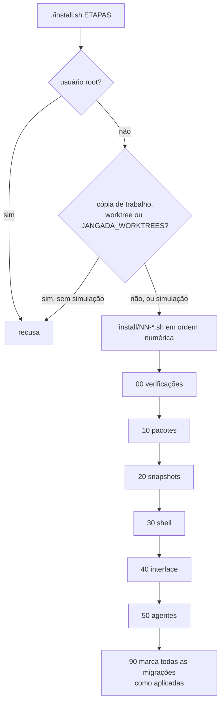
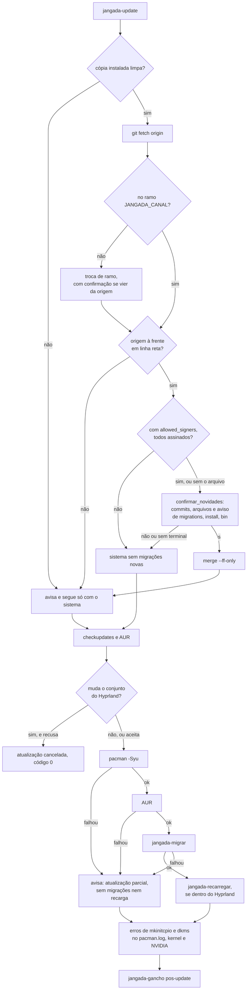
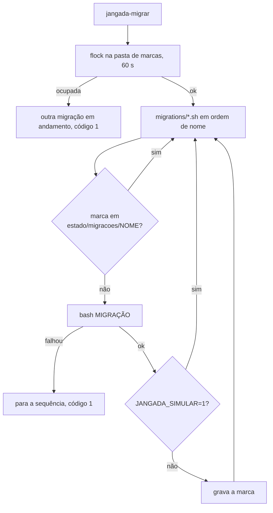

# Atualização e migrações

O jangada roda de uma cópia instalada em `~/.local/share/jangada`
(`JANGADA_PATH`), que só avança pelo `jangada-update` e só depois de você ver
e aceitar os commits novos. Mudança que exige ajuste numa instalação
existente chega por uma migração, aplicada uma única vez pelo `jangada-migrar`.

## Instalação inicial

- Com argumentos, roda só as etapas com esse prefixo: `./install.sh 20 50`.
- `JANGADA_SIMULAR=1 ./install.sh` mostra o que seria feito sem executar.
- A pasta de onde o `install.sh` roda vira o `JANGADA_PATH`. A cópia de
  trabalho e os worktrees são graváveis de dentro do isolamento, então
  instalar dali faria os hooks e a sessão rodarem o que o agente muda. Nelas
  só a simulação roda.
- A etapa 90 marca as migrações como aplicadas porque uma instalação nova já
  recebe os padrões atualizados.

## Como escrever uma etapa ou migração

As duas usam as funções de `install/lib.sh`:

| Função | Uso |
|---|---|
| `executar CMD...` | roda o comando, ou só o mostra com `JANGADA_SIMULAR=1` |
| `como_root CMD...` | o mesmo, com `sudo` quando não é root |
| `copia_seguranca ARQ` | cópia `.jangada-DATA.bak` antes de alterar um arquivo existente |
| `copiar_se_ausente ORIGEM DESTINO` | cria o arquivo do usuário só se ele não existir |
| `simulando` | verdadeiro com `JANGADA_SIMULAR=1` |

Regras de uma migração (`migrations/README.md`):

1. Nome `AAAAMMDDHHMM-descricao.sh`; a ordem de aplicação é a do nome.
2. Pode rodar de novo sem estragar nada: uma falha no meio faz ela ser
   tentada outra vez.
3. Nunca apaga arquivo do usuário; move para `.bak` com data.
4. Explica no topo o que mudou e por quê.
5. O padrão em `default/` é corrigido também, para a instalação nova.

Exemplo curto, `migrations/202609272200-subagentes-novos.sh`: carrega
`install/lib.sh` e chama `ligar_agentes_claude` e `mesclar_agentes_agy` só se
o Claude ou o agy estiverem presentes.

## jangada-update

- **Confirmação.** A origem da cópia instalada é a cópia de trabalho, cujas
  refs um agente isolado pode gravar. Por isso nada que chega por ela roda
  sem você ver: `confirmar_novidades` mostra os commits, os arquivos e um
  aviso quando mudam `migrations/`, `install/` ou `bin/`. Os textos passam
  por um filtro de caracteres de controle, para que uma sequência de escape
  não disfarce a lista. Sem terminal, a resposta é não.
- **Assinaturas.** Com `~/.config/jangada/allowed_signers`, todo commit que
  chegaria precisa de assinatura válida por esse arquivo, conferida commit a
  commit (o `--verify-signatures` do merge só olharia o último); se algum
  não tem, nada é aplicado. O arquivo fica fora da cópia de trabalho e
  somente leitura no isolamento, então um agente não inclui nele uma chave
  própria. Os agentes fazem commit sem a chave, que o isolamento oculta: o
  `jangada-assinar`, num terminal comum, mostra os commits ainda não
  enviados e sem assinatura válida e os assina com `JANGADA_ASSINATURA_CHAVE`
  depois da confirmação, a partir do primeiro sem assinatura, para não
  reescrever o que a cópia instalada já aplicou. Commit enviado sem
  assinatura e ainda não aplicado fica fora do que ele reescreve e dentro do
  que o `jangada-update` confere: o `jangada-assinar` avisa e mostra o
  comando que avança a cópia instalada à mão, depois de você conferir esses
  commits. Os merges do
  `jangada-agente-fim --integrar` são refeitos e assinados junto, e o
  próprio `--integrar` chama o `jangada-assinar` depois de apagar o ramo,
  quando a raiz é a cópia de trabalho do jangada; chamado de dentro da
  própria sessão, ele só avisa, porque a limpeza segue sem terminal. Refazer
  um merge perde o que foi resolvido ou alterado nele à mão: com conflito, o
  rebase para e `git rebase --abort` desfaz; sem conflito, o comando nota a
  diferença, volta o ramo ao que era e não assina nada. O `jangada-update` e
  o `jangada-assinar` fixam o `gpg.ssh.program` em `ssh-keygen`, porque o da configuração do repositório
  rodaria fora do isolamento.
- **Avanço rápido.** Só `--ff-only`: origem que não avança em linha reta
  não é aplicada.
- **Hyprland.** Se a atualização toca `hyprland`, `aquamarine`, `hyprutils`,
  o Noctalia e o resto do conjunto, mostra os pacotes e pede confirmação.
- **Falha do pacman.** Não interrompe o script: é justamente quando um hook
  do mkinitcpio ou do dkms falha que a conferência da imagem de boot precisa
  rodar. O que depende da atualização completa (AUR, migrações, recarga)
  fica para depois do conserto, e o código de saída é diferente de zero.
- **Depois.** Kernel trocado e driver NVIDIA carregado diferente do instalado
  pedem reinício.
- **Git sem ganchos.** Todo git sobre a cópia instalada passa por
  `jangada_git_seguro`, sem fsmonitor nem ganchos da configuração do
  repositório.

## jangada-migrar

Em simulação a marca não é gravada: gravar faria a execução seguinte, a de
verdade, pular uma migração que nunca foi aplicada.

## Testes

| Arquivo | O que cobre |
|---|---|
| `testes/update.sh` | só aplica com `s`; sem terminal não aplica; migração nova roda e grava marca; filtro de caracteres de controle; origem reescrita recusada; com `allowed_signers`, commit sem assinatura ou com chave de fora não é aplicado, o `jangada-assinar` assina só a partir do primeiro sem assinatura, assina também os merges da integração, avisa do commit enviado sem assinatura, recusa merge alterado à mão, não roda sem terminal nem sem a chave e ignora o `gpg.ssh.program` do repositório; `jangada-agente-fim --integrar` não mexe na cópia instalada e, com `allowed_signers`, assina depois da confirmação e, de dentro da própria sessão, só avisa; `install.sh` recusa a cópia de trabalho, um worktree e `JANGADA_WORKTREES` |
| `testes/hooks.sh` | `mesclar_hooks_claude` e `mesclar_hooks_agy` com o arquivo vazio gravam os hooks (o vazio conta como `{}`); com JSON inválido, avisam e não gravam; o `jangada-verificar` aponta o arquivo vazio ou inválido |
| `testes/barra.sh` | exemplo de migração testada: a que acrescenta o módulo de indicadores |
| `.github/workflows/verificar.yml` | a CI simula a instalação como usuário sem sudo e confere que nada foi escrito |

Veja também as [boas práticas](boas-praticas.md) e o ciclo de versão no
README (`jangada-versao`).
