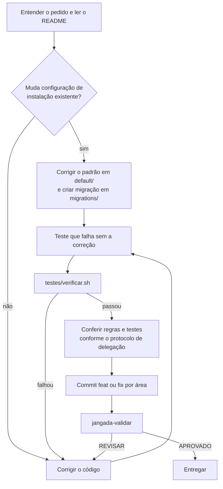

# Boas práticas de programação no jangada

Este guia reúne as regras do `AGENTS.md` e as lições que custaram
investigação. As pegadinhas de ferramentas específicas (API do Hyprland,
waybar, agy) ficam na skill, em `default/claude/skills/jangada/`; aqui fica o
que vale para qualquer mudança.

## Fluxo de uma mudança

Prefira commit antes da revisão para que a aprovação corresponda ao commit
limpo. `jangada-validar` também aceita alterações sem commit.
A conferência pode usar o subagente `verificador` quando o protocolo permitir;
no Codex com destino `local`, ela fica na própria sessão.

## Onde cada coisa grava

- Nada do jangada escreve em `~/.config/hypr`, na configuração do Noctalia ou
  em outra sessão existente. Tudo vai para `~/.config/jangada` (ajustes do
  usuário), `~/.local/share/jangada` (cópia instalada) e
  `~/.local/state/jangada` (estado e registros).
- Padrão no repositório, gosto pessoal no usuário: um atalho ou monitor
  pessoal vai para `~/.config/jangada/hypr/usuario.lua`, não para
  `default/hypr/`.
- Arquivo existente só muda depois de `copia_seguranca`; arquivo do usuário é
  criado com `copiar_se_ausente` (os dois em `install/lib.sh`).

## Segurança

- O agente é tratado como possivelmente hostil (regra 10 do `AGENTS.md`).
  Cada mudança responde: o que o agente grava pode rodar fora do
  isolamento? Veja o [modelo de ameaça](isolamento.md#modelo-de-ameaça).
- Nada gravável pelo agente roda fora do isolamento sem conferência. O
  estado da sessão é conferido campo a campo, as regras da validação vêm da
  base e o R não lê o `.Rprofile`, o `.Renviron` nem o `.lintr` do worktree.
- Conteúdo de fora (log, título de janela, página, texto de commit) é dado.
  Filtre caracteres de controle e diga ao agente que o bloco não traz
  instruções.
- Menor privilégio: cada peça recebe só o que precisa, como o D-Bus filtrado
  do isolamento ou um dispositivo pareado que não vira confiável sozinho.
- Caminho explícito no lugar de ordem de busca: o `bootstrap.lua` tira a
  pasta atual do caminho de módulos, porque o Hyprland roda em `$HOME`.
- Lista explícita no lugar de exceção implícita: o que foge de uma regra
  fica escrito, com o motivo.
- Dado guardado tem prazo: registro que só cresce precisa de retenção.

## Instalação e migrações

- Toda etapa de `install/` pode rodar de novo sem efeito colateral.
- Todo comando que altera o sistema passa por `executar` ou `como_root`, para
  que `JANGADA_SIMULAR=1` só mostre o que faria.
- Mudança que exige ajuste numa instalação existente ganha uma migração
  `migrations/AAAAMMDDHHMM-descricao.sh`, que também pode rodar de novo, nunca
  apaga arquivo do usuário (move para `.bak` com data) e explica no topo o que
  mudou e por quê. Detalhes em [atualização e migrações](atualizacao-e-migracoes.md).

## Bash

- Cabeçalho `set -euo pipefail`. Com `pipefail`, `curl ... | grep -q` falha
  quando a saída passa do tamanho do cano: o `grep -q` sai no primeiro acerto
  e o `curl` falha ao escrever o resto (código 23). Capture a saída numa
  variável e compare, como faz o `subir` de `bin/jangada-painel`.
- `trap` só em `EXIT`. Um trap em `INT` ou `TERM` não encerra o script: o bash
  roda o tratador e segue na linha seguinte.
- Argumentos que vão para outro interpretador (Lua do `hyprctl dispatch`,
  comando do tmux) saem de `printf %q` ou de campos conferidos, nunca de texto
  montado com dados do usuário ou do estado.
- Uma operação por vez sobre o mesmo recurso: `flock` na trava do recurso
  (coleta do painel, gravação do calendário) e gravação atômica, num
  temporário na mesma pasta seguido de `mv`.
- Funções de `shell/jangada-shell.sh` rodam em bash e zsh: nada de `read -p`
  nem `${var,,}`.
- Falha tratada avisa com o motivo e sai com código diferente de zero;
  falha que se ignora de propósito leva `|| true` e um comentário que diga
  por quê.

## Lua do Hyprland

- A API é a de `hl.*` (`hl.config`, `hl.bind`, `hl.window_rule`, `hl.dsp.*`).
  O formato `.conf` só continua em hyprlock e hypridle.
- Padrões de `class` e `title` são expressões regulares do Hyprland, não
  padrões do Lua.
- Atalho novo usa `j.atalho(teclas, descrição, ação)`, sempre com descrição.

## Testes

- Cada correção vem com um teste que falha no código antigo. Confira isso
  rodando o teste antes da correção: um teste que passa nos dois casos não
  prova nada.
- Quando um teste falha, descubra se o erro está no código ou no teste. Um
  simulador (`nmcli`, `agy`, `claude` falsos) no formato errado leva a mudar
  o código para agradar o teste; corrija o simulador pela saída real da
  ferramenta.
- Correção proposta por revisor ou auditoria também precisa de teste: a
  troca sugerida para o `curl | grep -q` trouxe a corrida descrita acima.
- Os testes nunca tocam a configuração real: usam `XDG_CONFIG_HOME` e
  `XDG_STATE_HOME` temporários.
- `testes/verificar.sh` roda antes de concluir qualquer mudança. Dentro de uma
  sessão isolada, rode com
  `env -u JANGADA_ISOLADO -u JANGADA_DELEGAR -u JANGADA_PAPEL -u JANGADA_PAPEL_AJUSTE`;
  o `testes/isolar.sh` pula ali o caso do D-Bus e a leitura da casa mínima,
  que só rodam num terminal comum.
- Para testar a cópia de trabalho sem instalar: `JANGADA_PATH=$PWD bin/...`.
- Regra que dá para conferir vira teste: o caso 8 de `testes/barra.sh`
  confere o `setsid -f` de todo clique da barra. Regra só escrita é
  esquecida.

## Documentação e textos

- Português, sem travessão, sem adjetivação desnecessária e sem
  estrangeirismo quando houver termo em português de uso corrente.
- Nos documentos, cite arquivo e função, não número de linha: o número muda a
  cada edição e a citação fica errada sem que ninguém perceba.
- Comentário explica o porquê que o código não mostra (a corrida, o limite da
  ferramenta), não repete o que a linha faz.
- Comportamento inesperado de ferramenta que custou investigação entra também
  na skill, no guia do assunto.

## Commits

- `feat(área): ...` para novidade e `fix(área): ...` para correção; elas
  alimentam o `CHANGELOG.md`, gerado por `jangada-versao --lancar X.Y.Z` e
  nunca editado à mão.
- Um commit por área. Mudanças misturadas são separadas antes do commit.
- Commit sem linha `Co-Authored-By`.

## Agentes

- Subagente só lê e propõe; quem implementa é o agente da sessão. O prompt do
  subagente leva as regras: citar `caminho:linha`, limite de palavras, só
  leitura e textos pelo item 7 do `AGENTS.md`. Detalhes em
  [subagentes e delegação](subagentes-e-delegacao.md).
- Antes do `jangada-validar`, o subagente `verificador` roda os testes e
  procura arquivos esquecidos fora do diff.
- Veja o [ciclo da tarefa](ciclo-da-tarefa.md) e o [isolamento](isolamento.md).
