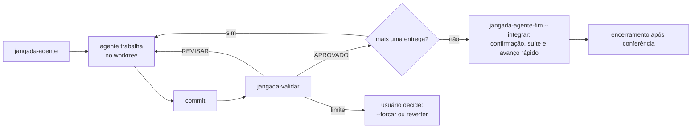
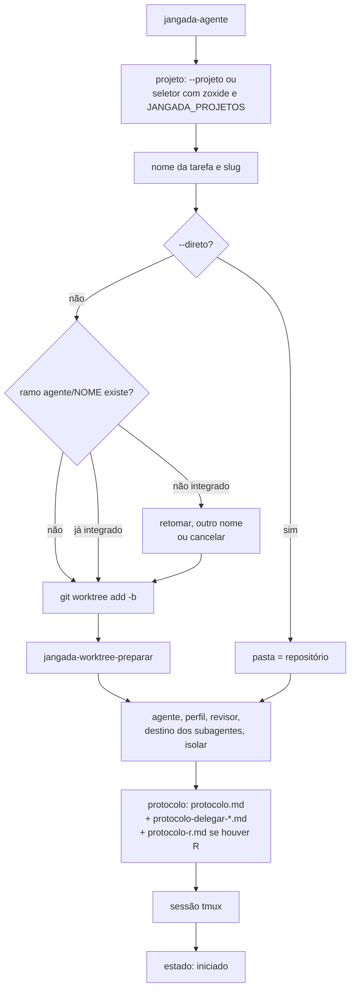
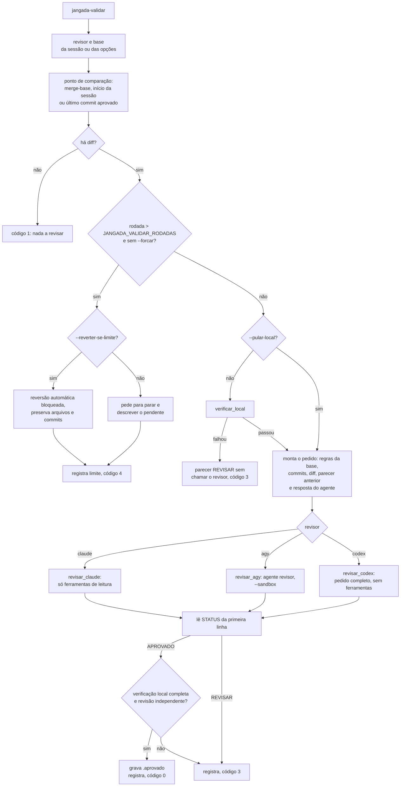

# Ciclo de uma tarefa com agentes

Uma tarefa passa por três comandos: `jangada-agente` abre a sessão,
`jangada-validar` manda a entrega ao revisor configurado e
`jangada-agente-fim` encerra e limpa. Com `--integrar`, ele avança a base
até o commit aprovado, depois de confirmação humana, e mantém a sessão.
Veja [segurança operacional](estabilizacao/SEGURANCA_OPERACIONAL.md). O estado de cada sessão fica em
`~/.local/state/jangada/agentes/SESSAO.json`, com o contrato descrito em
`default/claude/skills/jangada/agentes.md`.

Desde a modularização 3.0, os comandos deste ciclo moram em `core/bin/` e a
skill em `core/agentes/claude/skills/jangada/`. Os caminhos de `bin/` e
`default/` citados aqui são links de compatibilidade e continuam sendo a
forma de uso. O mapa das pastas está na seção Estrutura do [README](../README.md).

O Codex participa pelos perfis `codex`, `codex-codex` e `codex-agy`.
As diferenças de protocolo, hooks e revisão estão em [Codex](codex.md).

O fluxograma recomenda commit antes da revisão, para que a aprovação
identifique uma entrega limpa. O comando também revisa alterações sem commit,
mas registra a aprovação como `sujo`, sem avançar o ponto da próxima entrega.

## Abertura da sessão

- `slug` em `bin/jangada-agente` tira acentos e caracteres especiais do nome;
  o ramo é `agente/NOME` e o worktree fica em `JANGADA_WORKTREES`.
- `bin/jangada-worktree-preparar` leva ao worktree o que o git não leva: o que
  casa com `.worktreeinclude` e é ignorado pelo git é copiado, o que está em
  `.jangada/links` vira link e `.jangada/preparar.sh` roda por último.
- Revisor: `--revisor`, depois o `JANGADA_VALIDAR_REVISOR` do perfil, depois o
  da configuração; sem nenhum, Codex revisa Claude e Claude revisa Codex.
  Fora de sessão e nas sessões antigas do agy, o padrão é Claude.
- O protocolo vai ao Claude por `--append-system-prompt`, ao agy por `-i`
  junto com a tarefa e ao Codex por `developer_instructions`. O item de
  subagentes depende do destino; veja
  [subagentes e delegação](subagentes-e-delegacao.md).
- Com isolamento, o comando começa por `jangada-isolar --`; veja
  [isolamento](isolamento.md).
Os estados do ciclo são:

| Estado | Quando aparece |
|---|---|
| `iniciado` | abertura ou restauração da sessão |
| `trabalhando` | execução acompanhada pelos hooks |
| `aguardando` | pedido de resposta ou permissão; o agy não informa esse estado |
| `concluido` | fim de uma resposta ou encerramento informado pelo agente |
| `interrompido` | tmux desapareceu, mas a pasta permite restaurar a sessão |

Na Central de Tarefas v0.1, `concluido` aparece como **Turno encerrado**,
sem afirmar que a tarefa foi concluída. Cada sessão representa uma tarefa.
A central acompanha estados e mensagens a cada dois segundos; mudanças
observadas ficam em memória durante a janela. Perguntas e permissões
continuam no terminal. Na tarefa selecionada, `Alt+I` abre a integração,
que mantém a sessão; `Ctrl+X` abre o encerramento sem integração. Ambos usam
`jangada-agente-fim`, preservando suas conferências e confirmações.
Veja [instalação e reversão](../README.md#central-de-tarefas-v01).

Cada mudança registrada vira uma linha em `eventos-agentes.jsonl`
([registros](registros.md)).

## Validação da entrega

- **Ponto de comparação.** Parte do `merge-base` entre a base e o `HEAD`.
  Direto no ramo base, vale o commit `inicio` gravado na abertura. Depois de
  um APROVADO, a próxima chamada é outra entrega: a revisão parte do commit
  aprovado (`validacao-ROTULO.aprovado`) e as rodadas recomeçam, somente
  com marca protegida, validação local completa, independência, árvore e base
  conferidas. Marcas graváveis pelo agente não encurtam o diff.
- **Foto da entrega.** Antes de qualquer conferência, o worktree é
  congelado: o commit do agente, os arquivos rastreados e os novos viram
  árvores do git, e uma cópia temporária é montada a partir delas. O portão
  local, o diff e o revisor leem só essa cópia, então o que o agente altera
  durante a revisão fica fora do parecer e da aprovação. Fora do isolamento,
  a cópia fica em `fotos/` do estado, pasta privada que o isolamento oculta,
  e não em `revisoes/`, porque leva os links versionados da entrega. Os
  objetos passam antes por `git fetch` para um espelho em `revisoes/espelhos/`,
  que recalcula cada hash: o agente grava em `.git/objects`, e o git não
  reconfere um objeto solto ao ler. A integração confere os objetos com o
  mesmo espelho e faz o avanço lendo só os objetos dele. Uma divergência
  posterior ao avanço só gera aviso: não autoriza rollback destrutivo na
  cópia principal.
  A trava do Jangada não impede alterações do editor.
- **Diff.** Entram os arquivos rastreados e os novos não rastreados. Nome de
  arquivo com quebra de linha reprova na verificação local, porque escaparia
  das listas.
- **Verificação local** (`verificar_local`), antes de gastar o revisor:
  marcadores de conflito, script com byte nulo, sintaxe dos scripts
  alterados, `lintr` nas linhas R tocadas, segredos com o `gitleaks` só nas
  linhas acrescentadas, aviso de `Co-Authored-By` e, por último, o
  `.jangada/validar.sh` do projeto. As regras vêm da base, para a entrega não
  afrouxar o critério que a avalia. O R roda sem o `.Rprofile`, o `.Renviron`
  e o `.lintr` do worktree, que são código do repositório avaliado. O
  `.lintr` da base também é código R, e depois de um APROVADO a base da
  comparação é um commit do agente: por isso o `lintr` e o
  `.jangada/validar.sh` rodam pelo `jangada-isolar`, que numa sessão isolada
  roda direto e fora dela abre o bwrap. Com `.lintr` no projeto, o `lintr`
  que falha ou está ausente reprova a entrega. Sem configuração própria,
  achados do padrão continuam como aviso, mas a execução é obrigatória.
  ShellCheck e luac ausentes também reprovam arquivos aos quais se aplicam.
  O estado das verificações acompanha o parecer em `.verificacoes.tsv`.
  `.jangada/validar.sh` tem prazo de 300 segundos; lintr, 120 segundos.
- **Revisor.** O hook do revisor fica desligado, para o Stop dele não marcar
  a sessão como concluída. Pedido acima de 126.000 bytes leva o diff num
  arquivo que o agy lê. Sem o agente `revisor` instalado, o agy cairia no
  agente padrão, com todas as ferramentas; por isso o agy não é chamado.
  Quando a chamada ao revisor falha (sem cota, fora do ar, sem o agente
  `revisor`), a revisão passa aos outros modelos instalados, na ordem
  `claude`, `agy`, `codex`, e por último ao modelo do autor, com o aviso de
  revisão pelo mesmo modelo no pedido. Cada falha vira uma linha `erro` no
  `validar.jsonl`, e o estado registra quem deu o parecer. O Codex fica fora
  da troca quando o diff não cabe no pedido. Com `--revisor`, vale só o
  revisor pedido.
  Cada chamada ao revisor tem prazo de `JANGADA_VALIDAR_PRAZO` segundos
  (540): vencido, o revisor e o que ele abriu são encerrados, e a rodada sai
  com código 1 e sem parecer, sem passar a outro modelo. Como as rodadas são contadas pelos pareceres,
  essa chamada não gasta uma das rodadas da entrega.
  O diff acima de `JANGADA_VALIDAR_DIFF_MAX` bytes (150.000) vai cortado, com
  a lista do que ficou de fora para o revisor ler. O Codex revisa sem
  ferramentas: com diff cortado ou arquivo novo acima de 50 KB, a validação
  recusa a chamada com código 1, antes de gastar a rodada.
- **Registro.** Cada rodada grava `validacao-ROTULO-rN.md` e uma linha em
  `validar.jsonl` (`registrar`), e atualiza o campo `validacao` do estado.
  Dentro do isolamento, isso vai para `agentes/` e para o `validar.jsonl` do
  estado, que o agente pode alterar. Fora dele (sem `JANGADA_ISOLADO`), vai
  para `revisoes/`, que o `jangada-isolar` oculta, e a base, a tarefa e o
  revisor saem da cópia `revisoes/SESSAO.json` que o `jangada-agente` grava
  ao abrir a sessão. O `.aprovado` é um JSON que prende a aprovação ao que
  foi lido: commit e árvore do candidato, ponta da base, revisor, autor e
  `independent`. Com `limpo` falso (worktree com alteração sem commit), o
  commit sozinho não foi o que o revisor viu.
- **Parecer.** Só vale a primeira linha não vazia, e ela tem de ser
  exatamente `STATUS: APROVADO` ou `STATUS: REVISAR`, em maiúsculas. Outra
  forma conta como REVISAR. Parecer aprovado sem verificação local completa
  ou produzido pelo autor vira REVISAR e não gera marca de aprovação. Fora
  do isolamento, autoria sem cópia protegida da sessão também não aprova.

| Código | Significado |
|---|---|
| 0 | APROVADO |
| 3 | REVISAR (do revisor ou da verificação local) |
| 4 | limite de rodadas |
| 1 | erro: sem diff, nenhum revisor respondeu, prazo vencido, opção desconhecida |

## Fim da sessão

O `conferir_estado` recusa caracteres de controle, caminhos relativos, ramo
fora de `agente/NOME`, worktree fora de `JANGADA_WORKTREES` e worktree de
outro repositório. O estado gravável pelo agente não autoriza operação fora
da sessão.

Com `--integrar`, uma sessão com ramo próprio é integrada à base por avanço
rápido, fora do isolamento. O comando não chama o revisor e `--sem-revisao`
não libera. As etapas, na ordem:

1. O estado da sessão tem de ser igual à cópia protegida em
   `revisoes/SESSAO.json`. A worktree da tarefa tem de estar limpa, e a
   cópia principal, na base e sem alterações, inclusive arquivos novos e
   submódulos. A configuração local da cópia principal, com o
   `config.worktree` e o que entra por include, não pode definir chave
   `filter.*`: o comando recusa antes de qualquer `git status` e de novo sob
   a trava, porque o filtro rodaria comando ao gravar os arquivos.
2. Se a base andou, o ramo é refeito sobre ela com `git rebase` na worktree
   da tarefa. O commit muda, e o comando recusa pedindo
   `jangada-validar` para o commit novo. Um conflito deixa o rebase parado na
   worktree.
3. A marca `revisoes/validacao-SESSAO.aprovado` tem de registrar revisão
   independente, verificação local, worktree limpo e o commit, a árvore e a
   base exatos.
4. O usuário confirma: a resposta `s` no terminal (`Alt+I`) ou o botão da
   Central, que passa em `--confirmacao` os dois commits exibidos.
5. `testes/verificar.sh` roda numa cópia do commit tirada do espelho, em
   `integracoes/` do estado, e tem de sair com 0. O registro fica em
   `revisoes/verificar-SESSAO.log`. Projeto sem esse arquivo na base e no
   candidato segue com aviso.
6. Sob a trava do repositório, tudo é conferido de novo e a base avança com
   `git merge --ff-only`, lendo os objetos do espelho em `revisoes/espelhos/`,
   não os de `.git/objects`, que o agente grava.

A recusa por base alterada ou cópia principal alterada vale até a última
conferência, sob a trava. A trava não impede um Git de fora do jangada: se
ele mover a base para um ancestral do candidato entre essa conferência e o
merge, o `--ff-only` aceita. Essa janela é só detectada: depois do avanço,
o comando lê no reflog o valor anterior da base e, se não for o conferido,
avisa e sai com erro, sem desfazer. Uma recusa anterior ao avanço deixa
arquivos, índice e HEAD da cópia principal como estavam. Se, depois do
avanço, os arquivos da cópia principal não conferem com o espelho, a base
fica avançada, o comando sai com erro e pede conferência manual. Não há `merge --no-ff`, `reset --hard`, `git clean` nem outro
comando de descarte. O comando não envia ao remoto, não assina, não roda o
`jangada-update` e mantém sessão, ramo e worktree. O encerramento é outro
gesto: `Ctrl+X` ou `jangada-agente-fim SESSAO`.

Sem `--integrar`, o encerramento conserva a conferência de alterações
pendentes e a confirmação humana antes de remover a worktree. O ramo fica.
Uma confirmação de descarte perde arquivos sem commit: faça cópia antes.
Chamado de dentro da própria sessão, o `limpar` roda em segundo plano, com
registro, porque fechar o tmux encerraria o próprio comando.

## Sessões órfãs

As consultas `jangada-agentes --lista`, `--lista-atualizada` e `--waybar`
só leem o estado em `~/.local/state/jangada/agentes`. A limpeza é a ação
explícita `jangada-agentes --limpar-orfaos` (contrato K4 em
`docs/modularizacao-3.0/03-contratos.md`). Ela remove o estado de sessão sem
tmux e sem processo vivo. Ficam o `concluido` e o `aguardando` dentro de
`JANGADA_AGENTES_GUARDAR` horas (padrão 24) e o `interrompido` dentro de 7
dias. Sessão de agente sem processo e com a pasta no disco vira
`interrompido` em vez de sair.

Até a barra chamar a limpeza antes da consulta (tarefa M3-06), nada a chama
sozinho e as órfãs acumulam na pasta. Elas não aparecem na lista nem no
contador; a sessão que dá para restaurar aparece como `interrompido` sem
prazo para sair.

## Testes

| Arquivo | O que cobre |
|---|---|
| `testes/validar.sh` | veredito, rodadas, limite, ponto de comparação, verificação local, pareceres e métricas, com claude e agy falsos |
| `testes/fim.sh` | estado adulterado; integração por avanço rápido com parecer do commit final, recusa por parecer inválido, base alterada, cópia principal alterada, suíte com falha e objeto forjado; preservação de arquivos, índice, HEAD, sessão, ramo e worktree, inclusive com trabalho concorrente e chamadas simultâneas |
| `testes/baseline.py` | reprodução do rollback antigo, conflito, repetição após publicação manual, interrupção da trava, ferramentas ausentes, marcas inválidas e recuperação sintética |
| `testes/update.sh` | a integração não mexe na cópia instalada, não envia ao remoto, não assina nem roda ganchos; atualização e assinatura continuam ensaiadas com Git sintético |
| `testes/eventos.sh` | histórico de estados gravado pelos hooks e pela troca de foco |
| `testes/restaurar.sh` | volta de uma sessão interrompida |
| `testes/contratos-consulta.sh` | consultas de `jangada-agentes` sem gravar no estado e limpeza explícita das órfãs |
