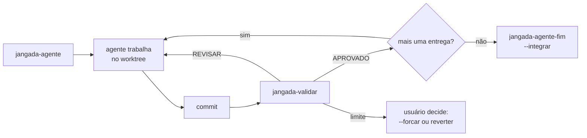
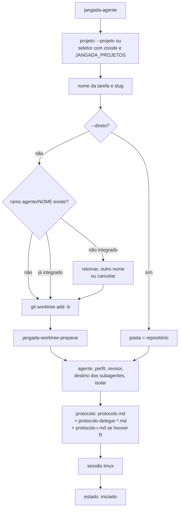
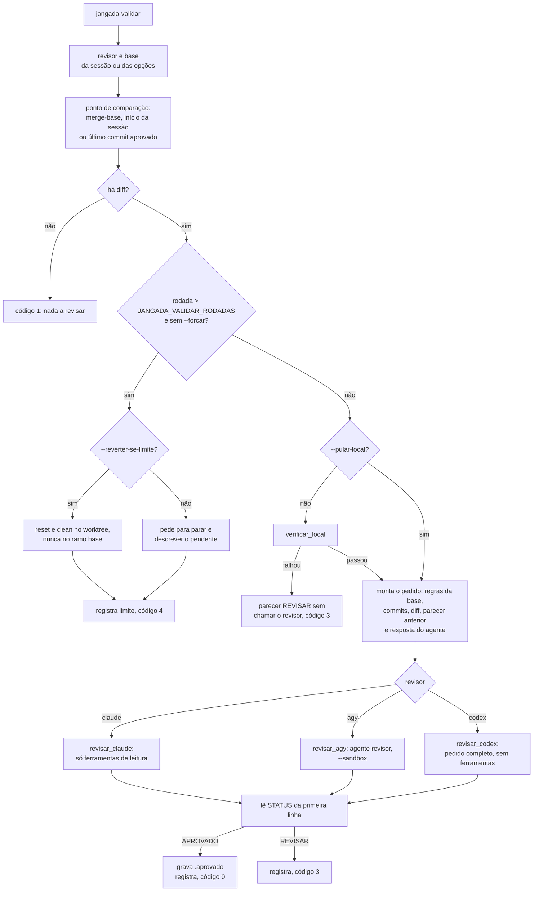
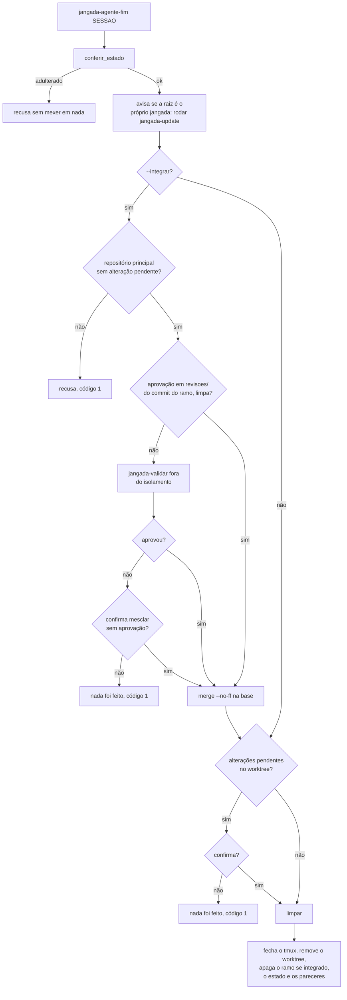

# Ciclo de uma tarefa com agentes

Uma tarefa passa por três comandos: `jangada-agente` abre a sessão,
`jangada-validar` manda a entrega ao revisor configurado e
`jangada-agente-fim` integra e limpa. O estado de cada sessão fica em
`~/.local/state/jangada/agentes/SESSAO.json`, com o contrato descrito em
`default/claude/skills/jangada/agentes.md`.

O Codex participa pelos perfis `codex`, `codex-codex` e `codex-agy`.
As diferenças de protocolo, hooks e revisão estão em [Codex](codex.md).

## Abertura da sessão

- `slug` em `bin/jangada-agente` tira acentos e caracteres especiais do nome;
  o ramo é `agente/NOME` e o worktree fica em `JANGADA_WORKTREES`.
- `bin/jangada-worktree-preparar` leva ao worktree o que o git não leva: o que
  casa com `.worktreeinclude` e é ignorado pelo git é copiado, o que está em
  `.jangada/links` vira link e `.jangada/preparar.sh` roda por último.
- Revisor: `--revisor`, depois o `JANGADA_VALIDAR_REVISOR` do perfil, depois o
  da configuração; sem nenhum, o modelo oposto ao do agente.
- O protocolo vai ao Claude por `--append-system-prompt`, ao agy por `-i`
  junto com a tarefa e ao Codex por `developer_instructions`. O item de
  subagentes depende do destino; veja
  [subagentes e delegação](subagentes-e-delegacao.md).
- Com isolamento, o comando começa por `jangada-isolar --`; veja
  [isolamento](isolamento.md).
- Os hooks do Claude, agy e Codex atualizam o estado da sessão. A lista
  inclui `iniciado`,
  `trabalhando`, `aguardando`, `concluido`, e `interrompido` quando o tmux
  some com o worktree presente. Cada mudança vira uma linha em
  `eventos-agentes.jsonl` ([registros](registros.md)).

## Validação da entrega

- **Ponto de comparação.** Parte do `merge-base` entre a base e o `HEAD`.
  Direto no ramo base, vale o commit `inicio` gravado na abertura. Depois de
  um APROVADO, a próxima chamada é outra entrega: a revisão parte do commit
  aprovado (`validacao-ROTULO.aprovado`) e as rodadas recomeçam.
- **Diff.** Entram os arquivos rastreados e os novos não rastreados. Nome de
  arquivo com quebra de linha reprova na verificação local, porque escaparia
  das listas.
- **Verificação local** (`verificar_local`), antes de gastar o revisor:
  marcadores de conflito, script com byte nulo, sintaxe dos scripts
  alterados, `lintr` nas linhas R tocadas, segredos com o `gitleaks` só nas
  linhas acrescentadas, aviso de `Co-Authored-By` e, por último, o
  `.jangada/validar.sh` do projeto. As regras vêm da base, para a entrega não
  afrouxar o critério que a avalia. O R roda sem o `.Rprofile`, o `.Renviron`
  e o `.lintr` do worktree, que são código do repositório avaliado. Pelo
  mesmo motivo, o `.jangada/validar.sh` roda pelo `jangada-isolar`, que numa
  sessão isolada roda direto e fora dela abre o bwrap.
- **Revisor.** O hook do revisor fica desligado, para o Stop dele não marcar
  a sessão como concluída. Pedido acima de 131.072 bytes leva o diff num
  arquivo que o agy lê. Sem o agente `revisor` instalado, o agy cairia no
  agente padrão, com todas as ferramentas; por isso a validação para.
- **Registro.** Cada rodada grava `validacao-ROTULO-rN.md` e uma linha em
  `validar.jsonl` (`registrar`), e atualiza o campo `validacao` do estado.
  Dentro do isolamento, isso vai para `agentes/` e para o `validar.jsonl` do
  estado, que o agente pode alterar. Fora dele (sem `JANGADA_ISOLADO`), vai
  para `revisoes/`, que o `jangada-isolar` oculta, e a base, a tarefa e o
  revisor saem da cópia `revisoes/SESSAO.json` que o `jangada-agente` grava
  ao abrir a sessão. O `.aprovado` guarda `COMMIT N limpo|sujo`: `sujo`
  quando o worktree tinha alteração sem commit, e aí o commit sozinho não foi
  o que o revisor viu.

| Código | Significado |
|---|---|
| 0 | APROVADO |
| 3 | REVISAR (do revisor ou da verificação local) |
| 4 | limite de rodadas |
| 1 | erro: sem diff, revisor ausente, opção desconhecida |

## Fim da sessão

- `conferir_estado` recusa caracteres de controle, caminhos relativos, ramo
  fora de `agente/NOME`, worktree fora de `JANGADA_WORKTREES` e worktree de
  outro repositório. O estado é gravável de dentro do isolamento, então nada
  dele é aceito sem conferência.
- O parecer que a sessão grava em `agentes/` não conta para o `--integrar`:
  o agente pode escrevê-lo. Vale só a marca em `revisoes/` para o commit
  atual do ramo, com o worktree limpo. Sem ela, o `--integrar` roda o
  `jangada-validar` fora do isolamento e, se não sair APROVADO, pede
  confirmação para mesclar assim mesmo. `--sem-revisao` pula essa revisão e
  vai direto à confirmação. Dentro do isolamento a revisão não roda, porque
  não valeria como aprovação.
- `--integrar` mescla no repositório de trabalho e nunca na cópia instalada;
  ela só avança pelo `jangada-update` ([atualização](atualizacao-e-migracoes.md)).
- Chamado de dentro da própria sessão, o `limpar` roda em segundo plano,
  porque fechar o tmux mataria o próprio comando.
- Sem `--integrar`, o ramo `agente/NOME` fica; apague com `git branch -d`.

## Testes

| Arquivo | O que cobre |
|---|---|
| `testes/validar.sh` | veredito, rodadas, limite, ponto de comparação, verificação local, pareceres e métricas, com claude e agy falsos |
| `testes/fim.sh` | recusa de estado adulterado (ramo, worktree, raiz, base), aprovação de fora no `--integrar` (marca forjada em `agentes/`, marca `sujo`, `--sem-revisao`, chamada de dentro do isolamento) e `--limpar-concluidos` |
| `testes/update.sh` | `--integrar` não mexe na cópia instalada nem roda ganchos do repositório do agente |
| `testes/eventos.sh` | histórico de estados gravado pelos hooks e pela troca de foco |
| `testes/restaurar.sh` | volta de uma sessão interrompida |
