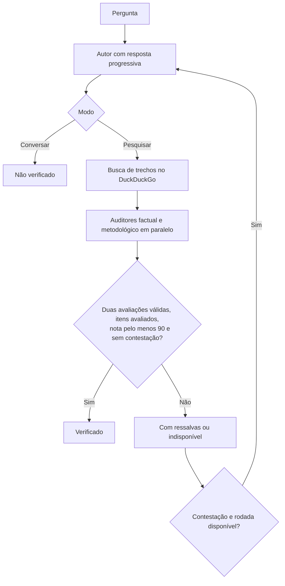

# Conversa de Pescador

O assistente abre uma janela de conversa com resposta progressiva, histórico de sessões e cancelamento. Execute `jangada-pescador --janela` ou use o menu central. A janela utiliza PyQt6, já incluído nos pacotes da interface.

## Uso

- **Conversar**, modo inicial: uma chamada ao autor. A resposta aparece durante a geração e fica marcada como **Não verificado**.
- **Pesquisar com fontes**: mostra a resposta antes da checagem, pesquisa na web e executa dois auditores em paralelo.
- **Verificar resposta**: pesquisa e audita a última resposta da conversa, sem gerar novamente o texto.
- **Parar**: cancela a consulta e encerra os processos dos modelos. O texto parcial permanece visível, mas não entra no contexto de uma próxima pergunta.
- **Opções**: permite escolher o par de modelos e entre uma e quatro rodadas. O padrão é uma rodada.

As fontes e os detalhes dos auditores ficam recolhidos abaixo da conversa. Copiar leva o texto da resposta para a área de transferência. Repetir devolve a pergunta ao campo de entrada para uma nova tentativa explícita.

## Fluxo implementado



A busca usa a pergunta, recolhe até quatro resultados com título, URL e trecho e remove URLs repetidas. Não lê páginas completas nem faz decomposição ou síntese com outro modelo. Uma rodada de pesquisa usa três chamadas aos modelos: autor e dois auditores. Conversar usa uma chamada; verificar um texto existente usa duas.

A avaliação dos auditores não representa uma probabilidade de verdade. Falta de fontes, erro de um auditor, JSON inválido e consulta sem auditoria não recebem nota 100. Uma contestação continua registrada mesmo quando outro auditor aprova a mesma afirmação. O painel exclui notas indisponíveis das médias e preserva uma nota zero válida.

## Componentes

| Arquivo | Responsabilidade |
|---|---|
| `bin/jangada-pescador` | acesso à janela, terminal e histórico |
| `default/pescador/janela.py` | interface Qt e comunicação por eventos com processo separado |
| `default/pescador/conversa-de-pescador.py` | conversa, pesquisa, auditoria e persistência |
| `default/pescador/execucao.py` | leitura progressiva, limite de execução, métricas e cancelamento dos modelos |
| `bin/jangada-pescador-modelo` | modelos sem ferramentas dentro de `jangada-isolar` |
| `default/agy/agents/pescador/agent.md` | agente agy sem ferramentas nem herança de MCP |
| `default/painel/coletor.py` | consultas do histórico para o painel |

Cada chamada recebe uma pasta temporária vazia no estado da Jangada. O executor exige isolamento mesmo quando a preferência geral o desliga. Claude recebe ferramentas vazias, MCP vazio e configurações de projeto desligadas. O agy usa o agente `pescador`; se ele não estiver registrado, a chamada falha com orientação para atualizar e executar a etapa 50. Não há troca silenciosa de provider após falha.

A janela bloqueia HTML e carregamento automático de imagens ou recursos externos nas respostas. Links HTTP/HTTPS abrem no navegador apenas após um clique.

## Modelos e terminal

São suportados `claude-claude`, `claude-agy`, `agy-claude` e `agy-agy`. A janela inicia com `claude-claude`; o terminal mantém `claude-agy`. Nesta aplicação, Codex e Ollama ainda não são motores disponíveis.

```bash
jangada-pescador --janela
conversa-de-pescador --rapido 'Explique esta ideia'
conversa-de-pescador --par claude-claude --rodadas 1 'Pesquise esta dúvida'
conversa-de-pescador --sessao minha-conversa --verificar-ultima
```

O terminal mantém `/par`, `/rodadas`, `/sessao`, `/contexto`, `/novo`, `/historico`, `/falar`, `/ouvir` e `/sair`. Voz via Piper e transcrição via whisper-cpp continuam disponíveis no terminal. A transcrição exige o programa local e não envia o áudio a outro modelo quando ele falta ou falha. `--eventos` fornece eventos JSON por linha para a interface.

## Estado e testes

Histórico e sessões ficam em `$XDG_STATE_HOME/jangada/pescador`, ou `~/.local/state/jangada/pescador`. Sessões têm gravação atômica e trava contra consultas concorrentes. A verificação posterior mantém o identificador da consulta; histórico e painel mostram sua versão mais recente.

Os registros guardam estado, duração, fontes e tempo das chamadas. Cancelamentos e erros ficam no histórico, mas não são acrescentados ao contexto da conversa. A busca tem limite de espera próprio; o cancelamento pode aguardar uma requisição de busca terminar.

`testes/pescador.py` cobre notas, falhas, concorrência dos auditores, sessões, transmissão progressiva, cancelamento e a janela com um executor falso. `testes/pescador-modelo.sh` verifica o isolamento real e as opções do Claude sem usar um provider pago. Ambos fazem parte de `testes/verificar.sh`.
