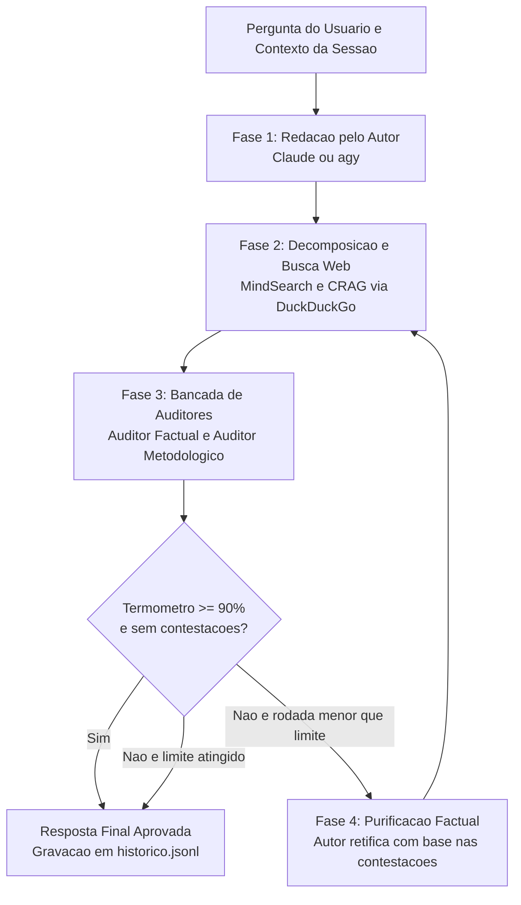

# Conversa de Pescador

O Conversa de Pescador é o assistente conversacional do jangada voltado a consultas técnicas de alta precisão, checagem factual rigorosa e depuração de hipóteses. Ele opera sem tocar na árvore de trabalho de projetos e sem exigir pasta de código, guardando seu histórico de sessões em `~/.local/state/jangada/pescador` e integrando suas métricas ao painel do jangada.

## Fundamentação Teórica

A arquitetura do Conversa de Pescador foi desenhada a partir das melhores práticas identificadas no estado da arte da literatura de inteligência artificial e em projetos de código aberto:

1. **Chain-of-Verification (CoVe, Meta AI):** a validação factual de afirmações é executada de forma desacoplada da redação do autor, confrontando os pontos contra evidências externas sem sofrer viés de confirmação (*sycophancy*).
2. **Decomposição em Grafos de Busca (MindSearch / STORM):** perguntas compostas são decompostas pelo planejador em duas ou três consultas de busca atômicas direcionadas na internet, cobrindo aspectos complementares (regras oficiais, cronologia e literatura técnica).
3. **Corrective RAG (CRAG):** as evidências coletadas na web passam por filtragem de ruído, remoção de duplicatas e priorização de fontes com autoridade antes de alimentarem o contexto dos auditores.
4. **Debate Multi-Agente Heterogêneo (Du et al., 2023):** o par de modelos cruza famílias distintas (Claude e Gemini via `claude` e `agy`), eliminando pontos cegos compartilhados por modelos de uma mesma linhagem.
5. **Purificação Iterativa (Self-Refine):** se o termômetro de veracidade apontar contestações ou grau de fato inferior a 90%, o autor recebe as contestações exatas e reescreve a resposta expurgando as falhas até a aprovação da bancada.

## Fluxo da Arquitetura

## Papéis dos Agentes

| Agente | Motor | Função Principal |
|---|---|---|
| **Pescador (Autor)** | Modelo configurado como autor (`claude` ou `agy`) | Elabora a resposta detalhada e explicativa; nas rodadas de purificação, reescreve o texto expurgando cada contestação apontada. |
| **Pesquisador de Fatos** | Modelo configurado como revisor (`agy` ou `claude`) | Decompõe a dúvida em consultas atômicas de busca, executa varredura web e sintetiza o dossiê de evidências e fontes. |
| **Auditor Factual** | Modelo configurado como revisor | Avalia afirmações específicas contra as evidências colhidas, classificando ponto a ponto em FATO REAL, CONVERSA DE PESCADOR ou CONTROVERSO. |
| **Auditor Metodológico** | Modelo configurado como revisor | Audita a consistência lógica, premissas implícitas, identificação causal, validade matemática e limites de escopo. |

## Pares de Modelos Suportados

A ferramenta suporta alternância livre entre pares de modelos pela flag `-p, --par` ou pelo comando `/par` no chat:

- `claude-agy` (padrão recomendado): Claude redige a resposta; o Gemini (`agy`) comanda a pesquisa e a bancada de auditores.
- `agy-claude`: Gemini redige a resposta; o Claude comanda a checagem crítica e a metodologia.
- `agy-agy`: Gemini atua como autor e revisor.
- `claude-claude`: Claude atua como autor e revisor.

## Ciclo de Purificação Iterativa

O parâmetro `--rodadas N` (padrão: 2; ajustável entre 1 e 4) controla o teto de refinamento:

1. **Rodada 1:** o Pescador formula a resposta explicativa. O Pesquisador colhe dados na internet e a bancada emite o diagnóstico inicial.
2. **Critério de Parada:** se o grau de fato atingir 90% ou mais sem nenhuma contestação de alucinação ou regra distorcida, o ciclo termina imediatamente com economia de tempo e tokens.
3. **Retificação (Rodadas seguintes):** se houver contestação, o autor recebe apenas as contestações formais levantadas pela bancada. O autor reescreve a resposta corrigindo cada falha. A bancada reavalia e o progresso (`R1: 75% -> R2: 95%`) é apresentado ao usuário.

## Integração ao Ecossistema Jangada

- **Isolamento e Segurança (Regra 1):** nenhum dado é lido ou gravado na árvore de código dos projetos. O histórico e as sessões ficam isolados em `~/.local/state/jangada/pescador` (com fallback automático para `$XDG_RUNTIME_DIR/jangada-pescador` em ambientes com restrição de permissão).
- **Painel Shiny de Indicadores:** o coletor do painel (`jangada-painel`) lê as consultas do Pescador e as consolida em `pesquisas.parquet`, exibindo volume de perguntas, evolução do termômetro de fato e distribuição por par de modelos.
- **Atalhos no Hyprland:**
  - `SUPER + P`: abre o chat conversacional em janela flutuante no terminal.
  - `SUPER + SHIFT + P`: abre o repositório de histórico com busca interativa via fzf e pré-visualização completa.
- **Voz Neural em Português:** com `-f, --falar`, narra a resposta e o diagnóstico via Piper TTS local; com `-o, --ouvir`, grava a dúvida via microfone pelo PipeWire e transcreve localmente via whisper-cpp.

## Comandos do Chat Interativo

Durante a sessão interativa, os seguintes comandos estão disponíveis:

- `/par [nome]`: mostra ou altera o par de modelos ativo (`claude-agy`, `agy-claude`, etc.).
- `/rodadas [N]`: ajusta o número máximo de rodadas de refinamento (1 a 4).
- `/sessao [nome]`: exibe ou alterna para outra sessão encadeada.
- `/contexto`: exibe os turnos acumulados e mantidos no contexto da conversa.
- `/novo`: inicia uma nova sessão limpa sem contexto prévio.
- `/historico`: abre o navegador de pesquisas salvas no fzf.
- `/falar`: alterna a leitura em voz alta.
- `/ouvir`: grava uma pergunta pelo microfone.
- `/sair`: encerra a aplicação.
