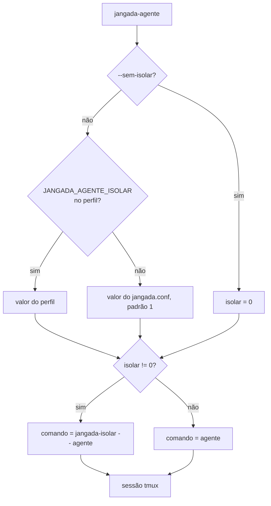
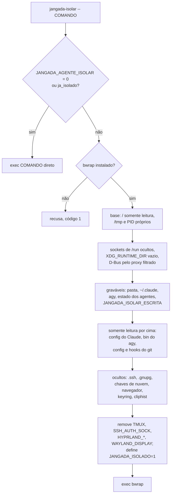
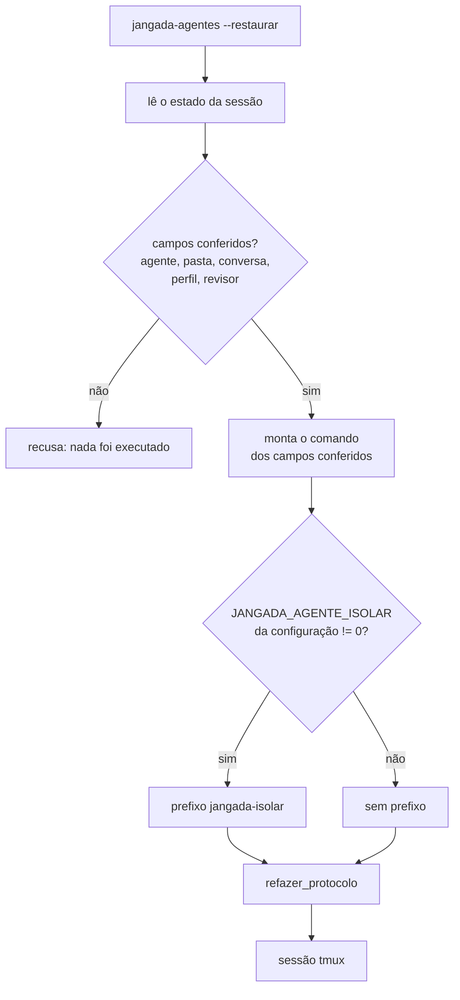

# Isolamento dos agentes

O agente (Claude ou agy) roda dentro do bubblewrap pelo `bin/jangada-isolar`.
Ele grava só na pasta da tarefa e no que o jangada libera; o resto da casa
fica somente leitura, e os segredos ficam ocultos. O objetivo é que nada do
que o agente fizer rode depois fora do isolamento: um hook do git, um
`settings.json` do Claude, um clone do AUR compilado com sudo.

## Modelo de ameaça

O agente é tratado como possivelmente hostil. Ele lê páginas, issues, logs e
documentos, e um texto preparado ali (injeção de prompt) faz um agente
comum agir contra o usuário. Por isso a pergunta que decide cada caso é: o
que o agente grava pode rodar depois fora do isolamento? Se pode, o jangada
confere antes (o `restaurar` recompõe o comando, o `jangada-validar` lê as
regras da base, o `jangada-update` mostra os commits) ou recusa (o
`install.sh` não instala da cópia de trabalho). O isolamento não protege
contra falha do próprio bubblewrap nem do kernel.

## Decisão de isolar

No `bin/jangada-agente`, `--sem-isolar` tem precedência; sem ela, vale o
`JANGADA_AGENTE_ISOLAR` do perfil e, depois, o da configuração. O prefixo
`jangada-isolar --` entra no comando da sessão. O campo `.isolar` do estado
da sessão é só para consulta.

## O que o jangada-isolar monta

A ordem importa: o bubblewrap aplica as montagens na sequência, e cada uma
vale por cima das anteriores. Por isso os graváveis vêm antes e o que precisa
ficar somente leitura dentro deles vem depois.

| Camada | O que entra | Por quê |
|---|---|---|
| Base | `/` somente leitura, `/dev`, `/proc`, `/tmp` próprio, `--unshare-pid`, `--die-with-parent` | um `rm` no `/tmp` não apaga os temporários do sistema; o agente não vê nem mata os processos da sessão, e o que ele deixou rodando morre com ele |
| `/run` | Docker, containerd, podman, tailscale, sshd local e D-Bus do sistema ocultos | esses sockets dão root ou mudam a máquina |
| `XDG_RUNTIME_DIR` | pasta vazia; o D-Bus da sessão volta pelo `xdg-dbus-proxy`, que só deixa falar com `org.freedesktop.secrets` e `org.freedesktop.Notifications` | some o socket do Hyprland (`hyprctl dispatch` rodaria comando fora), do Wayland, do gpg-agent e do systemd do usuário; o agy lê o login do keyring e os hooks avisam pelo `notify-send` |
| Graváveis | pasta da tarefa, `~/.claude`, `~/.gemini/antigravity-cli`, `agentes/`, `validar.jsonl`, `eventos-agentes.jsonl` e `delegacoes.jsonl` do estado, e o que estiver em `JANGADA_ISOLAR_ESCRITA` | o resto do estado (barra, marcas das migrações) alimenta código que roda fora |
| Camada temporária | `~/.cache` e, do Claude, `shell-snapshots`, `session-env` e `ide` | o agente lê o conteúdo de fora, e o que grava some no fim (sobreposição do bwrap; sem suporte, fica gravável) |
| Somente leitura | do Claude: `settings*.json`, `CLAUDE.md`, `commands`, `agents`, `skills`, `hooks`, `plugins`, scripts soltos; do agy: `bin`; clones do AUR | tudo isso define comando ou instrução que valeria numa sessão aberta fora |
| Git | num worktree, o `.git` comum inteiro somente leitura, liberados `objects`, `refs`, `logs` e o gitdir do worktree; direto no repositório, `config`, `hooks`, `commondir`, `worktrees` e `modules` somente leitura | `core.fsmonitor`, hooks e `commondir` rodariam fora no próximo `git status` |
| Ocultos | `.ssh`, `.gnupg`, `.password-store`, `.aws`, `.azure`, `.kube`, `.docker`, `.netrc`, `.git-credentials`, `gh`, `rclone`, perfis de navegador, keyrings e o banco do `cliphist`; `JANGADA_ISOLAR_OCULTAR` troca a lista | segredos e o histórico da área de transferência |

Para ver os argumentos sem abrir nada: `jangada-isolar --mostrar -- true`.

## A marca de isolamento

`ja_isolado` em `bin/jangada-isolar` só aceita a marca quando as duas coisas
valem: `JANGADA_ISOLADO` no ambiente e o ponto de montagem
`/tmp/.jangada-isolado` em `/proc/self/mountinfo`. Qualquer processo cria um
arquivo no `/tmp`, mas só quem monta cria um ponto de montagem; por isso a
variável herdada não basta para pular o isolamento.

## Falhas

- Sem `bwrap`: o `jangada-isolar` recusa com código 1 e diz como abrir mesmo
  assim (`jangada-agente --sem-isolar` ou `JANGADA_AGENTE_ISOLAR=0`).
- Sem proxy do D-Bus (programa ausente ou sem resposta em 5 segundos): o
  agente abre sem D-Bus, e o agy não acha o login.
- Apagar ramo ou tag e o `git gc` falham dentro de um worktree, porque
  regravam o `packed-refs`, que fica na raiz somente leitura.

## Restauração

`restaurar` em `bin/jangada-agentes` nunca executa o `.comando` nem lê o
`.isolar` do estado: o arquivo fica numa pasta que o agente grava, e um
agente poderia trocar o comando ou desligar o isolamento da próxima abertura.
O perfil também não desliga o isolamento na restauração. O protocolo é
refeito numa gravação por `mv -fT`, que não segue um link plantado.

## Testes

| Arquivo | O que cobre |
|---|---|
| `testes/isolar.sh` | argumentos do bwrap (gravável, somente leitura, oculto, `/tmp`, marca), repositório direto, `JANGADA_AGENTE_ISOLAR=0`, variável sem marca não dispensa, recusa sem bwrap e um isolamento de verdade: gravação, commit, chave oculta, D-Bus restrito e PID próprio |
| `testes/restaurar.sh` | comando gravado e `.isolar: false` ignorados, `JANGADA_AGENTE_ISOLAR=0` abre fora, campos inválidos recusados, perfil não desliga o isolamento, protocolo refeito sem seguir link |

O `testes/isolar.sh` só passa fora do isolamento: dentro de uma sessão do
agente, o bwrap não cria outro. Rode num terminal comum.

Veja também o [ciclo da tarefa](ciclo-da-tarefa.md) e a seção de isolamento
da skill em `default/claude/skills/jangada/agentes.md`.
