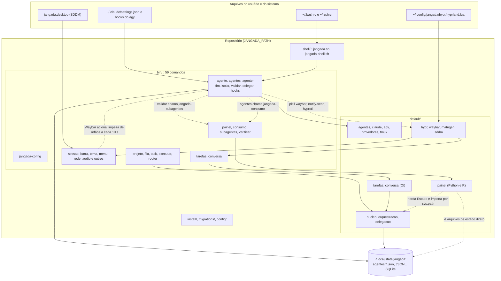
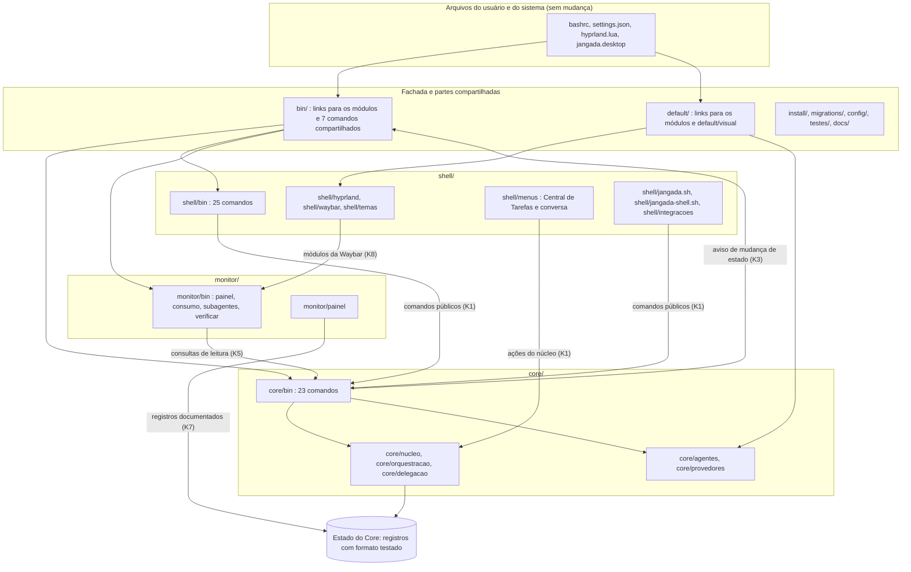

# 2, 3 e 4. Arquitetura atual, proposta e matriz de dependências

## 2. Arquitetura atual

As pastas seguem o tipo do arquivo (`bin/`, `default/`), não o módulo. As
setas tracejadas são os acoplamentos que a modularização precisa desfazer.

## 3. Arquitetura proposta

Regras da proposta:

1. O Core não chama nada do Shell nem do Monitor. O aviso de mudança de
   estado passa por uma função compartilhada (K3), e a falta de interface
   gráfica não muda o resultado de nenhum comando do Core.
2. O Shell usa o Core só por comandos públicos e pelas ações do núcleo.
3. O Monitor só lê. Ele nunca chama comando que altera estado.
4. Shell e Monitor podem ser removidos da árvore sem que os testes do Core
   falhem. Esse é o teste de fronteira (K9).

### Correspondência com o esboço

| Pasta do esboço | Onde fica na proposta | Motivo |
|---|---|---|
| `core/agentes` | `core/agentes` | perfis, subagentes, skills, hooks, tmux |
| `core/provedores` | `core/provedores` | igual |
| `core/projetos`, `core/tarefas`, `core/execucao`, `core/persistencia` | `core/nucleo`, `core/orquestracao`, `core/delegacao` | os pacotes Python atuais não têm esse corte; dividir exige reescrever importações (D4) |
| `core/seguranca` | `core/bin/jangada-isolar` e `jangada-validar` | são comandos, não pastas |
| `shell/hyprland`, `shell/waybar`, `shell/temas`, `shell/menus`, `shell/integracoes` | iguais | |
| `shell/atalhos` | `shell/hyprland/atalhos.lua` | é um arquivo só |
| `monitor/painel` | `monitor/painel` | igual |
| `monitor/indicadores`, `monitor/historico`, `monitor/diagnosticos` | `monitor/bin` e `monitor/painel` | hoje não há arquivos que justifiquem as três pastas |
| `tests/`, `scripts/` | `testes/`; `scripts/` não é criada | D5 |

## 4. Matriz de dependências

Leitura: a linha depende da coluna. "Hoje" é o que o código faz; "Alvo" é o
que os contratos permitem.

| De \ Para | Core | Shell | Monitor | Compartilhado |
|---|---|---|---|---|
| **Core, hoje** | | `pkill` da Waybar (`jangada-config:538-539`, `hook-claude:118`, `hook-agy:65`, `hook-codex:41`, `isolar:628`), `notify-send` nos hooks, `hyprctl` (`agentes:389,416,419,460`) | `jangada-subagentes` (`validar:159`), `jangada-consumo` (`agentes:635`) | `jangada-config`, `jangada-gancho` |
| **Core, alvo** | | nenhuma | nenhuma obrigatória; resumo de entrega opcional (K6) | `jangada-config` (aviso K3), `jangada-gancho` |
| **Shell, hoje** | comandos públicos; Central usa `nucleo.acoes`; `--waybar` aciona limpeza de órfãos | | `jangada-painel --waybar`, entradas do menu | `jangada-config`, `install/lib.sh` (tema, sddm), `default/visual` |
| **Shell, alvo** | comandos públicos e `nucleo.acoes` (K1); limpeza explícita (K4) | | módulos da Waybar (K8) | igual |
| **Monitor, hoje** | herda `Estado` (`painel/orquestracao.py:18`), importa por `sys.path` (`coletor.py:52,56`, `orquestracao.py:9,11`), lê `agentes/*.json`, JSONL e SQLite direto | nenhuma | | `jangada-config`, `default/visual` |
| **Monitor, alvo** | consultas de leitura (K5) e registros com formato testado (K7) | nenhuma | | igual |

Todas as chamadas atuais do Core ao Shell terminam em `|| true`: são
opcionais na execução, mas existem no código e por isso entram na lista de
exceções do teste de fronteira até serem retiradas.

Há ainda um ciclo dentro do Core, entre `nucleo` e `orquestracao`
(`nucleo/consultas.py:14` e `orquestracao/cli.py:23`). Ele não cruza módulo
e fica fora desta modularização.
