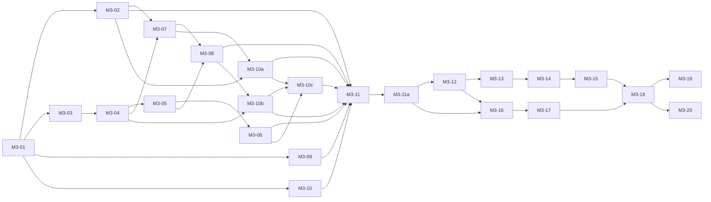

# 6. Backlog multiagentes

Vinte e quatro tarefas em quatro ondas. A situação das entregas aparece abaixo.

## Regras de execução

1. Cada tarefa sobe por `jangada-agente`, em worktree e ramo próprios
   (`agente/m3-NN-...`), dentro do isolamento padrão. Nenhuma permissão de
   isolamento muda.
2. O agente só grava nos arquivos permitidos da tarefa. Alteração fora da
   lista reprova a entrega.
3. Arquivos compartilhados têm um dono por vez. As dependências abaixo
   põem em fila as tarefas que tocam `bin/jangada-config`,
   `testes/verificar.sh` e `testes/regra1.sh`. Divergência registrada, sem
   ajuste desta regra: nos pares da Onda C (D11), duas tarefas editam
   `testes/contratos/modulos.txt` ao mesmo tempo, sob a regra do rebase
   descrita no molde comum da Onda C.
4. Toda entrega passa por `testes/verificar.sh` com saída 0 e por
   `jangada-validar` com revisor de outro modelo. Quem escreveu não aprova.
5. A integração no `main` exige confirmação humana por entrega, uma tarefa
   por vez. Até a M3-11a, é manual e `jangada-agente-fim --integrar` segue
   bloqueado. Depois da M3-11a, o botão ou o alt+i é o gesto de aprovação,
   sujeito às conferências da tarefa.
6. A cópia instalada só muda por `jangada-update`, quando o usuário quiser.

## Papéis e provedores

Só `claude` e `codex` abrem sessão principal (`docs/provedores.md`). `agy` e
`ollama` servem para delegação de leitura. No `jangada-router status` de
09/10/2026, `agy` e `local` aparecem sem observação de capacidade.

| Papel | Provedor | Revisor |
|---|---|---|
| Coordenador | sessão do usuário com Claude | usuário |
| Agente Core | `claude` | `codex` |
| Agente Shell | `claude` | `codex` |
| Agente Monitor | `claude` | `codex` |
| Agente Revisor | o modelo cruzado de cada tarefa, por `jangada-validar` | |
| Apoio de leitura | subagentes `explorador`, `arquiteto`, `verificador`; `agy` ou `ollama` por `jangada-delegar` | |

Decisão do usuário em 10/10/2026 (D10): as tarefas novas abertas por
criação de agentes têm `claude` como autor e `codex` como revisor, o que
mantém a revisão cruzada. Até essa data o Agente Shell era `codex`, com
revisor `claude`. As tarefas já integradas (M3-06 e M3-10) não mudam.

No máximo duas sessões de escrita ao mesmo tempo, as duas com `claude` como
autor e `codex` como revisor (D10 e D11). A regra anterior era uma sessão
por provedor.

## Ordem

A Onda C corre em duas frentes (D11): M3-12 sozinha; depois M3-13 e M3-16
em paralelo; depois M3-14 e M3-17 em paralelo; depois M3-15 e, por último,
M3-18. As etapas e a regra do rebase estão no molde comum da Onda C.

Aprovação humana obrigatória antes de M3-01 (este plano), antes de M3-11
(estrutura) e antes de M3-12 (primeira mudança de pasta). A M3-11a vem
logo depois do portão da M3-11 e antes da M3-12; não dispensa a confirmação
humana de nenhuma entrega.

## Onda A: contratos e desacoplamento, sem mover arquivo

### M3-01 Testes da fachada e dos caminhos legados

| Campo | Conteúdo |
|---|---|
| Objetivo | Criar os testes de K1 e K2 e fazer o `verificar.sh` rodar todo `testes/contratos-*` por padrão de nome; confirmar a tabela de testes por módulo (inventário 1.6) |
| Agente | Core (`claude`), revisor `codex` |
| Arquivos permitidos | `testes/contratos-fachada.sh`, `testes/contratos-caminhos.sh`, `testes/contratos/comandos.txt`, `testes/contratos/caminhos.txt`, `testes/verificar.sh`, `docs/modularizacao-3.0/01-inventario.md` |
| Dependências | aprovação deste plano |
| Aceitação | os dois testes passam no `main` atual sem nenhuma outra mudança; retirar um comando de `bin/` em cópia temporária faz o teste falhar |
| Testes | `testes/verificar.sh` |
| Riscos | lista congelada incompleta |
| Reversão | `git revert` do commit; só há arquivos novos e um passo no `verificar.sh` |

### M3-02 Prova dos links simbólicos

| Campo | Conteúdo |
|---|---|
| Objetivo | Responder, com evidência, se links relativos funcionam em todo o ciclo; a worktree é descartável e nada dela é integrado além do relatório |
| Agente | Core (`claude`), revisor `codex` |
| Arquivos permitidos | qualquer um dentro da worktree da prova; entrega só `docs/modularizacao-3.0/prova-links.md` |
| Dependências | M3-01 |
| Aceitação | relatório com resultado de: um comando de cada módulo movido com link em `bin/`; `default/waybar` e `default/painel` trocados por link de pasta; `verificar.sh` completo; `jangada-isolar` com o link visível no isolamento; `jangada-update` em cópia instalada falsa; `shellcheck` e `regra1.sh` seguindo links; `install.sh` com `JANGADA_SIMULAR=1`; `git archive` e clone novo preservando os links |
| Testes | os do relatório |
| Riscos | conclusão negativa, que troca D2 para arquivos de repasse |
| Reversão | não há integração de código |

Pontos já conhecidos que a prova precisa cobrir: `Path(__file__).resolve()`
segue links em 16 arquivos Python de `default/`, e `jangada-agente-fim` usa `realpath`; `regra1.sh`
varre `bin/` (linhas 98, 99 e 124); `jangada-isolar` recusa links em
alguns caminhos de estado (linha 325).

### M3-03 Teste de fronteira

| Campo | Conteúdo |
|---|---|
| Objetivo | Criar `testes/fronteiras.sh` (K9) com a lista inicial de exceções igual aos acoplamentos do inventário |
| Agente | Core (`claude`), revisor `codex` |
| Arquivos permitidos | `testes/fronteiras.sh`, `testes/contratos/fronteiras-excecoes.txt`, `testes/contratos/modulos.txt` |
| Dependências | M3-01 |
| Aceitação | passa no `main`; cada exceção cita arquivo, linha e contrato ou a marca provisória `sem-contrato`; acrescentar um `hyprctl` em arquivo do Core faz falhar |
| Testes | `testes/verificar.sh` |
| Riscos | falso positivo em comentário ou texto de ajuda |
| Reversão | `git revert`; só arquivos novos |

Situação em 09/10/2026: M3-03 entregue no commit `e654742` e integrada ao
`main` por aceitação humana, sem parecer aprovado. O `jangada-validar`
atingiu o limite de três rodadas com `REVISAR`. Foram aceitos dois pontos:
os limites da leitura por expressão regular, registrados no cabeçalho de
`testes/fronteiras.sh`, e a pendência dos 20 acoplamentos que nenhum contrato
de K3 a K6 retira, registrados como `sem-contrato` em
`testes/contratos/fronteiras-excecoes.txt`. A lista contém seis aberturas de
janela ou terminal do Shell pelo Core e uma chamada para criar snapshot pelo
Shell; quatro chamadas do Core ao Hyprland; oito leituras diretas de arquivo
de estado pelo Shell; e uma abertura de sessão de agente por
`jangada-verificar` (6 + 1 + 4 + 8 + 1 = 20). Cada item precisa de contrato,
de mudança de módulo ou de exceção permanente decidida antes do portão da
M3-11 (D8).

Situação em 10/10/2026: D8 decidida pelo usuário. As seis aberturas e as
quatro chamadas ao Hyprland saem pelo contrato K10 (M3-10b). Das oito
leituras do Shell, as quatro montagens do caminho saem pelo caminho único
de K5 e a de `_jangada_sessao_atual` sai pela consulta K4 (M3-10c); a de
`central.py` fica como exceção se o modo `--simular` precisar do padrão.
Ficam como exceção permanente, com motivo, o snapshot, o `jangada-verificar
--agente`, o `repassar` e os dois trechos de `observar_estado`. São 15
retirados e 5 permanentes, ou 14 e 6. As linhas citadas na lista de
exceções andaram desde a M3-03: em `bin/jangada-agentes`, 389, 416, 419,
422, 425, 460 e 717 são hoje 390, 417, 420, 423, 426, 461 e 716; em
`default/tarefas/janela.py`, 256, 691 e 697 são hoje 259, 694 e 700. O
trecho de cada exceção não mudou. Ver
[03-contratos.md](03-contratos.md#exceções-permanentes-de-k9).

### M3-04 Aviso de mudança de estado (K3)

| Campo | Conteúdo |
|---|---|
| Objetivo | Trocar as chamadas diretas à Waybar e ao `notify-send` no Core pelas funções de `jangada-config` |
| Agente | Core (`claude`), revisor `codex` |
| Arquivos permitidos | `bin/jangada-config`, `bin/jangada-hook-claude`, `bin/jangada-hook-agy`, `bin/jangada-hook-codex`, `bin/jangada-isolar`, `testes/contratos/fronteiras-excecoes.txt`, um teste novo `testes/contratos-aviso.sh` |
| Dependências | M3-03 |
| Aceitação | mesmas exceções retiradas da lista; barra continua atualizando ao mudar o estado de uma sessão; comandos saem com 0 sem `WAYLAND_DISPLAY` |
| Testes | `testes/hooks.sh`, `testes/eventos.sh`, `testes/barra.sh`, `testes/isolar.sh`, `verificar.sh` |
| Riscos | perder o sinal em um dos cinco pontos |
| Reversão | `git revert`; sem mudança de estado em disco |

### M3-05 Consulta de sessões sem efeito, lado do Core (K4)

| Campo | Conteúdo |
|---|---|
| Objetivo | Tirar `limpar_orfaos` das consultas de `jangada-agentes` e criar `--limpar-orfaos` |
| Agente | Core (`claude`), revisor `codex` |
| Arquivos permitidos | `bin/jangada-agentes`, `testes/contratos-consulta.sh`, `docs/ciclo-da-tarefa.md` |
| Dependências | M3-04, decisão D6 |
| Aceitação | as três consultas não alteram nenhum arquivo do estado; `--limpar-orfaos` remove a órfã do teste |
| Testes | `testes/eventos.sh`, `testes/fim.sh`, `verificar.sh` |
| Riscos | órfãs acumulam até M3-06 ser integrada |
| Reversão | `git revert` junto com M3-06 |

### M3-06 Consulta de sessões sem efeito, lado do Shell (K4)

| Campo | Conteúdo |
|---|---|
| Objetivo | `jangada-tarefas --waybar` chama a limpeza explícita antes da consulta |
| Agente | Shell (`codex`), revisor `claude` |
| Arquivos permitidos | `bin/jangada-tarefas`, `default/tarefas/central.py` se a chamada estiver nele, `testes/tarefas.sh` |
| Dependências | M3-05; as duas são integradas no mesmo dia |
| Aceitação | contador da barra igual ao de antes com uma sessão órfã falsa |
| Testes | `testes/tarefas.sh`, `testes/tarefas.py`, `testes/barra.sh`, `verificar.sh` |
| Riscos | limpeza dobrada ou custo a cada 10 s |
| Reversão | `git revert` junto com M3-05 |

### M3-07 Leitura da fila pelo Monitor (K5)

| Campo | Conteúdo |
|---|---|
| Objetivo | `painel/orquestracao.py` e `coletor.py` deixam de herdar `Estado` e de montar `sys.path` por `resolve()`; passam a usar `nucleo.consultas` e `JANGADA_CORE_PY` |
| Agente | Monitor (`claude`), revisor `codex` |
| Arquivos permitidos | `default/painel/orquestracao.py`, `default/painel/coletor.py`, `bin/jangada-config` (só a variável nova), `bin/jangada-painel`, `default/painel/app.R`, `default/painel/fichas.R`, `default/painel/operacional.R`, `testes/painel-motores.R`, `testes/painel-operacional.R`, `testes/painel-orquestracao.py`, `testes/contratos/fronteiras-excecoes.txt` |
| Dependências | M3-04 (fila do `jangada-config`), M3-02 |
| Aceitação | painel mostra os mesmos números com o banco somente leitura; exceções retiradas; ressalva 1: `JANGADA_CORE_PY` permite importar `coletor` e `orquestracao` com `default/painel` como link; o app R recebe `JANGADA_PATH` e carrega visual, logo e monitoramento sem depender de `getwd()`, antes da M3-17 |
| Testes | `testes/painel-orquestracao.py`, `testes/painel-local.py`, `testes/painel.sh`, `testes/painel-motores.R`, `testes/painel-operacional.R`, `verificar.sh` |
| Riscos | consulta que dependia de método herdado sem equivalente de leitura |
| Reversão | `git revert` |

### M3-08 Resumo de entrega (K6)

| Campo | Conteúdo |
|---|---|
| Objetivo | Função do resumo de entrega passa para `default/delegacao/`; `jangada-subagentes --entrega` a chama; `validar` e `agentes` toleram a falta dos comandos do Monitor |
| Agente | Core (`claude`), revisor `codex` |
| Arquivos permitidos | `default/delegacao/entrega.py` (novo), `default/painel/subagentes.py`, `bin/jangada-subagentes`, `bin/jangada-validar` (só o trecho da linha 159), `bin/jangada-agentes` (só o trecho da linha 635), `testes/validar.sh`, `testes/subagentes.sh`, lista de exceções |
| Dependências | M3-07 (mesma pasta `default/painel`), M3-05 (mesmo `jangada-agentes`) |
| Aceitação | parecer idêntico com e sem `jangada-subagentes` no `PATH`; saída de `--entrega` idêntica byte a byte à atual em três amostras; ressalva 3, `jangada-subagentes`: usa `JANGADA_PATH` em vez do `realpath` da linha 13 e executa pela fachada com destino em `monitor/bin`, antes da M3-17 |
| Testes | `testes/validar.sh`, `testes/subagentes.sh`, `testes/amostras-subagentes.py`, `verificar.sh` |
| Riscos | mexer no `jangada-validar`, que é a porta de aprovação |
| Reversão | `git revert` |

### M3-09 Testes de formato dos registros (K7)

| Campo | Conteúdo |
|---|---|
| Objetivo | Criar `testes/contratos-registros.py` para as cinco seções de `docs/registros.md` |
| Agente | Monitor (`claude`), revisor `codex` |
| Arquivos permitidos | `testes/contratos-registros.py`, `testes/contratos/registros.json`, `docs/registros.md` (só correção de divergência achada) |
| Dependências | M3-01 |
| Aceitação | passa no `main`; renomear um campo em cópia temporária faz falhar |
| Testes | `verificar.sh` |
| Riscos | documento divergir do código; a divergência vira achado, não correção silenciosa |
| Reversão | `git revert`; só arquivos novos |

### M3-10 Teste único dos módulos da Waybar (K8)

| Campo | Conteúdo |
|---|---|
| Objetivo | `testes/barra.sh` confere `text`, `tooltip` e `class` dos três comandos `--waybar` |
| Agente | Shell (`codex`), revisor `claude` |
| Arquivos permitidos | `testes/barra.sh` |
| Dependências | M3-01 |
| Aceitação | passa no `main`; saída sem `class` falha |
| Testes | `verificar.sh` |
| Riscos | baixo |
| Reversão | `git revert` |

### M3-10a Caminhos independentes da pasta física (K5)

| Campo | Conteúdo |
|---|---|
| Tarefa | M3-10a, Onda A |
| Objetivo | Corrigir os caminhos da Central, do hook leitor e do hook do Codex; ampliar a conferência de processos da atualização, conforme a prova |
| Agente | Core (`claude`), revisor `codex` |
| Arquivos permitidos | `default/tarefas/janela.py`, `bin/jangada-hook-leitor`, `bin/jangada-codex`, `bin/jangada-update`, `testes/tarefas.py`, `testes/tarefas.sh`, `testes/hooks.sh`, `testes/codex.sh`, `testes/update.sh`, `testes/update-codigo.py` |
| Dependências | M3-02, M3-07 (variáveis de K5) |
| Aceitação | ressalva 2: importação de `visual` (linha 25) e logo (linha 658) usam `JANGADA_PATH` e funcionam com `default/tarefas` e `default/logo` como links, antes da M3-13 e M3-15; ressalva 3: `jangada-hook-leitor:15` usa `JANGADA_PATH` e executa pelo link, e `jangada-codex:101,102` registra o hook pela fachada sem `realpath`; o hook altera de fato o estado da sessão, antes da M3-18; ressalva 5: atualização recusa processos com caminhos em `core/`, `shell/` e `monitor/`, além dos legados, em instalação falsa |
| Testes | `testes/tarefas.py`, `testes/tarefas.sh`, `testes/hooks.sh`, `testes/codex.sh`, `testes/update.sh`, `testes/update-codigo.py`, `testes/verificar.sh` |
| Riscos | hook sair com 0 sem atualizar o estado; conferência de processos incluir a própria atualização |
| Reversão | `git revert`; sem mudança de pasta |

### M3-10b Abertura de interface e foco de janela (K10)

| Campo | Conteúdo |
|---|---|
| Tarefa | M3-10b, Onda A |
| Objetivo | Criar em `bin/jangada-config` as funções de K10 e trocar por elas as dez chamadas dos grupos A e B da D8 em `bin/jangada-agente` e `bin/jangada-agentes`; sem mudança de comportamento com sessão gráfica |
| Agente | Core (`claude`), revisor `codex` |
| Arquivos permitidos | Prováveis: `bin/jangada-config`, `bin/jangada-agente`, `bin/jangada-agentes`, `testes/contratos/fronteiras-excecoes.txt`, `testes/fronteiras.sh` (só o teto), o teste que cobrir as funções |
| Dependências | M3-04 (forma do K3 em `bin/jangada-config`), M3-08 (mesmo `bin/jangada-agentes`), decisão D8 |
| Aceitação | as dez exceções saem da lista e o teto de `sem-contrato` passa de 20 para 10; o Core não cita `jangada-terminal`, `jangada-tarefas` nem `hyprctl` fora de `bin/jangada-config`; sem sessão gráfica, as funções avisam e saem com 0; com `hyprctl` e `jangada-terminal` falsos, os argumentos recebidos são os de hoje, inclusive `exec` onde há `exec` e terminal solto em `focar`; `testes/verificar.sh` sai com 0 fora do isolamento e com sessões de agente abertas na máquina; o teste novo isola o tmux, `HOME` e `XDG_STATE_HOME` |
| Testes | `testes/fronteiras.sh`, `testes/eventos.sh` (troca de foco), `testes/contratos-aviso.sh` ou o teste novo das funções, `testes/verificar.sh` |
| Riscos | trocar `exec` por chamada comum e deixar processo pendurado; perder o terminal solto de `focar` e prender o atalho; aviso sem sessão gráfica sair em código diferente de 0 e quebrar quem chama |
| Reversão | `git revert` do commit; sem mudança de estado em disco |

### M3-10c Caminho único do estado e sessão atual pela consulta (K4, K5)

| Campo | Conteúdo |
|---|---|
| Tarefa | M3-10c, Onda A |
| Objetivo | Exportar a pasta de sessões por variável de `bin/jangada-config` e retirar a montagem do caminho de `jangada-tarefas` e da Central; fazer `_jangada_sessao_atual` usar `jangada-agentes --lista`; trocar a marca `sem-contrato` das exceções permanentes por marca própria com motivo |
| Agente | Shell (`claude`), revisor `codex`, por decisão do usuário na D8 |
| Arquivos permitidos | Prováveis: `bin/jangada-config`, `bin/jangada-tarefas`, `default/tarefas/central.py`, `default/tarefas/dados.py`, `default/tarefas/janela.py`, `shell/jangada-shell.sh`, `testes/contratos/fronteiras-excecoes.txt`, `testes/fronteiras.sh`, `testes/tarefas.py`, `testes/tarefas.sh`, `testes/reverter.sh` ou o teste que cobrir `_jangada_sessao_atual`, `testes/snapshot.sh` |
| Dependências | M3-10b (mesmo `bin/jangada-config`, mesma lista de exceções e mesmo teto), M3-06 (mesmo `bin/jangada-tarefas`), M3-10a (mesmo `janela.py`), decisão D8 |
| Aceitação | saem da lista as quatro exceções do grupo E e a de `_jangada_sessao_atual`; as exceções do snapshot, do `jangada-verificar --agente`, do `repassar` e dos dois trechos de `observar_estado` passam a uma marca própria com motivo; o teto de `sem-contrato` vai a zero e a marca nova tem teto próprio de 5, ou 6 se o modo `--simular` precisar do padrão (a conferência do número de tetos em `testes/fronteiras.sh` muda junto); caso de teste mostra que `jangada-agente --snapshot` abre a sessão sem `jangada-snapshot` no `PATH`; `_jangada_sessao_atual` devolve a mesma sessão de hoje para um worktree de agente; a decisão sobre `dados.py`, em `registro(pasta, nome)`, fica registrada (exceção ou campos a mais na consulta K4); `testes/verificar.sh` sai com 0 fora do isolamento e com sessões de agente abertas na máquina; o teste novo isola o tmux, `HOME` e `XDG_STATE_HOME` |
| Testes | `testes/fronteiras.sh`, `testes/tarefas.py`, `testes/tarefas.sh`, `testes/barra.sh`, `testes/reverter.sh`, `testes/snapshot.sh` com o caso novo, `testes/verificar.sh` |
| Pontos a conferir | o modo `--simular` calcula o caminho em `central.py:121` sem `--estado`; a consulta K4 devolve `dir`, não `worktree`, e lista só sessões vivas ou guardadas, o que pode mudar o resultado de `_jangada_sessao_atual` em sessão `--direto` ou encerrada; `dados.py:132` e `janela.py:683` derivam `XDG_STATE_HOME` da pasta de sessões |
| Riscos | Central abrir em pasta de estado diferente da do Core; `_jangada_sessao_atual` deixar de achar a sessão e `repassar` ou `reverter` agirem sobre a sessão errada; consulta lenta no prompt do shell |
| Reversão | `git revert` do commit; sem mudança de estado em disco |

## Onda B: estrutura (Fase 3)

### M3-11 Pastas dos módulos e ferramentas que seguem as duas localizações

| Campo | Conteúdo |
|---|---|
| Objetivo | Criar `core/`, `monitor/` e as subpastas novas de `shell/`, cada uma com um `LEIAME.md` que cita este plano; fazer `verificar.sh`, `regra1.sh` e a integração contínua examinarem também `core/bin`, `shell/bin` e `monitor/bin` |
| Agente | Core (`claude`), revisor `codex` |
| Arquivos permitidos | `core/LEIAME.md`, `monitor/LEIAME.md`, `shell/LEIAME.md`, `testes/verificar.sh`, `testes/regra1.sh`, `testes/contratos-fachada.sh`, `testes/fronteiras.sh`, `.github/workflows/verificar.yml`, `AGENTS.md` (só a frase que lista as pastas conferidas pelo `regra1.sh`) |
| Dependências | M3-02 com conclusão positiva, M3-06, M3-08, M3-09, M3-10, M3-10a, M3-10b, M3-10c, aprovação humana |
| Aceitação | nenhum arquivo movido; `shell/jangada.sh` e `shell/jangada-shell.sh` intactos (mesmo `sha256sum`); `verificar.sh` com saída 0; um arquivo de teste posto em `core/bin` é examinado pelo shellcheck e pelo `regra1.sh`; ressalva 4: `testes/contratos-fachada.sh` e `testes/fronteiras.sh` copiam também `core/`, `shell/` e `monitor/`; passam em cópia temporária com os links da prova |
| Testes | `verificar.sh`, `regra1.sh` |
| Riscos | padrões de nome do `verificar.sh` deixarem arquivo sem exame |
| Reversão | `git revert`; pastas novas só têm `LEIAME.md` |

### M3-11a Integração supervisionada pelo botão e por alt+i

| Campo | Conteúdo |
|---|---|
| Objetivo | Restaurar a integração pelo botão da Central de Tarefas e por alt+i, conforme decisão do usuário em 09/10/2026; é restauração de comportamento existente |
| Primeira etapa | Reconstituir, pelo diff do commit `7707e86` e pelos testes removidos, o que a integração antiga fazia e qual era o risco ao trabalho concorrente; o que não estiver no commit ou no código fica a reconstituir na M3-11a |
| Agente | Core (`claude`), revisor `codex` |
| Arquivos permitidos | Prováveis: `bin/jangada-agente-fim`, `testes/fim.sh`, `testes/update.sh`, `docs/ciclo-da-tarefa.md`, `default/claude/skills/jangada/agentes.md`, `default/claude/skills/jangada/SKILL.md`; `bin/jangada-agentes` e `default/tarefas/janela.py` só se a chamada precisar mudar |
| Dependências | M3-11 e seu portão de aprovação humana; executar antes da M3-12 e das mudanças de pasta da Onda C |
| Aceitação | Só aceita parecer `APROVADO` de revisão independente, gravado fora do isolamento, correspondente ao SHA a integrar. Faz rebase do ramo sobre a base na worktree da tarefa, sem tocar na cópia principal durante a preparação. Se o rebase mudar o SHA, exige parecer para o novo SHA. Roda `testes/verificar.sh` fora do isolamento com saída 0. Integra só por avanço rápido (`merge --ff-only`). Recusa sem alterar nada se a base andou desde a conferência ou se a cópia principal tem alterações. Decisão do usuário em 10/10/2026: essa recusa vale até a última conferência, sob a trava; a janela entre ela e o merge é detectada pelo reflog depois do avanço, com aviso e saída com erro, sem desfazer. A confirmação humana por entrega continua obrigatória: o botão ou o alt+i é o gesto de aprovação. Não envia ao remoto, não roda `jangada-update`, mantém ramo e worktree; `--sem-revisao` continua sem liberar |
| Testes | `testes/fim.sh`, `testes/update.sh`, `testes/verificar.sh`; comprovar aprovação para o SHA final, recusa por base alterada ou cópia principal com alterações, preservação de trabalho concorrente, ramo e worktree, e ausência de envio ao remoto e de `jangada-update` |
| Riscos | Merge fora do isolamento a partir de estado gravável pelo agente: manter o `conferir_estado`. Perda de trabalho concorrente. Custo de cerca de quatro minutos da suíte por integração |
| Reversão | `git revert` do commit, voltando à recusa de integração |

Estado atual: o commit `7707e86`, de 08/10/2026, tem a mensagem
"bloqueia integração automática para preservar trabalho concorrente".
Seu diff retira o merge `--no-ff` na cópia principal e a recuperação com
`reset --hard`. O comentário da trava diz que ela não impede editores ou
Git externo. Os testes de integração são substituídos por testes de recusa
que preservam arquivos, índice, HEAD, sessão e worktree.
`bin/jangada-agentes` ainda chama `--integrar` por alt+i;
`default/tarefas/janela.py` confirma os SHA e chama `--integrar --confirmacao`.
Ambas as chamadas continuam sujeitas à recusa atual.

## Onda C: migração (Fase 4)

Molde comum às tarefas M3-12 a M3-18: `git mv` da origem para o destino,
link relativo no caminho antigo no mesmo commit, sem correções de conteúdo.
Ressalva 4: cada tarefa inclui `testes/contratos/modulos.txt` nos arquivos
permitidos e atualiza a lista junto com cada mudança de pasta. Ressalva 6:
a conferência das renomeações usa `git diff -M -B --stat`.
Aceitação comum: `verificar.sh` com saída 0, testes de K1, K2 e K9 passando
com `modulos.txt` atualizado; `git diff -M -B --stat` mostra só renomeações
e links, além da atualização dessa lista. Reversão comum: `git revert` do
commit único da tarefa; como os caminhos antigos continuam válidos,
a cópia instalada volta por
`jangada-update` sem migração.

Ordem em duas frentes, por decisão do usuário em 10/10/2026 (D11):

1. M3-12 sozinha, com o portão humano e a conferência na sessão gráfica
   (teste em Hyprland aninhado antes de integrar).
2. M3-13 e M3-16 em paralelo.
3. M3-14 e M3-17 em paralelo.
4. M3-15, depois M3-18.

M3-12 continua a primeira e M3-18 a última, pelos motivos escritos nos
riscos de cada uma. A M3-16 passa a depender também da M3-12 integrada.

Regra do rebase em cada par: uma tarefa integra primeiro. A outra faz
`git rebase` sobre o `main` na própria worktree e roda `testes/verificar.sh`
de novo fora do isolamento antes de integrar. As duas tarefas de um par
editam `testes/contratos/modulos.txt`. Se o rebase exigir mais do que juntar
linhas independentes desse arquivo, a tarefa volta ao `jangada-validar` para
novo parecer. O coordenador não resolve conflito de conteúdo por conta
própria.

A exigência da M3-11a continua valendo: se o rebase mudar o SHA, a
integração pede parecer para o novo SHA.

A conferir no código: se a M3-15 pode subir antes da M3-14. O usuário não
decidiu esse ponto. A ordem M3-13, M3-14, M3-15 e a dependência da M3-15
ficam como estão.

### M3-12 Shell: Hyprland e Waybar

| Campo | Conteúdo |
|---|---|
| Objetivo | `default/hypr`, `default/hypridle` e `default/waybar` para `shell/hyprland` e `shell/waybar` |
| Agente | Shell (`claude`), revisor `codex`, por decisão do usuário na D10 |
| Arquivos permitidos | as três pastas de origem, os destinos, os três links |
| Dependências | M3-11a, aprovação humana |
| Aceitação | comum; `testes/simular-hypr.lua` e `testes/aninhado.sh` passam; `require("default.hypr.jangada")` resolve pelo link |
| Testes | `testes/simular-hypr.lua`, `testes/barra.sh`, `testes/interface.sh`, `verificar.sh` |
| Riscos | sessão gráfica não subir depois do `jangada-update`; por isso é a primeira, com teste em Hyprland aninhado antes de integrar |
| Reversão | comum; se a sessão não subir, entrar por TTY e `git -C ~/.local/share/jangada switch --detach jangada-pre-modularizacao-3.0`, com autorização do usuário |

### M3-13 Shell: temas e integrações

| Campo | Conteúdo |
|---|---|
| Objetivo | `default/matugen`, `sddm`, `logo`, `fastfetch` para `shell/temas`; `default/snapper` e `default/r` para `shell/integracoes` |
| Agente | Shell (`claude`), revisor `codex`, por decisão do usuário na D10 |
| Arquivos permitidos | origens, destinos e links |
| Dependências | M3-12 |
| Aceitação | comum; `jangada-tema` gera os mesmos arquivos em pasta temporária |
| Testes | `testes/interface.sh`, `testes/snapshot.sh`, `verificar.sh` |
| Riscos | `jangada-sddm` copia arquivos para `/usr/share`: conferir que segue o link |
| Reversão | comum |

### M3-14 Shell: comandos

| Campo | Conteúdo |
|---|---|
| Objetivo | Os 25 comandos do Shell para `shell/bin`, com link em `bin/` |
| Agente | Shell (`claude`), revisor `codex`, por decisão do usuário na D10 |
| Arquivos permitidos | os 25 arquivos, `shell/bin/`, os 25 links |
| Dependências | M3-13 |
| Aceitação | comum; `jangada-sessao` monta o mesmo `PATH` |
| Testes | todos os testes do Shell do inventário, `verificar.sh` |
| Riscos | comando que se localiza por `realpath` |
| Reversão | comum |

### M3-15 Shell: Central de Tarefas e conversa

| Campo | Conteúdo |
|---|---|
| Objetivo | `default/tarefas` e `default/conversa` para `shell/menus` |
| Agente | Shell (`claude`), revisor `codex`, por decisão do usuário na D10 |
| Arquivos permitidos | origens, destinos e links |
| Dependências | M3-14, decisão D3 |
| Aceitação | comum; a Central abre e executa uma ação em estado temporário |
| Testes | `testes/tarefas.py`, `testes/tarefas.sh`, `testes/conversa.py`, `testes/operacional.py` |
| Riscos | importação do núcleo por caminho relativo |
| Reversão | comum |

### M3-16 Core: pacotes Python, agentes e provedores

| Campo | Conteúdo |
|---|---|
| Objetivo | `default/nucleo`, `orquestracao`, `delegacao` para `core/`; `default/agentes`, `claude`, `agy`, `tmux` para `core/agentes`; `default/provedores` para `core/provedores` |
| Agente | Core (`claude`), revisor `codex` |
| Arquivos permitidos | origens, destinos, links; `bin/jangada-config` (valor de `JANGADA_CORE_PY`) |
| Dependências | M3-11a e M3-12 integrada (D11) |
| Aceitação | comum; links de `~/.claude/skills` e `~/.claude/agents` seguem resolvendo em instalação simulada; `jangada-fila --json` idêntico antes e depois |
| Testes | todos os testes do Core do inventário, `verificar.sh` |
| Riscos | banco de estado não é tocado, mas o código que o lê muda de pasta: rodar em estado temporário antes |
| Reversão | comum |

### M3-17 Monitor: painel e comandos

| Campo | Conteúdo |
|---|---|
| Objetivo | `default/painel` para `monitor/painel`; os 4 comandos para `monitor/bin`; `default/nucleo/monitoramento.py` para `monitor/painel` com repasse no nome antigo |
| Agente | Monitor (`claude`), revisor `codex` |
| Arquivos permitidos | origens, destinos, links, `testes/monitoramento.py` |
| Dependências | M3-16 |
| Aceitação | comum; `jangada-painel --waybar` e `--conferir` iguais; o painel R abre em porta local |
| Testes | todos os testes do Monitor do inventário, `verificar.sh` |
| Riscos | scripts R com caminho relativo |
| Reversão | comum |

### M3-18 Core: comandos

| Campo | Conteúdo |
|---|---|
| Objetivo | Os 23 comandos do Core para `core/bin`, com link em `bin/` |
| Agente | Core (`claude`), revisor `codex` |
| Arquivos permitidos | os 23 arquivos, `core/bin/`, os 23 links |
| Dependências | M3-15, M3-17 |
| Aceitação | comum; um ciclo completo em repositório de teste (`jangada-agente`, `jangada-validar`, `jangada-agente-fim` sem integrar) |
| Testes | `testes/isolar.sh`, `testes/validar.sh`, `testes/fim.sh`, `testes/hooks.sh`, `testes/delegar.sh`, `verificar.sh`, trabalho `sandbox-e2e` |
| Riscos | é a tarefa que move a ferramenta usada para fazer a própria migração; por isso é a última, e roda com a cópia instalada ainda na versão anterior |
| Reversão | comum |

## Onda D: validação (Fase 5)

### M3-19 Dividir `jangada-config` (opcional)

| Campo | Conteúdo |
|---|---|
| Objetivo | Separar as funções do Core e do Shell em arquivos carregados por `jangada-config`, sem mudar nomes |
| Agente | Core (`claude`), revisor `codex` |
| Arquivos permitidos | `bin/jangada-config`, `core/bin/jangada-config-core`, `shell/bin/jangada-config-shell` |
| Dependências | M3-18, decisão do usuário |
| Aceitação | `declare -F` lista as mesmas funções antes e depois |
| Testes | `verificar.sh` |
| Riscos | 46 comandos carregam o arquivo |
| Reversão | `git revert` |

### M3-20 Validação final e documentação

| Campo | Conteúdo |
|---|---|
| Objetivo | Conferir os critérios de aceitação da especificação; atualizar `README.md`, a tabela de exceções do `AGENTS.md` e os guias da skill com os caminhos novos |
| Agente | Revisor (modelo que não fez a maior parte das tarefas), com leitura final do usuário |
| Arquivos permitidos | `README.md`, `AGENTS.md`, `docs/`, `default/claude/skills/jangada/` (pelo caminho novo) |
| Dependências | M3-18 |
| Aceitação | lista de exceções de K9 vazia ou com justificativa aprovada; teste de remoção (apagar `shell/` e `monitor/` em cópia temporária e rodar os testes do Core); `verificar.sh` e `sandbox-e2e` com saída 0 |
| Testes | os acima |
| Riscos | documentação fora de sincronia |
| Reversão | `git revert` |
