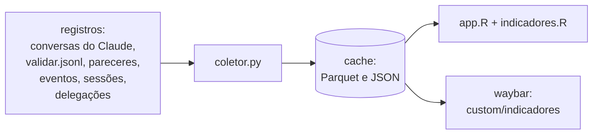
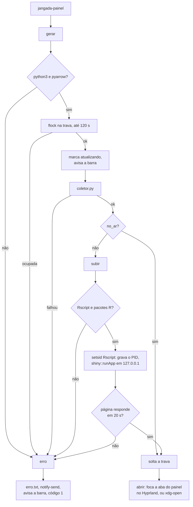

# Painel de indicadores

O `jangada-painel` junta os registros dos agentes num cache e serve um app
Shiny em `127.0.0.1:8765` (`JANGADA_PAINEL_PORTA`). São três peças, e cada
uma usa o cache em `~/.local/state/jangada/painel`. O monitoramento de
recursos consulta fontes locais apenas enquanto sua aba estiver ativa:

As definições de cada indicador estão no README, seção "Painel de
indicadores", e os campos de cada registro em [registros](registros.md).

Desde a modularização 3.0, o painel mora em `monitor/painel/`, o
`jangada-painel` em `monitor/bin/` e a configuração da barra em
`shell/waybar/`. Os caminhos `default/painel/`, `bin/jangada-painel` e
`default/waybar/` citados aqui são links de compatibilidade e continuam
valendo; `default/visual/` não mudou de lugar.

## Fila, provedores e autonomia

O painel abre em **Operacional**, na aba **Visão Geral**. O seletor no topo
permite abrir **Indicadores**, no mesmo processo e com filtros próprios.
**Central de Atividades** reúne fila e sessões a partir de `nucleo.json`.
Filtros operacionais usam identificador de projeto, estado, agente e data.
Detalhes mostram critérios, dependências, execuções, eventos e hashes.
**Indicadores** conserva as análises anteriores, incluindo **Fila e provedores**,
que lê `orquestracao.json`, produzido pelo coletor.
Os bancos SQLite são consultados sobre cópias estáveis com o WAL. A leitura
não grava banco ou arquivos auxiliares na origem, mesmo com escritor ativo.
A coleta não cria filas, inicia tarefas ou consulta serviços de modelos.
Uma dependência ainda não concluída aparece como bloqueio da tarefa na fila.
Sem tarefas, a tela explica a ausência de cadastro ou de resultados no filtro
de projeto. Sem observações de provedores, informa que a disponibilidade
dos serviços não foi medida. Erros de coleta continuam como avisos de erro.
A seção "Como os dados chegam aqui?" apresenta `jangada-fila --importar` e
`jangada-executar`; abrir o painel não executa esses comandos.

O filtro de projeto afeta tarefas, orçamento, custo e supervisão. São
retratos atuais e métricas acumuladas da fila, independentemente do período
selecionado. A saúde dos provedores é global e mostra o estado registrado
na coleta, o motivo, a cota e a validade da observação. Uma observação
expirada não confirma cota nem disponibilidade; a validade não representa
um horário garantido de retomada.

O orçamento mostra limites e saldos de chamadas e segundos por tarefa.
Execuções em andamento e consumo desconhecido deixam o saldo sem medida.
O custo usa apenas `precos.json` do usuário. Custo total desconhecido e
parcela conhecida aparecem separados, junto da moeda e da cobertura.
Supervisões, revisões da fila e conclusões fora da amostra têm contagens
próprias; não entram nas taxas de aprovação do `jangada-validar`.

Na aba **Autonomia de agentes**, período e projeto filtram os metadados
antes de recalcular contagens e medianas. O app chama `autonomia.py` sobre
os registros do cache, sem reler conversas. Os demais filtros mantêm o
escopo indicado na interface. Codex econômico aparece nas delegações por
destino, no resumo e na tabela de relatórios sem fonte.

Os gráficos acompanham o seletor claro/escuro do painel. Fundo, textos,
eixos, grades, dicas e cores das séries mudam ao alternar o modo, sem
recarregar a página. No escuro, o fundo e o texto seguem a paleta do matugen;
no claro, usam as fichas claras da mesma imagem. As redes também adaptam
rótulos, arestas e legendas ao modo selecionado. As fichas compartilhadas
têm verificação de contraste e reserva em `default/visual/`; os testes
medem texto e estados em três imagens sintéticas, nos dois modos.
A separação das cores sob simulação de daltonismo não foi validada.
A evolução diária usa
linhas, preserva lacunas sem medida e passa a pequenos múltiplos acima de
quatro séries. Comparações por destino e velocidade local usam barras
horizontais ordenadas, com eixo a partir de zero. Período, unidade e fonte
acompanham os gráficos.

## Consumo por executor e origem

O período inicial é o dia atual. A aba de consumo reúne Claude, Codex e
Ollama em `consumo.parquet`; `chamadas.parquet` guarda apenas metadados das
ferramentas e `cobertura.json` informa quais fontes foram lidas. Os filtros
de executor, origem, modelo, provedor e papel afetam as tabelas e os novos
gráficos de consumo e desempenho local. O detalhamento antigo
do Claude mantém seus filtros de período e projeto.

Sessões Codex em `JANGADA_ESTADO/codex` ficam separadas do histórico em
`CODEX_HOME/sessions`, identificado como `interface_externa`. O histórico
externo não entra nas taxas de aprovação das entregas do Jangada. Contadores
por resposta prevalecem sobre o formato cumulativo; respostas e chamadas
repetidas são descartadas pela identificação. Não são guardados argumentos
de ferramentas nem conteúdo das mensagens nas novas tabelas.

Entrada inclui cache lido. Raciocínio aparece separadamente e não é somado
à saída. Cada resumo mostra quantos registros possuem entrada e saída
medidas. Ausência de medida permanece ausente, inclusive quando todos os
registros estão sem informação. Fonte com erro conserva o cache anterior,
com aviso na tabela de cobertura.

Novas delegações locais recebem uma identificação e registram cada chamada
Ollama, incluindo fatias e consolidação, tokens e durações internas em
milissegundos. Chamadas individuais prevalecem sobre os agregados antigos.
Falhas preservam o consumo conhecido. Tokens por segundo usa somente a
duração de geração; registros antigos sem esse campo não permitem calcular
velocidade. A média usa a soma dos tokens dividida pela soma das durações
das chamadas medidas. O fluxo local não oferece ferramentas.

O comparativo de modelos continua dependendo de tarefas equivalentes,
qualidade dos retornos e amostra suficiente. A chamada local encontrada na
análise de 30/09/2026 não sustenta conclusão sobre economia ou desempenho.
O adaptador Codex mantém um cache por origem, em `codex-jangada.json` e
`codex-interface_externa.json`. Guarda posição em bytes, dispositivo, inode,
tamanho, data de alteração, assinaturas de trechos, contexto e metadados
normalizados dentro da retenção. A segunda
coleta lê apenas linhas acrescentadas. Uma linha incompleta fica para a
próxima coleta; truncamento, troca de inode ou reescrita de mesmo tamanho
reconstroem o arquivo. Se o arquivo mudou, compara hashes dos primeiros e
últimos 4 KiB já consumidos, detectando também reescritas crescentes nessas
bordas. Uma alteração apenas no meio que preserve ambas as bordas e aumente
o tamanho exige apagar o cache da origem para reler tudo.

Metadados antigos são podados, preservando o último contador cumulativo.
Ampliar a retenção reconstrói o cache a partir dos históricos ainda disponíveis.
Um cache acima do limite de tamanho não é reutilizado nem substituído por
outro acima do limite; a coleta continua relendo os históricos.
Registros futuros permanecem no cache e entram nas tabelas quando o relógio
os alcançar.

Os caches não contêm argumentos de ferramentas, mensagens ou credenciais.
São publicados por troca de nome só após ler toda a fonte sem erro. Como
contêm os metadados junto das posições, uma interrupção posterior na publicação
das tabelas não perde os registros já lidos. Cache ausente, com JSON inválido ou de
outra versão é reconstruído. Os limites de arquivos, linhas e tamanho
continuam valendo.

A tabela de cobertura mostra a última coleta válida, a última tentativa,
o último registro e a idade em minutos. Quando uma fonte falha, conserva
os dados, as contagens e a data da coleta anterior. O aviso na aba Revisão
e síntese distingue fontes com dados, sem dados e com erro. A cobertura é
da fonte inteira, independente dos filtros de período e projeto. Carimbos
legados ausentes ou sem fuso mostram “sem data válida” na idade.

A evolução diária separa executor, origem e modelo, sem transformar ausência
em zero. O gráfico do Ollama mostra tokens por segundo de geração e o número
de chamadas com medida. A tabela mantém média ponderada, mediana e percentil
95. Esses gráficos não demonstram economia causal.

## bin/jangada-painel

| Opção | O que faz |
|---|---|
| (nenhuma) | `gerar`, `subir` se o app não estiver no ar, `abrir` |
| `--gerar` | só `gerar`; imprime o `coleta.json` |
| `--json` | `gerar` e imprime o `hoje.json` |
| `--parar` | encerra o app e libera a memória do R |
| `--waybar` | JSON do módulo da barra; só lê o cache |
| `--conferir` | lista o que falta (R, pacotes R, pyarrow); não instala nada |

- **Trava.** Fica presa desde a coleta até o app subir. Solta antes, um
  segundo clique subiria outro R antes de o primeiro gravar o PID, e sobraria
  um app que o `--parar` não vê. Ela é solta antes do `xdg-open`, senão o
  navegador herdaria a trava.
- **Identidade do app.** `no_ar` só aceita o PID do `app.pid` se o comando
  do processo tiver `jangada-painel-app`; um PID reaproveitado por outro
  programa não conta.
- **Subida.** A checagem compara a página capturada numa variável. Com
  `curl | grep -q` sob `pipefail`, o `grep` saía no título, o `curl` falhava
  ao escrever o resto e a subida era dada como falha
  ([boas práticas](boas-praticas.md)).
- **Marca de coleta.** Um `trap` em `EXIT` apaga a marca `atualizando`, para
  uma coleta interrompida não deixar a barra presa.

## default/painel/coletor.py

`main` roda nesta ordem:

1. `conversas_claude`: lê `~/.claude/projects/*/*.jsonl` e as conversas dos
   subagentes a partir da posição guardada em `posicoes.json` (inode e
   byte). Arquivo com outro inode ou menor que a posição é relido do início.
   Uma resposta ainda sem `stop_reason` não avança a posição.
2. `acrescentar`: grava mensagens, ferramentas e resultados como partes
   Parquet novas; com muitas partes, junta numa só sem repetidos.
3. Grava `posicoes.json` só depois das tabelas: uma coleta interrompida relê
   o trecho, e os ids evitam a duplicata.
4. `podar`: tira de mensagens, ferramentas e resultados o que é de antes dos
   últimos `JANGADA_PAINEL_RETENCAO` dias (180; 0 guarda tudo), por dia
   inteiro. O consumo desses dias fica em `mensagens-dias.parquet`, somado
   por dia, projeto e modelo; um dia já somado não muda, para uma poda
   interrompida ou um jsonl relido do início não contarem em dobro. As
   chamadas e os resultados só saem: os indicadores de ferramentas dependem
   da sequência das chamadas, que uma contagem por dia não guarda.
5. `validacoes` (do `validar.jsonl` e, antes dele, dos pareceres; o
   `revisoes/validar.jsonl`, das revisões feitas fora do isolamento, entra
   com origem `revisoes` e entregas próprias, fora das taxas),
   `eventos`, `sessoes` e `apontamentos` (arquivos citados nos itens
   REVISAR): cada um vira uma tabela Parquet inteira.
6. `indicadores_do_dia` grava o `hoje.json`, lido pela barra.
7. `subagentes.indicadores()` grava o `subagentes.json`. Um erro ali não
   derruba a coleta: vai para o próprio arquivo, e o painel o mostra em vez
   dos números da coleta anterior. O `subagentes-memo.json` guarda um
   registro por subagente com o mtime e o tamanho dos arquivos lidos
   (meta.json, jsonl e conversa mãe no Claude; json e banco da conversa no
   agy): só o subagente com arquivo mudado é relido, e o que sumiu sai do
   memo.
8. `coleta.json` com o resumo (arquivos, linhas e bytes lidos, segundos).

Toda gravação é num temporário na mesma pasta, seguido de troca de nome.

## default/painel/app.R e indicadores.R

- `indicadores.R` tem as funções puras (carregar o cache, calcular cada
  indicador), testáveis sem subir o app; `app.R` monta a interface.
- Um processo R serve **Operacional** e **Indicadores**, com seletor no topo,
  a mesma porta e o mesmo token. Cada página tem sua própria barra de abas.
- **Operacional** abre em Visão Geral e reúne Projetos, Central de Atividades,
  Central de Agentes, Modelos e Provedores, Central de Revisão, Monitoramento,
  Histórico e Artefatos e Configurações. Não tem barra lateral de filtros.
- Configurações mostra chave e valor, com o arquivo no cabeçalho. Valor vazio
  ou nulo aparece como "não definido".
- Monitoramento mostra fichas de CPU, memória em GiB e GPU com memória em
  MiB. Modelos carregados e erros ficam em tabelas; listas vazias mostram
  "nenhum". Medição ausente permanece "não registrado".
- Detalhes de projeto, tarefa e sessão mostram atributos em tabelas de campo
  e valor, com tabelas próprias para listas e vínculos. O JSON completo fica
  recolhido em **Ver registro bruto**.
- **Indicadores** tem seis abas, visíveis na barra. Os filtros de período,
  projeto, agente, revisão e consumo ficam na barra lateral desta página.
  **Fila e provedores** mantém o retrato da coleta, filtrado apenas por projeto.
  As outras cinco abas são:
  1. **Revisão e síntese**: diagnóstico operacional dinâmico do dia, taxa de
     aprovação direta na 1ª rodada, tempo de revisão cruzada e entregas no
     limite de rodadas.
  2. **Consumo de modelos**: síntese de tokens gerados, proporção de raciocínio
     deliberativo, taxa de reaproveitamento de cache e blocos de 5 horas.
  3. **Tempo e atenção**: horas em aguardando do desenvolvedor, trocas de foco
     e alerta de sessões abertas sem entrega.
  4. **Gargalos e redes**: diagnóstico de ciclos de retrabalho edit-test-edit,
     pontos quentes com edições concorrentes entre sessões e espaço de
     capacidades.
  5. **Autonomia de agentes**: síntese de delegação ao agy, recusas do
     jangada-delegar, métricas de conformidade (desvios zero) e árvore de
     delegações.
- Cada seção apresenta tarjas de diagnóstico contextual (micro-narrativas em
  R) que orientam a tomada de ação antes das tabelas e gráficos.
- `origem_local` só abre sessão com `Host` `127.0.0.1` ou `localhost` e
  `Origin` vazio ou igual ao `Host`: uma página de fora, aberta no mesmo
  navegador, não lê os indicadores.
- `token_certo` só abre sessão com `?token=` igual à primeira linha de
  `~/.local/state/jangada/painel-chave/token`. O `jangada-painel` grava o
  token (64 dígitos hexadecimais, arquivo 600 numa pasta 700) antes de subir
  o app e o põe na URL que abre; o token fica entre reinícios, para uma aba
  aberta continuar valendo. O `jangada-isolar` oculta a pasta sempre, mesmo
  com `JANGADA_ISOLAR_OCULTAR`, e um agente isolado, que alcança a porta
  pela rede, não abre sessão.
- `esc` escapa o HTML de nomes de arquivo, sessão e ferramenta antes de irem
  para o título dos nós do grafo.
- A leitura do cache descarta linhas repetidas por id, que sobram de uma
  compactação interrompida.
- Cada gráfico mostra o período e o número de observações, com aviso "pouco
  dado" abaixo de 10.

## Barra

O módulo `custom/indicadores` (`default/waybar/config.jsonc`) roda
`jangada-painel --waybar`, que só lê o cache: classes `parado`, `no-ar`,
`atualizando` e `erro`, e a dica com a aprovação na 1ª rodada, os tokens de
saída e o tempo em aguardando do dia. O clique roda o `jangada-painel`; o
botão direito, `--parar`. O script avisa a barra pelo sinal 9
(`pkill -RTMIN+9 -x waybar`), reservado a esse módulo.

## Testes

| Arquivo | O que cobre |
|---|---|
| `testes/painel.sh` | coletor sobre registros de exemplo: coleta incremental, resposta repetida, rodadas e pareceres antigos, `--waybar` em cada estado, `--conferir`, coleta interrompida, erro nos subagentes; com R, os indicadores, as redes, as abas, o escape do HTML e a checagem de Host, Origin e token |
| `testes/barra.sh` | módulo `custom/indicadores` e a migração que o acrescenta |
| `testes/metricas.py` | coleta incremental Codex, contexto entre coletas, respostas e cumulativos, linhas parciais, rotação, truncamento, cache inválido e preservação de uma fonte com erro |
| `testes/painel-motores.R` | agregação diária sem inventar zero, gráficos, filtros por provedor e papel e aviso de fonte com erro |
