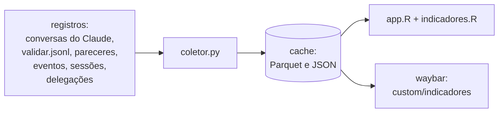
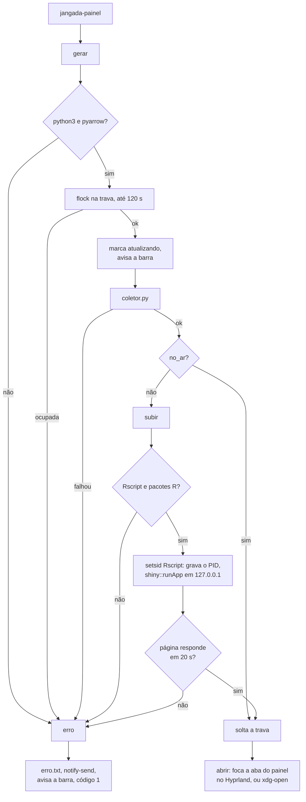

# Painel de indicadores

O `jangada-painel` junta os registros dos agentes num cache e serve um app
Shiny em `127.0.0.1:8765` (`JANGADA_PAINEL_PORTA`). São três peças, e cada
uma só conversa com a seguinte pelo cache em `~/.local/state/jangada/painel`:

As definições de cada indicador estão no README, seção "Painel de
indicadores", e os campos de cada registro em [registros](registros.md).

## bin/jangada-painel

| Opção | O que faz |
|---|---|
| (nenhuma) | `gerar`, `subir` se o app não estiver no ar, `abrir` |
| `--gerar` | só `gerar`; imprime o `coleta.json` |
| `--json` | `gerar` e imprime o `hoje.json` |
| `--parar` | encerra o app e libera a memória do R |
| `--waybar` | JSON do módulo da barra; só lê o cache |
| `--conferir` | lista o que falta (R, pacotes R, pyarrow); não instala nada |

- **Trava.** Fica presa desde a coleta até o app subir. Solta antes, um
  segundo clique subiria outro R antes de o primeiro gravar o PID, e sobraria
  um app que o `--parar` não vê. Ela é solta antes do `xdg-open`, senão o
  navegador herdaria a trava.
- **Identidade do app.** `no_ar` só aceita o PID do `app.pid` se o comando
  do processo tiver `jangada-painel-app`; um PID reaproveitado por outro
  programa não conta.
- **Subida.** A checagem compara a página capturada numa variável. Com
  `curl | grep -q` sob `pipefail`, o `grep` saía no título, o `curl` falhava
  ao escrever o resto e a subida era dada como falha
  ([boas práticas](boas-praticas.md)).
- **Marca de coleta.** Um `trap` em `EXIT` apaga a marca `atualizando`, para
  uma coleta interrompida não deixar a barra presa.

## default/painel/coletor.py

`main` roda nesta ordem:

1. `conversas_claude`: lê `~/.claude/projects/*/*.jsonl` e as conversas dos
   subagentes a partir da posição guardada em `posicoes.json` (inode e
   byte). Arquivo com outro inode ou menor que a posição é relido do início.
   Uma resposta ainda sem `stop_reason` não avança a posição.
2. `acrescentar`: grava mensagens, ferramentas e resultados como partes
   Parquet novas; com muitas partes, junta numa só sem repetidos.
3. Grava `posicoes.json` só depois das tabelas: uma coleta interrompida relê
   o trecho, e os ids evitam a duplicata.
4. `podar`: tira de mensagens, ferramentas e resultados o que é de antes dos
   últimos `JANGADA_PAINEL_RETENCAO` dias (180; 0 guarda tudo), por dia
   inteiro. O consumo desses dias fica em `mensagens-dias.parquet`, somado
   por dia, projeto e modelo; um dia já somado não muda, para uma poda
   interrompida ou um jsonl relido do início não contarem em dobro. As
   chamadas e os resultados só saem: os indicadores de ferramentas dependem
   da sequência das chamadas, que uma contagem por dia não guarda.
5. `validacoes` (do `validar.jsonl` e, antes dele, dos pareceres),
   `eventos`, `sessoes` e `apontamentos` (arquivos citados nos itens
   REVISAR): cada um vira uma tabela Parquet inteira.
6. `indicadores_do_dia` grava o `hoje.json`, lido pela barra.
7. `subagentes.indicadores()` grava o `subagentes.json`. Um erro ali não
   derruba a coleta: vai para o próprio arquivo, e o painel o mostra em vez
   dos números da coleta anterior. O `subagentes-memo.json` guarda um
   registro por subagente com o mtime e o tamanho dos arquivos lidos
   (meta.json, jsonl e conversa mãe no Claude; json e banco da conversa no
   agy): só o subagente com arquivo mudado é relido, e o que sumiu sai do
   memo.
8. `coleta.json` com o resumo (arquivos, linhas e bytes lidos, segundos).

Toda gravação é num temporário na mesma pasta, seguido de troca de nome.

## default/painel/app.R e indicadores.R

- `indicadores.R` tem as funções puras (carregar o cache, calcular cada
  indicador), testáveis sem subir o app; `app.R` monta a interface.
- Abas: Revisão, Consumo, Tempo e atenção, Redes e Subagentes.
- `origem_local` só abre sessão com `Host` `127.0.0.1` ou `localhost` e
  `Origin` vazio ou igual ao `Host`: uma página de fora, aberta no mesmo
  navegador, não lê os indicadores.
- `token_certo` só abre sessão com `?token=` igual à primeira linha de
  `~/.local/state/jangada/painel-chave/token`. O `jangada-painel` grava o
  token (64 dígitos hexadecimais, arquivo 600 numa pasta 700) antes de subir
  o app e o põe na URL que abre; o token fica entre reinícios, para uma aba
  aberta continuar valendo. O `jangada-isolar` oculta a pasta sempre, mesmo
  com `JANGADA_ISOLAR_OCULTAR`, e um agente isolado, que alcança a porta
  pela rede, não abre sessão.
- `esc` escapa o HTML de nomes de arquivo, sessão e ferramenta antes de irem
  para o título dos nós do grafo.
- A leitura do cache descarta linhas repetidas por id, que sobram de uma
  compactação interrompida.
- Cada gráfico mostra o período e o número de observações, com aviso "pouco
  dado" abaixo de 10.

## Barra

O módulo `custom/indicadores` (`default/waybar/config.jsonc`) roda
`jangada-painel --waybar`, que só lê o cache: classes `parado`, `no-ar`,
`atualizando` e `erro`, e a dica com a aprovação na 1ª rodada, os tokens de
saída e o tempo em aguardando do dia. O clique roda o `jangada-painel`; o
botão direito, `--parar`. O script avisa a barra pelo sinal 9
(`pkill -RTMIN+9 -x waybar`), reservado a esse módulo.

## Testes

| Arquivo | O que cobre |
|---|---|
| `testes/painel.sh` | coletor sobre registros de exemplo: coleta incremental, resposta repetida, rodadas e pareceres antigos, `--waybar` em cada estado, `--conferir`, coleta interrompida, erro nos subagentes; com R, os indicadores, as redes, as abas, o escape do HTML e a checagem de Host, Origin e token |
| `testes/barra.sh` | módulo `custom/indicadores` e a migração que o acrescenta |
