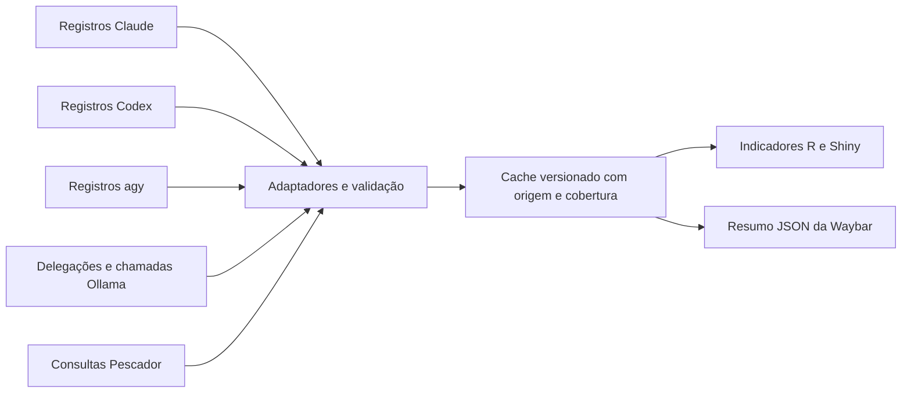
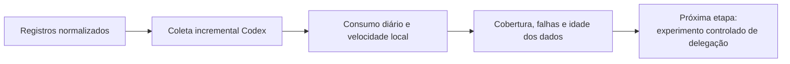

# Proposta de atualização do painel de indicadores

- Data: 30/09/2026.
- Base analisada: `85b273f`.
- Estado: implementação parcial, atualizado em 01/10/2026.
- Método: três agentes de análise somente leitura, com consolidação pelo agente principal. Frentes: benchmarking, registros do Ollama e auditoria do painel/Codex.

## 1. Resultado pretendido

O painel deve mostrar quem precisa de atenção, quais dados estão atualizados e como cada executor utiliza tempo e tokens. A comparação deve incluir Claude, Codex, agy e delegações locais ao Ollama, com cobertura explícita e valores ausentes preservados.

Manter Python, Parquet/JSON, funções R e Shiny. A Waybar continua lendo o cache e recebendo atualizações pelo sinal já reservado ao painel. Abrir ou atualizar o painel não gera respostas de modelos nem carrega modelos na GPU.

## 2. Diagnóstico verificado

| Área | Situação atual | Consequência |
|---|---|---|
| Pescador | `coletor.py:767` soma notas que podem ser `None` | Uma conversa sem auditoria pode interromper a coleta inteira |
| Resumo diário | `app.R:330–344` conta todas as consultas como auditadas | Texto incorreto e média sem avaliação disponível |
| Tabela de pesquisas | `app.R:881` formata notas ausentes como percentuais | Exibição de `NA%` |
| Filtros de pesquisas | `pesqs()` em `app.R:314` usa a tabela inteira | A aba não acompanha o período selecionado como as demais |
| Esquema de pesquisas | Faltam id, estado e par de modelos | Cobertura de auditoria e filtros por motor ficam incompletos |
| Consumo e ferramentas | `conversas_claude()` alimenta as tabelas gerais | Codex e delegações locais ficam fora desses indicadores |
| Ollama | `jangada-delegar:347–350` já registra tokens locais | Falta incorporar dados existentes às agregações |
| Classificação local | `subagentes.py:562–563` distingue agy e os demais | Delegações locais acabam classificadas como Claude |
| Qualidade das delegações | `app.R:751` chama todas de delegações ao agy | Mistura destinos e atribui resultados ao executor errado |
| Codex | `jangada-hook-codex` registra estados da sessão | Estados não substituem consumo e eventos de ferramentas |

A aba de pesquisas já contém uma correção parcial: `app.R:760–773` exclui notas ausentes da média e explica que avaliações dos auditores não são probabilidades de acerto. Essa regra precisa alcançar o coletor, o resumo geral e a tabela.

O diagnóstico da média foi reproduzido com dados sintéticos: `[None]`, `[0, None]` e `[90, None]` provocam `TypeError`; uma nota zero válida deve continuar sendo zero.

## 3. O que aproveitar do benchmarking

| Referência | Aplicação proposta | Limite |
|---|---|---|
| [Benchmark de agentes](../revisao/benchmark-agentes.md), seções 3.3 e 5 | Evoluir o contrato de estado e as ações das interfaces existentes | Os itens já concluídos do benchmark não são novidades desta proposta |
| [Benchmark de agente local](../revisao/benchmark-agente-local.md), itens C, E e H | Cache, operação independente do modelo local e medição do texto delegado | Ganhos publicados por outros projetos não são ganhos medidos na Jangada |
| [Benchmark da Waybar](../benchmarking/README.md), seção 3.2 | Visão por provedor, atualização por sinal e leitura de cache | A barra não deve executar uma coleta pesada a cada leitura |
| [Infomarchy](https://github.com/nixfred/infomarchy) | Cartões por sessão, indicadores de atualização e estado do Ollama | Adotar ideias compatíveis com o estado e o isolamento da Jangada |
| [ai-usagebar](https://github.com/akitaonrails/ai-usagebar) | Separar provedores e atualizar a barra por sinal | Consumo observado, saldo e cota contratual são indicadores distintos |

Os dois projetos externos foram consultados nesta análise. O Infomarchy documenta cartões de sessões, cache e ausência de carregamento automático de modelos pelo painel. O ai-usagebar documenta módulos por provedor e atualização da Waybar por sinal. A proposta aproveita esses padrões mantendo o módulo e as cores atuais da Jangada.

## 4. Contrato de dados

Separar executor, provedor, modelo, origem e papel. `local` é um destino de delegação; `ollama` é seu provedor. Uma sessão Codex que delega ao Ollama deve continuar identificando o Codex como orquestrador.

A [análise dos dados reais de 30/09](analise-painel-20260930.md) acrescenta uma distinção necessária: sessões lançadas pela Jangada e sessões externas da interface Codex. O uso externo só participa de uma visão geral com origem identificada; não entra automaticamente nas taxas de entrega ou nos resultados dos agentes Jangada.

Tabelas propostas:

| Tabela | Unidade de registro | Campos centrais |
|---|---|---|
| Consumo | Chamada ou turno concluído | id, fonte, executor, provedor, modelo, sessão/conversa, projeto, papel, data, estado, tokens e cobertura |
| Ferramentas | Uma chamada com resultado relacionado | id nativo, id da chamada, executor, sessão, ferramenta, início/fim e estado |
| Delegações | Um pedido de delegação | id, orquestrador, destino, provedor, papel, entrega, estado, recusa e chamadas relacionadas |
| Chamadas locais | Uma requisição ao Ollama | id, delegação, índice, fase, modelo, tokens, durações e estado |
| Pesquisas | A versão mais recente de uma consulta | id, estado, modo, autor/revisor, nota opcional, fontes e duração |
| Cobertura | Uma fonte por coleta | capacidade, última coleta bem-sucedida, último evento, rejeições, erro e versão do adaptador |

Regras de agregação:

1. Campo não informado permanece `null`/`NA`. Zero só representa uma medida conhecida igual a zero. Booleanos, números não finitos e contagens negativas não são medidas válidas.
2. Preservar a semântica de tokens de cada fonte. O adaptador deve declarar se a entrada já inclui cache; tokens em cache não podem entrar duas vezes no total.
3. Contadores cumulativos do Codex exigem diferenças entre marcos ou uma fonte de totais única. Repetir a coleta, retomar uma sessão ou ler eventos parciais não pode multiplicar consumo.
4. Uma delegação é diferente de uma requisição ao modelo. Três fatias e uma consolidação representam uma delegação e quatro requisições.
5. A ferramenta Bash que chama `jangada-delegar` pertence ao orquestrador. As requisições HTTP internas são chamadas de modelo. O fluxo local atual não oferece ferramentas ao Ollama.
6. Relacionar fontes por identificadores estáveis de sessão, turno/chamada e delegação. Para registros antigos, documentar uma identidade compatível e a precisão da associação; não deduplicar somente por pergunta ou horário.
7. Consumo de uma execução que terminou em erro ou recusa continua contando quando foi medido. Ausência de resultado não significa ausência de consumo.
8. Usar um ponto de publicação da coleta: a interface só considera atual um conjunto de tabelas publicado por completo. Uma fonte com erro conserva o último resultado válido e mostra sua idade e erro.

Os registros antigos e as chaves atuais de `subagentes.json` continuam legíveis. Novos campos recebem versão explícita; a migração não inventa medições históricas.

## 5. Integrações

### Codex

Adicionar adaptador incremental para os registros das sessões realmente abertas pela Jangada, incluindo seu estado isolado. Confirmar o formato da versão instalada com exemplos sintéticos e arquivos sanitizados. Validar sessão, projeto e origem antes de associar dados.

A [documentação oficial da OpenAI](https://learn.chatgpt.com/docs/non-interactive-mode) documenta `codex exec --json`, eventos de ferramentas e uso no fim do turno. Esse formato serve às execuções não interativas. As sessões interativas devem manter seu lançamento atual e usar um adaptador próprio para seu histórico; o fluxo de `exec` não deve ser presumido igual ao histórico interativo.

Importar tokens de entrada, cache, saída e raciocínio quando informados, além das chamadas de ferramentas e resultados. O hook atual continua responsável pelos estados, sem inferir consumo pela quantidade de eventos.

### Ollama

Primeiro aproveitar `tokens_local_entrada`, `tokens_local_saida`, modelo, papel, sessão, destino, segundos e recusas já gravados em `delegacoes.jsonl`. Corrigir a classificação em todas as tabelas, árvores e resumos.

Em seguida ampliar o registro do executor com id da delegação e das chamadas, número de fatias, fase de consolidação, tamanho do documento original, tamanho do relatório devolvido e contexto configurado.

A [documentação oficial do Ollama](https://docs.ollama.com/api/usage) fornece contagens e durações de carregamento, avaliação de entrada e geração. Registrar os campos com unidade explícita e preservar ausência em versões que não os retornem. Manter o tempo total da delegação separado dos tempos internos da API.

Velocidade agregada de geração: soma dos tokens gerados dividida pela soma do tempo de geração, convertendo nanossegundos para segundos. Exibir também mediana e percentil 95 por chamada, com tamanho da amostra. Duração zero ou ausente não permite calcular velocidade.

Inventário e estado do Ollama podem usar consultas de leitura limitadas e cache quando a visão local estiver aberta. Modelo parado aparece como parado; uma atualização do painel não chama geração. Carregar/descarregar modelos fica fora da primeira entrega.

### Claude, agy e Pescador

Claude mantém seu coletor incremental. O agy participa com estados, delegações, etapas e demais medidas efetivamente registradas; métricas indisponíveis continuam identificadas como tais.

Pescador passa a contar consultas e avaliações separadamente. A média usa apenas notas válidas; todos os casos sem nota mostram “Sem avaliação”. A tabela mostra o estado da consulta e usa os mesmos filtros de período e motor do painel. A verificação posterior atualiza a consulta pelo id, preservando sua relação com o turno original.

As chamadas do Pescador operam sem persistência de sessão no Claude. Seu consumo precisa ser registrado pelo executor a partir do resultado quando disponível e identificado pela consulta; não presumir que o histórico do Claude contenha essas chamadas.

## 6. Experiência do painel

Manter as abas existentes e acrescentar filtros coerentes por período, projeto, executor/provedor, modelo e papel.

- **Revisão e síntese:** sessões aguardando, fontes com erro, idade do cache e resumo de cobertura.
- **Consumo de modelos:** séries por provedor/modelo, entrada, saída e cache conhecido. Exibir unidades e cobertura.
- **Tempo e atenção:** distinguir tempo do usuário aguardando, duração do agente, espera de delegação e geração local.
- **Gargalos e redes:** ferramentas por executor e relação entre chamadas do orquestrador e delegações.
- **Autonomia de agentes:** participação por destino, requisições por delegação, recusas, tamanho dos retornos e desempenho local.
- **Pesquisas:** estados, consultas com e sem auditoria, avaliações numéricas válidas e fontes.

Nenhum percentual de cota contratual será deduzido de contagem local de tokens. Comparações entre provedores devem reconhecer diferenças de tokenização. Custo financeiro exige preços e origem de cobrança explicitados; energia e hardware local não têm custo conhecido só porque a requisição não tem cobrança de API.

## 7. Experimento de delegação

Usar o mesmo conjunto de tarefas de leitura/redação em execução direta e delegação ao modelo local. Medir tokens consumidos pela nuvem, texto original enviado pelo script, relatório devolvido, revisões necessárias, conclusão e tempo total.

Separar modelo frio de modelo residente. Incluir fatias, consolidação e falhas. Mostrar estimativa de leitura evitada com método e amostra; tokens gerados pelo Ollama não equivalem a tokens poupados no Claude ou no Codex. Ganho de qualidade ou economia causal depende dessa comparação controlada.

## 8. Entregas e critérios de aceite

| Ordem | Entrega | Critério de aceite |
|---|---|---|
| 1 | Confiabilidade do Pescador e classificação das delegações | Notas ausentes não interrompem a coleta; zero permanece zero; locais não entram como Claude/agy; consultas e auditorias têm contagens próprias |
| 2 | Contrato versionado, cobertura e publicação consistente | Dados antigos continuam legíveis; uma fonte inválida não derruba as demais; cache antigo não aparece como recém-atualizado |
| 3 | Ollama nos indicadores usando registros existentes | Totais por sessão/modelo/dia batem com `delegacoes.jsonl`; repetição da coleta mantém os totais |
| 4 | Registro por requisição e desempenho local | Fatias e consolidação têm ids; falhas parciais preservam consumo; velocidade usa tempo de geração |
| 5 | Codex nas métricas de consumo e ferramentas | Sessões interativas e revisões têm cobertura identificada; retomada, eventos parciais e contadores cumulativos não duplicam consumo |
| 6 | Visão consolidada e experimento de delegação | Todos os filtros têm o mesmo efeito; cobertura aparece nas comparações; estimativas são distinguíveis de medidas |

Testes necessários: históricos vazios, notas todas ausentes ou mistas, zero, JSON parcial, valores inválidos, arquivos truncados/rotacionados, retomada Codex, coleta repetida, uma chamada local, várias fatias, recusa antes da chamada, falha após uma fatia e modelo sem dados de velocidade. Testar também a atualização posterior de consulta, filtros do Shiny e a publicação interrompida do cache.

Preservar leitura limitada de arquivos, isolamento, proteção da chave do painel, validação de Host/Origin e escape de texto externo. Mudanças de cache ganham migração repetível com simulação. Na implementação, executar os testes das áreas alteradas e `testes/verificar.sh` antes da entrega.

## 9. Escopo desta proposta

A análise das seções 2 e 3 registra a base de 30/09, antes da implementação.
O commit `1b884db` incorporou consumo de Claude, Codex e Ollama, cobertura,
registro por requisição local e correções das pesquisas. A atualização de
01/10 acrescenta coleta incremental Codex, evolução diária, gráfico de
velocidade local, filtros por provedor e papel e idade da última coleta válida.

| Entrega | Situação verificada |
|---|---|
| 1 | Notas ausentes e filtros de pesquisas corrigidos; destinos locais separados |
| 2 | Falhas preservam dados e idade; publicação conjunta de todas as tabelas ainda pendente |
| 3 | Consumo Ollama incorporado, com deduplicação por chamada |
| 4 | Tokens, durações internas, média, mediana e percentil 95 por modelo disponíveis |
| 5 | Consumo e ferramentas Codex incorporados; coleta incremental e contexto entre coletas testados |
| 6 | Visão consolidada com filtros de consumo; experimento direto versus delegado ainda pendente |

Também permanecem pendentes o inventário do Ollama, a medição de consumo
própria do executor do Pescador e a associação completa entre ferramentas,
turnos e delegações. Não há resultado de economia causal a apresentar.
Os novos caches incrementais são derivados e reconstruídos automaticamente;
a atualização mantém os esquemas das tabelas e não exige alterar configuração
do usuário. Datas, estrelas e percentuais dos benchmarks não foram
atualizados e não fundamentam estimativas de ganho para esta máquina.
