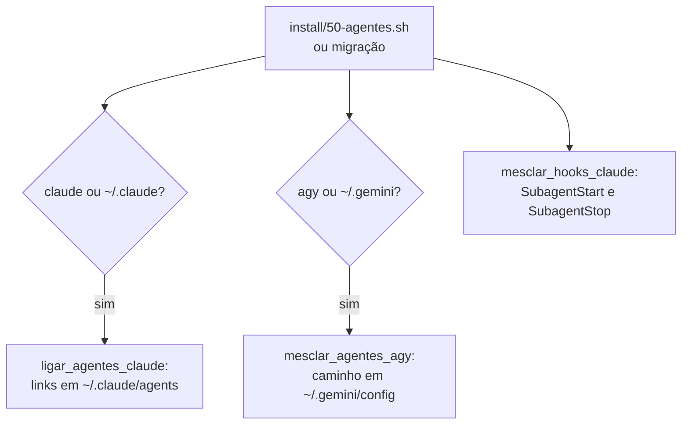
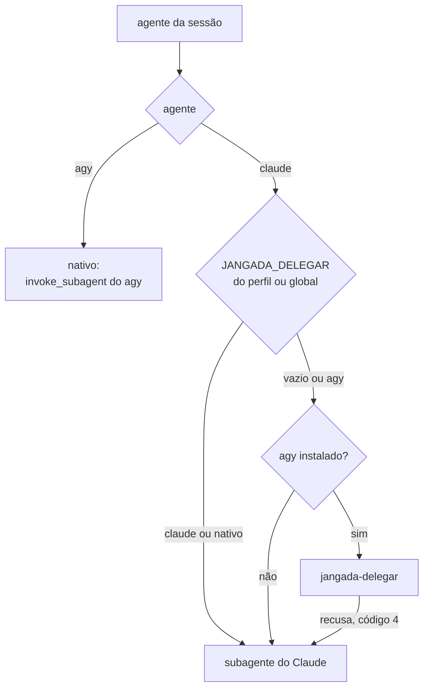
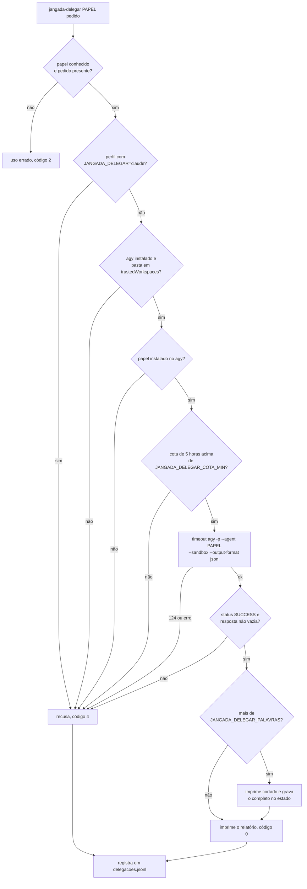

# Subagentes e delegação

O agente da sessão pode passar trabalho de leitura a um subagente: explorar
código, ler documento longo, pesquisar na web, verificar antes do
`jangada-validar`, auditar segurança, analisar arquitetura, procurar gargalo
ou revisar redação. O subagente só lê e devolve um relatório curto com
`caminho:linha`; quem edita é sempre o agente da sessão, porque o worktree é
um só. Paralelismo de implementação é outra sessão do jangada.

## Papéis

Cada papel existe nos dois agentes, com o mesmo nome: no Claude em
`default/claude/agents/PAPEL.md`, no agy em `default/agy/agents/PAPEL/agent.md`.

| Papel | Uso | Claude | agy (`jangada-delegar`) |
|---|---|---|---|
| explorador | localizar código e ligações entre partes | haiku | Flash, esforço baixo |
| leitor | trechos de PDF, planilha, relatório | haiku | Flash, médio |
| pesquisador | documentação e dados públicos na web | haiku | Flash, médio |
| verificador | testes, lint e regras antes do `jangada-validar` | sonnet | Flash, alto |
| auditor | segurança: injeção, credenciais, permissões | sonnet | Flash, alto |
| arquiteto | módulos, contratos e impacto de mudança | sonnet | Flash, alto |
| otimizador | gargalos, leituras redundantes, memória | sonnet | Flash, médio |
| redator | clareza e regras de texto do `AGENTS.md` | haiku | Flash, baixo |

O agy tem também o `revisor`, usado só pelo `jangada-validar`, com
ferramentas de leitura.

Só o leitor e o verificador têm terminal (Bash no Claude, `run_command` no
agy). O leitor lê documentos de fora, que podem trazer injeção de prompt: no
Claude, o hook `PreToolUse` do frontmatter chama o `jangada-hook-leitor`, que
só deixa passar comandos de leitura (`pdftotext` com saída `-`, `pdfinfo`,
`grep`, `head`, `tail`, `wc`, `cut`, `tr`, `cat`, `ls`) ligados por `|`, sem
redirecionamento, `;`, `&` nem expansão. Sem o script no PATH, o comando é
recusado. No agy, o mesmo script responde ao `PreToolUse` do `run_command`
(`jangada-hook-leitor --agy`, em `~/.gemini/config/hooks.json`). Esse hook
dispara para todo agente do agy: reconhece o leitor pela variável
`JANGADA_AGY_PAPEL=leitor`, que o `jangada-delegar` põe no agy que roda o
papel, ou, quando o leitor é subagente de uma sessão, pelo
`brain/*/.system_generated/subagents/CONVERSA.json` com o `typeName`
`leitor`. Para o leitor, o comando fora da lista recebe `deny`; o resto
recebe `ask`, que segue as permissões do agy. Sem terminal, o agy só roda o
que está em `permissions.allow`, e essa lista vale para todos os agentes
(pode ter `cp` ou `curl`); por isso o `jangada-delegar` recusa o leitor
quando o hook não está instalado. O verificador roda os testes do projeto e fica com o terminal livre.

## Instalação

As funções ficam em `install/lib.sh`. Papel novo entra numa instalação
existente por migração, como `migrations/202609272200-subagentes-novos.sh`.

## Para onde vai a delegação

`jangada_delegacao` em `bin/jangada-config` decide o destino, e o
`jangada-agente` monta o protocolo da sessão com o arquivo do destino:

| Destino | Arquivo | O que manda |
|---|---|---|
| `agy` | `default/agentes/protocolo-delegar-agy.md` | usar primeiro `jangada-delegar PAPEL "pedido"`; só na recusa, o subagente do Claude do mesmo papel |
| `claude` | `default/agentes/protocolo-delegar-claude.md` | usar os subagentes do Claude |
| `nativo` | `default/agentes/protocolo-delegar-nativo.md` | usar os subagentes do próprio agy |
| `local` | `default/agentes/protocolo-delegar-local.md` | usar `jangada-delegar` no destino local com `--arquivos` para leitor e redator; os outros papéis seguem nos subagentes do Claude |

Os quatro são seguidos de `default/agentes/protocolo-delegar.md`, com as regras
comuns: citar a fonte, conferir no arquivo o que decide a mudança, não editar
e não substituir o `jangada-validar`. Em nenhum caso vale o
`general-purpose` para esses papéis.

## jangada-delegar

- A pasta é a raiz do repositório atual, que o agy precisa confiar; um
  worktree do jangada entra em `trustedWorkspaces` pelo
  `jangada-worktree-preparar`, só se a raiz já estiver lá, e sai no
  `jangada-agente-fim`.
- A cota vem de `agy -p "/usage"`, guardada por `JANGADA_DELEGAR_CACHE`
  minutos (5). Abaixo de `JANGADA_DELEGAR_COTA_MIN` (20%), recusa.
- O tempo limite é `JANGADA_DELEGAR_TEMPO` segundos (300).
- Comando de terminal que o agy nega aparece listado; libera-se em
  `permissions.allow` do `settings.json` do agy.
- O relatório conta as frases sem fonte (`caminho:linha`, URL, página ou
  célula), que entram no registro.
- Na recusa, a última linha diz qual subagente do Claude usar. O
  `jangada-delegar` nunca chama o Claude.

## Destino local

O destino `local` do `jangada-delegar` despacha tarefas de leitura a um modelo
executado no Ollama na máquina local. Esse destino não gasta cotas externas
e mantém os dados locais.

Para evitar alucinações e desperdício de contexto, o destino local atende
exclusivamente os papéis `leitor` e `redator`. O script lê e extrai os
arquivos indicados (`--arquivos`), numerando linhas ou páginas, e envia texto
puro ao modelo. O modelo não possui ferramentas de terminal.

### Medições e escolha do modelo

Observação pontual realizada em 29/09/2026 numa NVIDIA GeForce RTX 4060 (8 GB de memória de vídeo, driver proprietário 580.126.09, área de trabalho Hyprland ocupando ~2,4 GB e ~5,6 GB disponíveis para o Ollama):

- Método: chamadas diretas ao endpoint `/api/chat` do Ollama 0.34.4.
- Medição de tempo: campos `eval_count`, `eval_duration`, `prompt_eval_count` e `prompt_eval_duration` do JSON retornado.
- Memória: inspeção por `/api/ps` e `nvidia-smi`.

| Modelo | Contexto (`num_ctx`) | Memória total | Memória de vídeo | Transbordo CPU | Geração (t/s) | Avaliação de prompt (t/s) |
|---|---|---|---|---|---|---|
| `qwen3:8b` | 8192 | 6,12 GiB | 5,03 GiB | 1,09 GiB | 33,2 | ~212 |
| `qwen3:8b` | 4096 | 5,56 GiB | 5,08 GiB | 0,48 GiB | 44,9 | ~238 |
| `qwen3:4b` | 16384 | 4,75 GiB | 4,75 GiB (100%) | 0 | 86,2 | ~3.600 |
| `qwen3:4b` | 8192 | 3,61 GiB | 3,61 GiB (100%) | 0 | 85,6 | ~3.691 |

Num teste com documento real de 10 páginas (4.098 tokens de prompt), o
`qwen3:4b` avaliou o prompt em 1,11s (3.691 t/s) e gerou 2.992 tokens em
44,27s (67,6 t/s).

A `qwen3:8b` não coube inteiramente na memória de vídeo com a área de trabalho ativa,
com queda substancial de desempenho. A `qwen3:4b` com contexto 8192 coube 100% na GPU
e preservou cerca de 2,0 GB de folga, atendendo a margem mínima de 1,5 GB.

### Configuração e proteção

- `JANGADA_LOCAL_MODELO`: `qwen3:4b`.
- `JANGADA_LOCAL_CTX`: `8192`.
- `JANGADA_LOCAL_VRAM_MIN`: `4000` (MiB livres exigidos no `nvidia-smi` quando
  presente; a memória do modelo já residente no Ollama é somada à livre).
- `JANGADA_LOCAL_KEEP_ALIVE`: `2m` (descarrega o modelo rapidamente para
  liberar memória de vídeo aos jogos).
- `JANGADA_LOCAL_ESPERA`: `30` (segundos de espera pela trava de concorrência).
- `JANGADA_LOCAL_FATIAS_MAX`: `5` (limite de fatias para documentos que excedem o contexto).
- `JANGADA_OLLAMA_URL`: `http://localhost:11434` (endereço da API do Ollama).
- Concorrência e modelo de ameaça: uma vaga exclusiva por chamada controlada por trava
  exclusiva (`flock`) em `$JANGADA_ESTADO/local.lock`, obtida antes das checagens de
  memória e de processos. Como o arquivo de trava é gravável pelo agente dentro do isolamento,
  um agente hostil pode segurar o `flock` indefinidamente; o pior efeito é negação de serviço
  local para as próximas delegações, sem vazamento ou execução de código fora do isolamento.
- Proteção de jogos e isolamento: fora do isolamento, verifica `pgrep -f 'reaper SteamLaunch'`
  e `nvidia-smi`. Na sessão isolada (`jangada-isolar`), como `pgrep` e `nvidia-smi` não conseguem
  inspecionar o host diretamente pelo namespace de PID e pela falta de nós de GPU, o host grava
  marcas com carimbo de data/hora em `$JANGADA_ESTADO/marcas/vram-livre` e `$JANGADA_ESTADO/marcas/jogo-ativo`
  na inicialização e as renova conforme `JANGADA_MONITOR_INTERVALO` (padrão de 30 segundos). Um
  intervalo configurado perto ou acima de 120 segundos faz o `jangada-delegar` recusar por marca
  expirada. O script lê essas marcas apenas sob `JANGADA_ISOLADO=1` e descarta marcas com mais de
  120 segundos. A ausência de `jogo-ativo` depende do host estar vivo para criá-la quando um jogo
  abre; caso o host morra, a expiração da marca de VRAM livre garante a recusa se o modelo não
  estiver residente. Se a memória não puder ser verificada e o modelo não estiver residente, a
  chamada é recusada por segurança.
  Se o `nvidia-smi` devolver texto de erro na saída padrão, esse texto é
  descartado antes de ler a marca do host. A marca recente continua sujeita
  ao limite de memória; uma marca expirada não libera a delegação.
- Falhas e privacidade: em qualquer falha (Ollama inacessível, modelo ausente,
  jogo aberto, memória insuficiente ou contexto estourado), o comando recusa com código 4
  apontando o subagente do Claude, sem redirecionar dados para a nuvem. O protocolo
  da sessão orienta o agente a consultar o usuário antes de recorrer ao Claude em
  documentos confidenciais.

## Registro e medição

- Cada chamada do `jangada-delegar`, atendida ou recusada, vira uma linha em
  `delegacoes.jsonl`, com papel, modelo, segundos, código, palavras, cota
  antes e depois e motivo da recusa.
- Os hooks `SubagentStart` e `SubagentStop` do Claude
  (`default/claude/hooks.json`, `bin/jangada-hook-claude`) gravam
  `subagente-inicio` e `subagente-fim` em `eventos-agentes.jsonl`, com o id e
  o tipo do subagente.
- `default/painel/subagentes.py` lê esses registros e as conversas dos
  subagentes. O `bin/jangada-subagentes` mostra os indicadores, o resumo de
  uma entrega (`--entrega`, que o `jangada-validar` grava no campo
  `subagentes` do `validar.jsonl`) e os registros crus (`--registros`).

Os campos de cada arquivo estão em [registros](registros.md).

## Testes

| Arquivo | O que cobre |
|---|---|
| `testes/subagentes.sh` | papéis do Claude e do agy e a instalação deles; hook do leitor no Claude e no agy (papel pela variável, subagente pelo json da conversa, conversa fora do formato, falha do Python) |
| `testes/delegar.sh` | `jangada-delegar` com agy falso: recusas (entre elas o leitor sem o hook no agy), cota, corte do relatório e registro |
| `testes/validar.sh` | o campo `subagentes` e o `subagentes_erro` do `validar.jsonl` |
