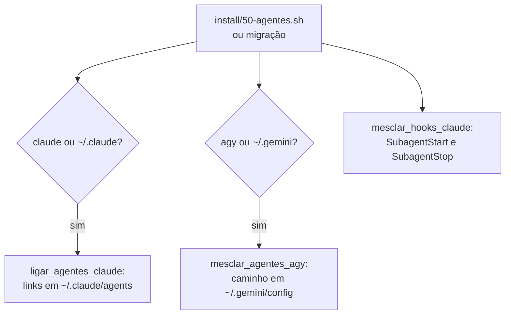
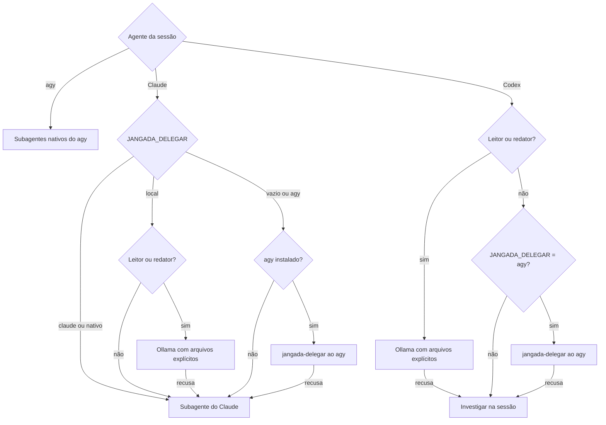
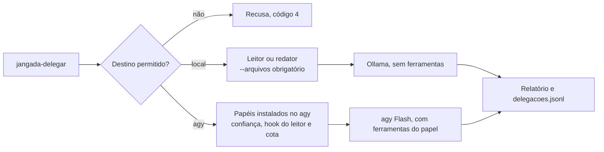
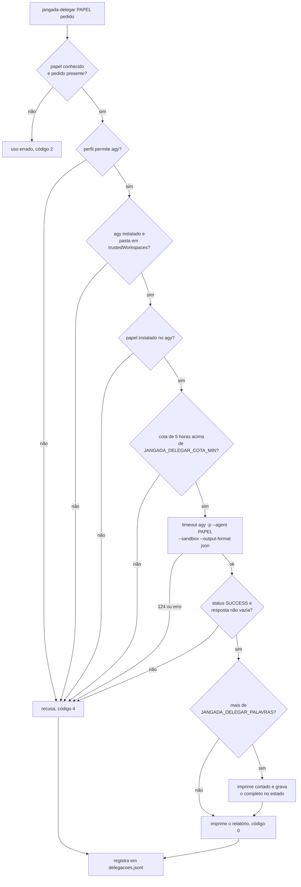

# Subagentes e delegação

O agente da sessão pode passar trabalho de leitura a um subagente: explorar
código, ler documento longo, pesquisar na web, verificar antes do
`jangada-validar`, auditar segurança, analisar arquitetura, procurar gargalo
ou revisar redação. O subagente só lê e devolve um relatório curto com
`caminho:linha`; quem edita é sempre o agente da sessão, porque o worktree é
um só. Paralelismo de implementação é outra sessão do jangada.

## Papéis

Cada papel existe nos dois agentes, com o mesmo nome: no Claude em
`default/claude/agents/PAPEL.md`, no agy em `default/agy/agents/PAPEL/agent.md`.

| Papel | Uso | Claude | agy (`jangada-delegar`) |
|---|---|---|---|
| explorador | localizar código e ligações entre partes | haiku | Flash, esforço baixo |
| leitor | trechos de PDF, planilha, relatório | haiku | Flash, médio |
| pesquisador | documentação e dados públicos na web | haiku | Flash, médio |
| verificador | testes, lint e regras antes do `jangada-validar` | sonnet | Flash, alto |
| auditor | segurança: injeção, credenciais, permissões | sonnet | Flash, alto |
| arquiteto | módulos, contratos e impacto de mudança | sonnet | Flash, alto |
| otimizador | gargalos, leituras redundantes, memória | sonnet | Flash, médio |
| redator | clareza e regras de texto do `AGENTS.md` | haiku | Flash, baixo |
| supervisor | fidelidade de relatório intermediário às fontes | haiku | Flash, médio |

O agy tem também o `revisor`, usado só pelo `jangada-validar`, com
ferramentas de leitura.

Só o leitor e o verificador têm terminal (Bash no Claude, `run_command` no
agy). O leitor lê documentos de fora, que podem trazer injeção de prompt: no
Claude, o hook `PreToolUse` do frontmatter chama o `jangada-hook-leitor`, que
só deixa passar comandos de leitura (`pdftotext` com saída `-`, `pdfinfo`,
`grep`, `head`, `tail`, `wc`, `cut`, `tr`, `cat`, `ls`) ligados por `|`, sem
redirecionamento, `;`, `&` nem expansão. Sem o script no PATH, o comando é
recusado. No agy, o mesmo script responde ao `PreToolUse` do `run_command`
(`jangada-hook-leitor --agy`, em `~/.gemini/config/hooks.json`). Esse hook
dispara para todo agente do agy: reconhece o leitor pela variável
`JANGADA_AGY_PAPEL=leitor`, que o `jangada-delegar` põe no agy que roda o
papel, ou, quando o leitor é subagente de uma sessão, pelo
`brain/*/.system_generated/subagents/CONVERSA.json` com o `typeName`
`leitor`. Para o leitor, o comando fora da lista recebe `deny`; o resto
recebe `ask`, que segue as permissões do agy. Sem terminal, o agy só roda o
que está em `permissions.allow`, e essa lista vale para todos os agentes
(pode ter `cp` ou `curl`); por isso o `jangada-delegar` recusa o leitor
quando o hook não está instalado. O verificador roda os testes do projeto e fica com o terminal livre.

## Instalação



As funções ficam em `install/lib.sh`. Papel novo entra numa instalação
existente por migração, como `migrations/202609272200-subagentes-novos.sh`.

## Para onde vai a delegação



`jangada_delegacao` em `bin/jangada-config` decide o destino. No Claude,
o perfil prevalece sobre a configuração global; no agy, vale sempre
`nativo`. No Codex, vale `agy` quando configurado; nos demais casos, `local`.

| Agente e destino | Protocolo em `default/agentes/` | Regra |
|---|---|---|
| Claude, `agy` | `protocolo-delegar-agy.md` | primeiro agy; na recusa, subagente do Claude |
| Claude, `claude` | `protocolo-delegar-claude.md` | subagentes do Claude |
| agy, `nativo` | `protocolo-delegar-nativo.md` | subagentes do próprio agy |
| Claude, `local` | `protocolo-delegar-local.md` | leitor e redator primeiro no Ollama; demais papéis no Claude |
| Codex, `local` ou `agy` | `protocolo-delegar-codex.md` | leitor e redator primeiro no Ollama; outros papéis no agy se permitido, ou na sessão |

O Codex não chama subagentes do Claude. Mesmo no perfil `codex-agy`, leitor
e redator passam primeiro pelo destino local. Os perfis e seus revisores
estão em [Codex](codex.md).

Todos recebem também `default/agentes/protocolo-delegar.md`: citar fontes,
conferir o que decide a mudança, não editar e não substituir o
`jangada-validar`. Uma recusa local não autoriza enviar documentos
confidenciais a outro provedor. As setas de recusa para o Claude exigem
aviso ao usuário antes desse envio, conforme o protocolo local.

## jangada-delegar

O destino pode ser explícito: `--destino local` ou `--destino agy`.
Sem essa opção, o comando usa o destino definido pela configuração.
`JANGADA_DELEGAR=claude` recusa ambos; `JANGADA_DELEGAR=local` recusa o agy.

### Seleção por capacidade

`--capacidade` ativa seleção para o papel `leitor`, com fontes em
`--arquivos`. As capacidades disponíveis são `leitura_documental`,
`resumo_curto` e `analise_documental`. Sem essa opção, as chamadas mantêm
a seleção anterior.

```sh
jangada-delegar leitor "Compare os documentos" \
  --capacidade analise_documental --permitir-remoto \
  --arquivos fontes/a.txt fontes/b.txt
```

A ordem vem de `default/delegacao/roteamento.json`. Um arquivo opcional
`~/.config/jangada/delegacao.json` substitui essa política: contém um objeto
com capacidades e listas de destinos, sem comandos. Aceita apenas `local`
e `agy`, sem repetições. Capacidade ausente ou configuração inválida recusa
a execução. Claude e Codex não são alternativas automáticas.

O agy exige `--permitir-remoto` nesta tarefa e um perfil que permita o
destino. A autorização não vence `JANGADA_DELEGAR=local`. Sem autorização,
a seleção descarta o agy; uma falha local nunca autoriza envio remoto.
`--destino` explícito restringe a seleção a esse destino.

Cada candidato é tentado uma vez. Permitem tentar o próximo destino
autorizado: `indisponivel`, `modelo_ausente`, `ocupado`, `cota_desconhecida`,
`cota_insuficiente`, `contexto_insuficiente`, `saida_invalida` e
`erro_execucao`. Isso inclui jogo aberto, vaga ocupada, modelo concorrente,
falha de chamada e tempo esgotado de uma chamada. Negação de ferramentas,
ausência de confiança ou de proteção do leitor interrompem a seleção.

`JANGADA_DELEGAR_TEMPO_TOTAL` limita a seleção e seus executores a 600
segundos. `JANGADA_DELEGAR_CHAMADAS_MAX` limita as chamadas aos modelos a
8, incluindo partes e consolidação local. Ambos aceitam inteiros positivos
de até seis dígitos. Consultas de disponibilidade e cota entram no tempo
total, mas não na contagem de chamadas ao modelo.
Antes de processar um documento dividido, o executor local verifica se há
chamadas suficientes para todas as partes e uma consolidação. Se faltar
orçamento, recusa antes de consumir tokens.
Cada chamada documental com capacidade solicita raciocínio desligado e limita a geração
a 1.024 tokens. Alguns modelos continuam raciocinando; saída interrompida
pelo limite de geração é recusada, sem aprovação parcial. Chamadas sem
capacidade preservam as opções anteriores de geração.
Ao atingir o limite global, o GNU `timeout` envia SIGKILL ao grupo de
processos do executor e encerra os filhos que permanecem nesse grupo. Processos que
criem outra sessão ou pedidos já aceitos pelo provedor exigem cancelamento
próprio; o limite da execução local não garante esse cancelamento.

Antes de gravar ou entregar o relatório completo, a verificação exige uma referência
a cada fonte fornecida, em linha ou página existente. Nomes de arquivo
ambíguos exigem o caminho. Essa conferência não comprova fidelidade nem
aprova conclusões. Sem saída válida, recusa com código 4.
Para exigir completude estrutural, repita `--requisito "Nome do item"`.
Cada requisito exige uma seção `## Nome do item`, uma referência e pelo
menos cinco palavras de explicação além do título e do localizador.
Isso rejeita listas de referências sem explicações, mas não comprova que
a explicação responde corretamente ao pedido. Confira o conteúdo na fonte.
Essa opção exige `--capacidade`; pedidos sem requisitos mantêm a conferência
de referências. Quando os requisitos passam, `verificacao` contém
`referencias_e_requisitos_validos`.
Relatórios reprovados pela conferência ficam em
`$JANGADA_ESTADO/agentes/delegacao-reprovada-ID.md`, com o caminho registrado
no executor e `verificacao=reprovada`. Não substituem o arquivo da entrega.
O corte por palavras pode omitir referências na prévia. Nesse caso, leia
o arquivo completo indicado; a verificação vale para esse arquivo.

`--json` devolve o relatório, capacidade, decisão, motivos e tentativas em
JSON. `verificacao_escopo` identifica o relatório completo;
`relatorio_cortado` e `artefato` identificam a prévia e seu arquivo completo.
O `roteamento_id` reúne os registros dos executores da mesma seleção.
As tentativas anteriores aparecem no resultado do executor seguinte. Se o
tempo interromper um executor, seu número de chamadas fica desconhecido.
O painel mantém a contagem por registro: cada executor e a recusa final
da seleção são entradas distintas. Ele não agrupa pedidos por
`roteamento_id`. As chamadas locais são medidas individualmente, sem
somar de novo o histórico repetido em `tentativas`.



### Destino agy

O destino `agy` segue o fluxo abaixo. O destino local não consulta cota
nem depende do agy instalado; seu funcionamento está na próxima seção.



- A pasta é a raiz do repositório atual, que o agy precisa confiar; um
  worktree do jangada entra em `trustedWorkspaces` pelo
  `jangada-worktree-preparar`, só se a raiz já estiver lá, e sai no
  `jangada-agente-fim`.
- A cota vem de `agy -p "/usage"`, guardada por `JANGADA_DELEGAR_CACHE`
  minutos (5). Exige uma única fração numérica entre 0 e 1 para `gemini-5h`.
  Se a atualização falhar, não usa o valor expirado. Cota desconhecida ou
  abaixo de `JANGADA_DELEGAR_COTA_MIN` (20%) recusa.
- O tempo limite é `JANGADA_DELEGAR_TEMPO` segundos (300).
- Comando de terminal que o agy nega aparece listado; libera-se em
  `permissions.allow` do `settings.json` do agy.
- O relatório conta as frases sem fonte (`caminho:linha`, URL, página ou
  célula), que entram no registro.
- Na recusa, o comando orienta conforme o agente da sessão: subagente do
  Claude, investigação na sessão do Codex ou `invoke_subagent` no agy.
  O `jangada-delegar` nunca chama o Claude.

## Destino local

O destino `local` do `jangada-delegar` despacha tarefas de leitura a um modelo
executado no Ollama na máquina local. Esse destino não gasta cotas externas
e mantém os dados locais.

Para evitar alucinações e desperdício de contexto, o destino local atende
exclusivamente os papéis `leitor` e `redator`. O script lê e extrai os
arquivos indicados (`--arquivos`), numerando linhas ou páginas, e envia texto
puro ao modelo. O modelo não possui ferramentas de terminal.

### Medições e escolha do modelo

Observação pontual realizada em 29/09/2026 numa NVIDIA GeForce RTX 4060 (8 GB de memória de vídeo, driver proprietário 580.126.09, área de trabalho Hyprland ocupando ~2,4 GB e ~5,6 GB disponíveis para o Ollama):

- Método: chamadas diretas ao endpoint `/api/chat` do Ollama 0.34.4.
- Medição de tempo: campos `eval_count`, `eval_duration`, `prompt_eval_count` e `prompt_eval_duration` do JSON retornado.
- Memória: inspeção por `/api/ps` e `nvidia-smi`.

| Modelo | Contexto (`num_ctx`) | Memória total | Memória de vídeo | Transbordo CPU | Geração (t/s) | Avaliação de prompt (t/s) |
|---|---|---|---|---|---|---|
| `qwen3:8b` | 8192 | 6,12 GiB | 5,03 GiB | 1,09 GiB | 33,2 | ~212 |
| `qwen3:8b` | 4096 | 5,56 GiB | 5,08 GiB | 0,48 GiB | 44,9 | ~238 |
| `qwen3:4b` | 16384 | 4,75 GiB | 4,75 GiB (100%) | 0 | 86,2 | ~3.600 |
| `qwen3:4b` | 8192 | 3,61 GiB | 3,61 GiB (100%) | 0 | 85,6 | ~3.691 |

Num teste com documento real de 10 páginas (4.098 tokens de prompt), o
`qwen3:4b` avaliou o prompt em 1,11s (3.691 t/s) e gerou 2.992 tokens em
44,27s (67,6 t/s).

A `qwen3:8b` não coube inteiramente na memória de vídeo com a área de trabalho ativa,
com queda substancial de desempenho. A `qwen3:4b` com contexto 8192 coube 100% na GPU
e preservou cerca de 2,0 GB de folga, atendendo a margem mínima de 1,5 GB.

### Configuração e proteção

- `JANGADA_LOCAL_MODELO`: `qwen3:4b`.
- `JANGADA_LOCAL_CTX`: `8192`.
- `JANGADA_LOCAL_VRAM_MIN`: `4000` (MiB livres exigidos no `nvidia-smi` quando
  presente; a memória do modelo já residente no Ollama é somada à livre).
- `JANGADA_LOCAL_KEEP_ALIVE`: `2m` (descarrega o modelo rapidamente para
  liberar memória de vídeo aos jogos).
- `JANGADA_LOCAL_ESPERA`: `30` (segundos de espera pela trava de concorrência).
- `JANGADA_LOCAL_FATIAS_MAX`: `5` (limite de fatias para documentos que excedem o contexto).
- `JANGADA_OLLAMA_URL`: `http://localhost:11434` (endereço da API do Ollama).
- Concorrência e modelo de ameaça: uma vaga exclusiva por chamada controlada por trava
  exclusiva (`flock`) em `$JANGADA_ESTADO/local.lock`, obtida antes das checagens de
  memória e de processos. Como o arquivo de trava é gravável pelo agente dentro do isolamento,
  um agente hostil pode segurar o `flock` indefinidamente; o pior efeito é negação de serviço
  local para as próximas delegações, sem vazamento ou execução de código fora do isolamento.
- Proteção de jogos e isolamento: fora do isolamento, verifica `pgrep -f 'reaper SteamLaunch'`
  e `nvidia-smi`. Na sessão isolada (`jangada-isolar`), como `pgrep` e `nvidia-smi` não conseguem
  inspecionar o host diretamente pelo namespace de PID e pela falta de nós de GPU, o host grava
  marcas com carimbo de data/hora em `$JANGADA_ESTADO/marcas/vram-livre` e `$JANGADA_ESTADO/marcas/jogo-ativo`
  na inicialização e as renova conforme `JANGADA_MONITOR_INTERVALO` (padrão de 30 segundos). Um
  intervalo configurado perto ou acima de 120 segundos faz o `jangada-delegar` recusar por marca
  expirada. O script lê essas marcas apenas sob `JANGADA_ISOLADO=1` e descarta marcas com mais de
  120 segundos. A ausência de `jogo-ativo` depende do host estar vivo para criá-la quando um jogo
  abre; caso o host morra, a expiração da marca de VRAM livre garante a recusa se o modelo não
  estiver residente. Se a memória não puder ser verificada e o modelo não estiver residente, a
  chamada é recusada por segurança.
  Se o `nvidia-smi` devolver texto de erro na saída padrão, esse texto é
  descartado antes de ler a marca do host. A marca recente continua sujeita
  ao limite de memória; uma marca expirada não libera a delegação.
- Falhas e privacidade: em qualquer falha (Ollama inacessível, modelo ausente,
  jogo aberto, memória insuficiente ou contexto estourado), o comando recusa com código 4
  apontando o subagente do Claude, sem redirecionar dados para a nuvem. O protocolo
  da sessão orienta o agente a consultar o usuário antes de recorrer ao Claude em
  documentos confidenciais.

## Fila persistente de projetos

`jangada-fila --importar plano.json` importa tarefas sem executar os dados
do plano. `jangada-fila --json` permite consultar o estado. Cada projeto,
identificado pela raiz do Git ou por `--projeto PASTA`, tem um banco separado em
`$JANGADA_ESTADO/agentes/projetos/HASH/tarefas.sqlite`.
Fora do Git, a pasta atual identifica o projeto. Subpastas do mesmo
repositório consultam a mesma fila.

```json
[
  {
    "id": "T1", "papel": "leitor", "capacidade": "leitura_documental",
    "pedido": "Extraia as regras de roteamento", "risco": 1,
    "qualidade": "medium", "fontes": ["fontes/documento.md"],
    "requisitos": ["Autorizações", "Limites"], "max_tentativas": 2
  },
  {
    "id": "T2", "papel": "leitor", "capacidade": "resumo_curto",
    "pedido": "Prepare o resumo final", "risco": 2,
    "qualidade": "high", "fontes": ["fontes/documento.md"],
    "dependencias": ["T1"]
  }
]
```

Uma importação repetida com fontes inalteradas preserva resultados. Alterar
a tarefa ou o conteúdo de uma fonte exige outro identificador. Ciclos e dependências inexistentes são recusados antes
de gravar o plano. As fontes precisam estar dentro do projeto; caminhos
resolvidos e resumos SHA-256 são preservados na especificação.

O campo opcional `prioridade` aceita, nesta ordem, `critical`, `high`,
`normal`, `low` e `background`. Sem esse campo, conserva `normal` e a
ordem anterior: data de criação, depois identificador. A fila mostra a
prioridade declarada na última coluna.

Na reserva, tarefas prontas são ordenadas pela prioridade efetiva. Uma
tarefa em fila transmite sua prioridade aos antecessores também em fila,
para antecipar os pré-requisitos de um trabalho importante. A transmissão
é transitiva e para em tarefas pausadas, em revisão ou fora da fila.
Um antecessor pronto pode ser antecipado mesmo quando outra dependência
do trabalho importante aguarda revisão ou provedor. Assim, seus demais
pré-requisitos avançam durante a espera; o descendente continua impedido
até a conclusão de todas as dependências.
Dependências continuam exigindo conclusão; a prioridade não interrompe
uma reserva existente nem altera risco, qualidade, permissões ou orçamento.
O evento `reservada` registra as prioridades declarada e efetiva.

`jangada-task T1 pausar`, `retomar`, `cancelar` e `repetir` controlam tarefas
fora de execução. A repetição mantém o limite total de tentativas. Uma
reserva expirada exige conferência antes de repetir; outro executor não
pode concluir a reserva anterior. Os artefatos usam resumo SHA-256 do conteúdo
e são gravados em UTF-8, com substituição atômica. Dependências que falharam
ou foram canceladas deixam suas tarefas dependentes em `BLOCKED`, com motivo.

Uma saída de modelo fica em `REVIEW_REQUIRED`, sem liberar dependências.
Após conferir o artefato e as fontes, o responsável registra
`jangada-task T1 revisar --aprovar --parecer "Conferido nas fontes"` ou
`--reprovar`. A revisão aceita somente o mesmo artefato preservado. Esse
registro é uma anotação editável do projeto. O comando não autentica o
revisor nem impede que o autor registre sua própria aprovação. Portanto,
`COMPLETED` não comprova revisão independente e não autoriza integração,
envio externo ou operação irreversível. A revisão da fila não substitui
`jangada-validar`.

`jangada-fila --revisao` lista as tarefas em `REVIEW_REQUIRED`, com
capacidade, executor, modelo e caminho do artefato preservado. Depois de
conferir cada artefato, um parecer comum vale para várias tarefas:
`jangada-task T1,T2,T3 revisar --aprovar --parecer "Conferidos nas fontes"`.
O lote grava todas as revisões ou nenhuma: uma tarefa ausente, repetida ou
fora de `REVIEW_REQUIRED` recusa o comando inteiro.
Tarefas em revisão não podem ser pausadas para contornar a conferência.

### Execução da fila

`jangada-executar --limite 10` executa até dez tarefas elegíveis em sequência.
Para modelos, usa `jangada-delegar`, sem interpretar comandos no plano. Atende `leitor`
com `leitura_documental`, `resumo_curto` ou `analise_documental`, risco até 2
e qualidade `low` ou `medium`. Tarefas que exigem um principal aguardam em
`WAITING_REVIEWER`; capacidades sem adaptador aguardam em `WAITING_PROVIDER`.

As fontes são conferidas antes e depois da chamada. Artefatos das dependências
concluídas entram como fontes adicionais, com conferência de integridade.
O relatório completo passa pela verificação de referências e requisitos;
depois fica em `REVIEW_REQUIRED`, sem aprovação automática do conteúdo.

`max_chamadas` e `tempo_total` valem para todas as tentativas da tarefa.
Interrupção ou resposta sem contagem confiável impede repetição automática.
Recusa antes de qualquer chamada não consome tentativa. Cota insuficiente
ou desconhecida mantém `WAITING_QUOTA` até uma retomada explícita.

`jangada-executar --paralelo 3 --limite 12 --permitir-remoto` divide o limite
entre três processos, de 2 a 4. Cada processo reserva uma tarefa diferente
da mesma fila, e as dependências continuam valendo: só entra tarefa cujas
dependências já concluíram. A opção exige `--permitir-remoto` e perfil com
nuvem, porque o modelo local tem uma vaga só; não combina com `--acompanhar`.
Ela não autoriza envio: cada tarefa ainda precisa de `permitir_remoto: true`.

- Tarefa que cai no modelo local ocupado espera a vaga por
  `JANGADA_LOCAL_ESPERA` segundos. Esgotada a espera, fica em
  `WAITING_PROVIDER` sem gastar tentativa e volta com `jangada-retomar`.
- O Codex econômico também tem uma vaga: a segunda chamada é recusada.
- A cota do agy é lida antes de cada chamada, sem reserva. Chamadas
  simultâneas podem ser liberadas pela mesma leitura; por isso o teto de
  quatro processos.
- Ctrl+C é repassado uma vez a cada processo, que encerra a tarefa em curso
  como na execução em sequência.
- Se um processo falha, o comando imprime os resultados dos demais e sai
  com código 2. Consulte `jangada-fila` antes de repetir.

### Tarefas dos agentes principais na sessão aberta

Claude e Codex podem assumir uma tarefa de alta qualidade ou risco 3
na própria sessão, sem abrir outra chamada de modelo:

```sh
jangada-task T5 assumir --executor codex
# Use o identificador dono devolvido na reserva.
jangada-task T5 entregar --dono IDENTIFICADOR --arquivo work/sintese.md
jangada-task T5 revisar --aprovar --parecer 'Conferido por revisão separada'
```

`assumir` devolve a especificação, os caminhos e resumos dos artefatos das
dependências, o identificador da reserva e seu prazo. Exige dependências
concluídas, fontes inalteradas e orçamento disponível. Aceita tarefas em
fila, em `WAITING_PROVIDER` ou em `WAITING_REVIEWER`. Não assume tarefas
pausadas, em espera de cota, reservadas, com consumo desconhecido ou risco 4.

O agente executa o pedido e grava um relatório UTF-8 dentro do projeto.
As fontes importadas continuam imutáveis; alterações de código exigem
outro fluxo. `entregar` confere reserva, integridade das fontes e dependências,
referências e requisitos. Preserva o relatório completo, limitado a 1 MiB,
em `REVIEW_REQUIRED`; falha de formato ou integridade gera `REVISION_REQUIRED`.
Recusas antes da validação do conteúdo, como arquivo fora do projeto,
especial, simbólico, acima do limite ou sem UTF-8 válido, mantêm a reserva
para corrigir o arquivo e entregar novamente dentro do prazo. A recusa
por codificação fica registrada, sem copiar bytes inválidos para o estado.
O prazo é conferido novamente ao persistir: se expirar durante a validação,
a entrega inteira é recusada, sem gravar artefato ou conclusão no estado.
O arquivo de relatório original permanece no projeto.
Somente a revisão separada libera os dependentes. Esses comandos não
publicam, enviam, fazem integração de código ou substituem `jangada-validar`.

`--executor` e o `--modelo` opcional são declarações para rastreabilidade,
sem autenticar a identidade ou conferir autoridade. Os dados da tarefa
nunca autorizam comandos externos. A reserva respeita o tempo restante
da tarefa; após expirar, uma entrega é recusada. Não há medição confiável
das chamadas e tokens da sessão aberta: o consumo permanece desconhecido,
impedindo uma repetição automática. Este fluxo não inicia agentes em segundo
plano nem aplica uma variante econômica ou premium por conta própria.

### Execução documental principal pelo Codex

Uma tarefa de risco 3 ou qualidade `high` ou `critical` pode executar uma
análise principal por chamada delimitada, sem ferramentas. Configure
`JANGADA_CODEX_PRINCIPAL_MODELO` com o identificador do modelo disponível
na sua conta. O padrão vazio desativa essa execução; não há modelo implícito.
O nome configurado não comprova qualidade: o relatório exige revisão separada.

```sh
jangada-task T5 executar-principal --executor codex --permitir-remoto --permitir-codex
```

A tarefa também exige `permitir_remoto: true` e `permitir_codex: true`,
perfil de delegação `agy`, dependências concluídas e fontes inalteradas.
Aceita capacidades `analise_documental`, `sintese` e `revisao_critica`.
Recusa microtarefas, risco 4, programação e ações externas. Este comando
não faz parte das alternativas econômicas nem da execução automática da fila.
Claude permanece disponível pelo fluxo da sessão aberta.

Antes de gerar texto, consulta a cota real do Codex e respeita
`JANGADA_CODEX_COTA_MIN`, com reserva de 25% por padrão. Usa a mesma cota
e trava da variante econômica; modelos distintos não têm cotas independentes.
Cota desconhecida ou insuficiente produz `WAITING_QUOTA`, sem consumir
tentativa de geração. Após atualizar a saúde do provedor, retome a tarefa
com `jangada-task T5 retomar` e solicite novamente a execução principal.
Pausa, indisponibilidade ou trava ocupada recusam o comando antes da reserva.

O orçamento da tarefa inclui chamadas e tempo anteriores. Fontes e artefatos
das dependências são enviados como texto UTF-8 numerado, sujeito ao limite
de contexto do adaptador. PDF precisa de extração prévia. A execução usa
credenciais copiadas para uma pasta privada temporária, sem renovação,
ferramentas ou gravação nas fontes. Interrupção com consumo desconhecido
impede repetição automática. Chamadas e tokens confirmados ficam nas métricas.

O relatório completo passa pelos critérios de referências, requisitos e
integridade e fica em `REVIEW_REQUIRED`. Saída reprovada fica preservada em
`REVISION_REQUIRED`. Somente a revisão separada libera dependentes. A execução
principal não aprova a entrega final nem substitui `jangada-validar`.

### Supervisão automática de relatórios intermediários

Uma tarefa documental de risco 1 pode declarar `intermediaria: true` e
`supervisao_automatica: true`. Exige papel `leitor`, qualidade `low` ou
`medium` e uma das capacidades documentais já integradas. Tarefas finais,
de risco maior ou alta qualidade não aceitam essa política.

```sh
jangada-executar --supervisionar --permitir-remoto
jangada-executar --acompanhar --supervisionar --permitir-remoto
```

A opção do comando não autoriza envio por si só: a tarefa também precisa
de `permitir_remoto: true`, e o perfil da sessão precisa permitir nuvem.
O supervisor é agy ou Codex econômico, sempre diferente do autor. Codex
exige modelo explícito e autorização do comando e da tarefa, como na execução.
Ollama pode produzir o relatório, mas nunca fornece a aprovação semântica.

Esse papel existe nos padrões de Claude e agy, com ferramentas somente
de leitura; o adaptador Codex recebe o mesmo pedido sem ferramentas.
O agy precisa encontrar `supervisor` no catálogo, como os demais papéis.
Uma instalação anterior sem esse papel recusa a revisão até ser atualizada.
O supervisor recebe objetivo, fontes e relatório como dados. Confere
fidelidade, completude e extrapolações em JSON estrito, com justificativas
e referências. O parecer identifica a tarefa e o SHA-256 do relatório.
Somente todos os critérios `PASS`, sem observações e com referências
conferidas, permitem `COMPLETED` e liberam dependências intermediárias.
Erros exigem correção; ambiguidades, parecer inválido ou consumo desconhecido
mantêm revisão pendente. Não se repetem pareceres inconclusivos até obter aprovação.

Autor e supervisor compartilham o limite de chamadas e o tempo da tarefa.
As retomadas de supervisão também compartilham `max_tentativas`, cujo padrão
é 2. Uma retomada que inicia chamadas usa a segunda tentativa; recusas com
zero chamadas não gastam tentativa. Esgotar esse limite deixa o relatório
para revisão manual, sem repetir o autor.
Sem quota ou supervisor autorizado, o relatório completo permanece salvo.
`--supervisionar` retoma somente a revisão quando o provedor estiver disponível;
`--acompanhar` consulta a saúde e aguarda a recuperação dentro do prazo configurado.
As fontes e dependências são conferidas novamente antes da conclusão.

O parecer completo fica no resultado da tarefa. Referências ao relatório
temporário são vinculadas pelo SHA-256 ao artefato preservado. As métricas
distinguem pareceres automáticos, revisões manuais e esperas de quota. `esperas_supervisao`
conta tentativas que aguardaram um supervisor, separadas dos pareceres.
Uma aprovação automática
não alimenta o histórico usado para sugerir redução da amostragem.
Essa supervisão não aprova entregas finais, publicação, alterações de produção
ou a entrega de código do próprio Jangada. `jangada-validar` continua obrigatório.

### Conferência determinística de JSON

A capacidade `validacao_json` executa um critério local de formato, sem
modelos, comandos das fontes ou acesso à rede. Exige papel `verificador`,
risco zero e nenhum `requisito` adicional. O `pedido` descreve a tarefa;
não acrescenta critérios executáveis. Para importar uma conferência:

```json
[
  {
    "id": "J1", "papel": "verificador", "capacidade": "validacao_json",
    "pedido": "Confira a sintaxe dos dados JSON", "risco": 0,
    "qualidade": "medium", "fontes": ["dados.json"]
  }
]
```

O critério aceita raízes JSON de qualquer tipo, em UTF-8. Rejeita chaves
repetidas, valores não finitos, substitutos Unicode isolados e texto após
o valor. Limita a profundidade a 64 níveis, as fontes a 32 arquivos,
o tamanho a 1 MiB por arquivo e a 4 MiB no total. Recusa arquivos
especiais e links simbólicos no último componente do caminho. Diretórios
intermediários podem ser links; o executor verifica antes da leitura que
o destino resolvido permanece dentro do projeto.

O relatório preserva caminho, SHA-256, tamanho e o critério executado.
Antes de gravar `COMPLETED`, o estado repete a conferência das fontes
importadas e compara o relatório. Uma aprovação declarada na saída não
substitui esse critério. A conclusão libera dependências automaticamente.

O campo opcional `esquema` indica um arquivo do projeto com um esquema
JSON, aplicado a todas as fontes da tarefa:

```json
{
  "id": "J2", "papel": "verificador", "capacidade": "validacao_json",
  "pedido": "Confira os dados pelo esquema", "risco": 0,
  "qualidade": "medium", "fontes": ["dados.json"], "esquema": "esquema.json"
}
```

A importação guarda o caminho e o SHA-256 do esquema; alterá-lo depois
impede a conclusão. O esquema segue os mesmos limites de leitura das fontes.
São aceitas as palavras-chave `type`, `enum`, `const`, `required`,
`properties`, `additionalProperties`, `items`, `minItems`, `maxItems`,
`minLength`, `maxLength`, `minimum` e `maximum`, além das anotações
`$schema`, `title` e `description`. Qualquer outra, como `pattern`, `$ref`
ou `allOf`, recusa o esquema inteiro: uma regra ignorada aprovaria dados
que o esquema proíbe. Comprimentos contam caracteres Unicode, `integer`
aceita `1.0` e `true` não é igual a `1`. A falha informa o caminho do
primeiro valor fora do esquema, como `$["itens"][2]`, sem copiar o valor.
O relatório registra o critério `sintaxe_json_estrita_e_esquema` e o resumo
do esquema.

JSON inválido, fora do esquema ou fonte alterada deixa `REVISION_REQUIRED`. Risco maior,
papel incompatível ou requisitos adicionais deixam `WAITING_REVIEWER`.
Consumo anterior desconhecido impede repetição automática; os limites de
tempo e tentativas continuam persistidos. O contador de chamadas a modelos
permanece zero. Funciona também no perfil `offline`.

Esse critério comprova somente o formato e, com `esquema`, a estrutura
declarada. Não valida fidelidade documental, conteúdo ou autorização para
operações externas.
Os relatórios de modelos continuam sujeitos à revisão de conteúdo, manual
ou automática quando a política intermediária permitir.

Perfis disponíveis:

| Perfil | Seleção |
|---|---|
| `balanced` | política existente por capacidade |
| `quality` | agy explícito, com revisão do conteúdo pendente |
| `offline` | somente local, sem permissão remota |

Envio remoto exige `--permitir-remoto`, `permitir_remoto: true` no plano e
perfil de sessão compatível. Os perfis não ampliam as permissões da sessão.
O destino opcional `codex-economico` exige também `--permitir-codex`,
`permitir_codex: true` no plano e modelo econômico explicitamente configurado.
Consulte [as restrições do executor Codex](codex.md#executor-economico).
Nenhum perfil chama Claude como trabalhador externo. Os registros
de cada tentativa ficam no resultado da tarefa e no histórico persistente.

### Disponibilidade dos provedores e retomada

`jangada-router status` consulta as observações compartilhadas entre projetos,
em `$JANGADA_ESTADO/agentes/runtime/`. Estados expirados aparecem como
`UNKNOWN`; o término de uma espera não declara o provedor disponível.
Pausas e observações ficam persistidas, com data, motivo e histórico.
São dados operacionais graváveis pela sessão. A pausa não resiste a um
agente hostil: ele pode alterar o banco ou chamar os controles diretamente.
Esses registros não comprovam autorização externa nem substituem as
restrições de isolamento e de envio remoto. Os controles da fila não
impedem uma chamada direta ao `jangada-delegar` fora dela.

`jangada-provedor pausar agy` impede novas delegações pelo executor da fila.
`jangada-provedor ativar agy` remove a pausa e exige nova verificação.
Uma espera `COOLDOWN` ainda vigente é preservada ao pausar ou ativar.
Três falhas de serviço registradas desde a última observação `AVAILABLE`
geram `COOLDOWN` por 900 segundos. Saídas com erro de conteúdo não são
tratadas como falhas de rede.

`jangada-router status --atualizar` consulta os modelos instalados no Ollama
e lê a cota recente do agy. Com `--permitir-remoto` e sessão que permita
agy, pode consultar `/usage` quando o registro estiver ausente ou expirado.
Essa consulta envia somente o comando de metadados, sem as fontes da tarefa.
Roda com isolamento do agy, entrada fechada e fora da pasta do projeto.
Cota ausente, inválida ou expirada permanece desconhecida. A reserva segue
`JANGADA_DELEGAR_COTA_MIN`, como na delegação existente.

O estado `UNKNOWN` permite as verificações do adaptador, sem comprovar
disponibilidade. Antes de gerar um relatório remoto, o `jangada-delegar`
precisa confirmar a cota. Provedores pausados ou em espera são descartados
com motivo estruturado e zero chamadas. A disponibilidade não comprova
qualidade nem amplia permissões.

`jangada-retomar` recoloca na fila tarefas em `WAITING_QUOTA` ou
`WAITING_PROVIDER` que tenham executor disponível, orçamento e tentativas
restantes. Confere permissão remota, perfil e capacidade. As fontes são
conferidas pelo executor antes e depois da execução.
Não retoma tarefas pausadas, em revisão ou com consumo desconhecido.
Para atualizar os provedores e executar a fila após a retomada:

```sh
jangada-retomar --atualizar --executar --limite 10 --permitir-remoto
```

O comando faz uma passagem; não instala um serviço permanente.

### Acompanhamento da fila

Para manter a fila em execução enquanto houver trabalho ou espera recuperável:

```sh
jangada-executar --acompanhar --duracao 28800 --intervalo 60 --limite 100 --permitir-remoto
```

O acompanhamento roda em primeiro plano. Por padrão, dura até oito horas,
com intervalo de 60 segundos e limite de 100 execuções. `--duracao` aceita
1 a 86400 segundos, `--intervalo` aceita 1 a 3600 e `--limite` aceita 1 a 1000.
Sem `--acompanhar`, o comando mantém a passagem única e o limite padrão de uma tarefa.

O prazo impede iniciar novas tarefas; uma tarefa já iniciada conserva seu
próprio orçamento de tempo. Cada execução com chamadas consome uma posição
do limite, inclusive uma falha. Conferências determinísticas iniciadas
também consomem posição, mesmo sem chamadas a modelos. Uma recusa antes
da execução não consome posição. Consumo desconhecido exige revisão antes de repetir.

As esperas por cota ou provedor são retomadas somente com capacidade,
permissões e orçamento restantes. As sondas ocorrem no máximo uma vez
a cada 60 segundos por acompanhamento. Codex exige as mesmas permissões
explícitas da passagem única, inclusive `--permitir-codex` e modelo configurado.
O perfil da sessão continua limitando o envio à nuvem.

O comando registra cada ciclo e o encerramento em linhas JSON na saída.
Uma trava impede dois acompanhamentos simultâneos do mesmo projeto.
Ao pressionar Ctrl+C, nenhuma outra tarefa é iniciada. Uma execução
interrompida permanece pendente de conferência, com consumo desconhecido.
Tarefas aprovadas, pausadas ou em revisão não são retomadas automaticamente.
Quando só restam dependências de revisão ou tarefas sem adaptador, o
acompanhamento encerra. Não aprova relatórios nem instala serviços.

### Revisão por amostragem de relatórios intermediários

Uma tarefa que aceita supervisão automática também pode declarar
`amostragem: true`, com as mesmas exigências: `intermediaria: true`, papel
`leitor`, risco 1, qualidade `low` ou `medium` e capacidade documental.

```sh
jangada-executar --amostrar --permitir-remoto
jangada-executar --amostrar --supervisionar --permitir-remoto
```

Sem a opção do comando ou sem o campo da tarefa, todo relatório continua em
revisão. Com os dois, depois de conferir referências, requisitos e
integridade, o executor aplica a taxa de amostragem do grupo (capacidade,
executor, modelo e risco) descrita em [registro e medição](#registro-e-medição).
O sorteio vem do identificador da tarefa e do SHA-256 do relatório: repetir
a conta dá o mesmo resultado, e o estado refaz o cálculo antes de aceitar
a conclusão.

- Relatório sorteado: segue para o supervisor, com `--supervisionar`, ou
  fica em `REVIEW_REQUIRED`.
- Relatório fora da amostra: fica `COMPLETED` e libera dependentes
  intermediários **sem revisão do conteúdo**. O resultado guarda taxa,
  sorteio e revisões na janela, e o motivo registra que o conteúdo não
  foi conferido.

A taxa só cai abaixo de 100% com 20 revisões manuais do grupo na fila do
projeto; pareceres do supervisor e conclusões fora da amostra não contam.
Relatório produzido pelo Ollama é sempre revisado. O histórico é uma
anotação editável: quem aprova sem conferir reduz a própria amostra. Por
isso a amostragem vale só para relatórios intermediários, não aprova
entrega final e não substitui `jangada-validar`.

## Registro e medição

`jangada-fila --metricas` mostra os indicadores do projeto em JSON. Consulta
o histórico em uma transação de leitura, sem chamar provedores ou importar
tarefas. Não aceita `--importar` na mesma chamada.

O resumo inclui estados, execuções registradas, processamentos confirmados,
recusas sem chamadas, reservas expiradas, repetições solicitadas, retomadas,
chamadas, segundos, tokens disponíveis e revisões aprovadas ou reprovadas.
Um total desconhecido aparece como `null`; os campos `*_confirmados` ou
`*_confirmadas` preservam a parcela conhecida. Reserva expirada torna
consumo e duração desconhecidos. Ausência de preço não é custo zero:
`custo_estimado` permanece `null`.
Registros sem duração são aceitos por compatibilidade, mas não comprovam
duração zero. O resumo preserva as chamadas informadas; o controle de
orçamento recusa repetição quando a duração é desconhecida.

`por_executor` agrupa pelo executor e modelo registrados no encerramento.
Os campos `*_do_fluxo_*` abrangem toda a cadeia daquela execução, incluindo
alternativas; não atribuem chamadas ou duração individualmente a cada provedor.
Os contadores `chamadas_do_fluxo_desconhecidas` e `duracoes_do_fluxo_desconhecidas`
indicam parcelas não medidas. Reservas expiradas entram em `nao_informado`,
pois não comprovam qual executor chegou a trabalhar.
Reservas ainda em `RUNNING` aparecem em `reservas_em_aberto`, com consumo
e duração desconhecidos. O estado não comprova que o processo continua vivo.
`mudancas_entre_candidatos` conta mudanças de destino na sequência registrada,
inclusive candidatos recusados. Tokens Codex conhecidos entram no total
somente quando representam a única chamada; em cadeias com outras chamadas,
entram na parcela conhecida e o total permanece desconhecido.

`desempenho` separa capacidade, executor, modelo e risco. Considera as últimas
50 revisões de cada grupo, ligadas a uma saída preservada. Conferências
determinísticas concluídas automaticamente não entram na taxa de revisão.
Com menos de 20 revisões, risco acima de 1 ou identidade incompleta, a
amostragem sugerida é 100%. Para os demais grupos, sugere 10% normalmente,
50% com reprovação acima de 5% e 100% acima de 15%.

A taxa é aplicada somente em tarefas com `amostragem: true` executadas com
`--amostrar`; nos demais casos é uma sugestão. `selecionadas_na_amostra` e
`conclusoes_fora_da_amostra` contam os sorteios. Não altera permissões nem
preferências do roteador.
O histórico registra pareceres editáveis; não autentica revisores nem
comprova independência ou qualidade real das respostas.

- Cada chamada do `jangada-delegar`, atendida ou recusada, vira uma linha em
  `delegacoes.jsonl`, com papel, modelo, segundos, código, palavras, cota
  antes e depois e motivo da recusa.
- Os hooks `SubagentStart` e `SubagentStop` do Claude
  (`default/claude/hooks.json`, `bin/jangada-hook-claude`) gravam
  `subagente-inicio` e `subagente-fim` em `eventos-agentes.jsonl`, com o id e
  o tipo do subagente.
- `default/painel/subagentes.py` lê esses registros e as conversas dos
  subagentes. O `bin/jangada-subagentes` mostra os indicadores, o resumo de
  uma entrega (`--entrega`, que o `jangada-validar` grava no campo
  `subagentes` do `validar.jsonl`) e os registros crus (`--registros`).

Os campos de cada arquivo estão em [registros](registros.md).

## Testes

| Arquivo | O que cobre |
|---|---|
| `testes/subagentes.sh` | papéis do Claude e do agy e a instalação deles; hook do leitor no Claude e no agy (papel pela variável, subagente pelo json da conversa, conversa fora do formato, falha do Python) |
| `testes/delegar.sh` | `jangada-delegar` com agy falso: recusas (entre elas o leitor sem o hook no agy), cota, corte do relatório e registro |
| `testes/validar.sh` | o campo `subagentes` e o `subagentes_erro` do `validar.jsonl` |
