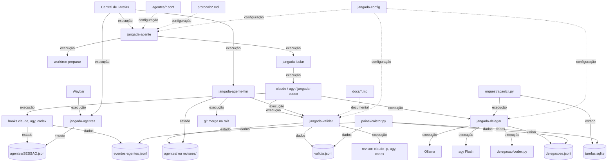

# Auditoria AS-IS da Jangada

Estudo de como a Jangada funciona em 03/10/2026, no commit `061e93c`. Descreve
o sistema existente e não traz proposta de mudança. A leitura não alterou
nenhum arquivo do repositório.

Li diretamente o núcleo de sessão, isolamento, validação, delegação e fila.
Painel, Central de Tarefas, Pescador e desktop vieram de três subagentes
`explorador`; o que uso deles está marcado como inferência quando não reli o
arquivo.

Graus de certeza: **F** fato observado, **I** inferência forte, **H** hipótese,
**A** informação ausente.

Cada achado segue a ordem observação, evidência, consequência e grau de
certeza. As evidências citam arquivo, função ou script e o comportamento
observado.

## Parte I: Inventário

O repositório tem 300 arquivos e 59 executáveis em `bin/`. Os componentes do
subsistema de agentes:

| Componente | Responsabilidade | Entradas | Saídas e efeitos | Chamadores | Estado | Evidência |
|---|---|---|---|---|---|---|
| `bin/jangada-config` | biblioteca: variáveis, git blindado, travas, eventos | `jangada.conf`, ambiente | funções `jangada_*` | todos os `bin/*` por `source` | nenhum próprio | `jangada_git_seguro` l.296, `jangada_com_trava_dir` l.403 |
| `bin/jangada-agente` | abre sessão | projeto, nome, perfil, prompt | worktree, ramo `agente/NOME`, tmux, `SESSAO.json`, cópia em `revisoes/` | usuário, Central, atalho SUPER+A | cria `agentes/SESSAO.json` | `worktree add` l.220-273, `new-session` l.410 |
| `bin/jangada-worktree-preparar` | leva ao worktree o que o git não leva | `.worktreeinclude`, `.jangada/links`, `.jangada/preparar.sh` | cópias, links, execução isolada do script | `jangada-agente` | nenhum | arquivo inteiro (201 l.) |
| `bin/jangada-isolar` | monta o bubblewrap | comando, configuração | processo isolado, proxy D-Bus, vigia `inotifywait` | `jangada-agente`, `-validar`, `-codex`, `-pescador-modelo`, shell | pastas `painel-chave` e `revisoes` criadas e ocultadas | l.72, l.184-193, l.351-357 |
| `bin/jangada-hook-claude`, `-agy`, `-codex` | traduzem eventos do agente em estado | JSON do evento, `JANGADA_SESSAO` | grava `SESSAO.json`, linha em `eventos-agentes.jsonl`, sinal à Waybar, notificação | os três CLIs | altera `SESSAO.json` | `jangada-hook-codex` l.27-46 |
| `bin/jangada-hook-leitor` + `default/claude/hook-leitor.py` | lista de comandos de leitura do papel leitor | JSON do `PreToolUse` | libera, recusa (2) ou `deny` | Claude (frontmatter), agy (`hooks.json`) | nenhum | `jangada-hook-leitor` l.16-23 |
| `bin/jangada-validar` | portão local e revisão por modelo | diff, estado, regras da base | parecer `.md`, `.aprovado`, linha em `validar.jsonl`, campo `.validacao` | agente, `revisar` do shell, `jangada-agente-fim` | `agentes/` (dentro) ou `revisoes/` (fora) | arquivo inteiro (881 l.) |
| `bin/jangada-delegar` | delegação a local, agy ou Codex | papel, pedido, `--arquivos`, `--capacidade` | relatório, linha em `delegacoes.jsonl`, arquivos `delegacao-*.md` | agente, `executor.py`, `supervisao.py` | travas `local.lock`, `codex-economico.lock` | arquivo inteiro (868 l.) |
| `default/delegacao/validar.py` | confere referências `arquivo:linha` | texto, fontes, requisitos | exceção ou silêncio | `jangada-delegar`, `principal.py`, `supervisao.py` | nenhum | l.11-60 |
| `default/delegacao/codex.py` | executor documental Codex sem ferramentas | pedido, fontes | JSON com relatório e contagem | `jangada-delegar`, `principal.py` | pasta temporária | l.63-180 |
| `bin/jangada-codex`, `-codex-hooks` | adaptador do Codex | comando, confiança | `codex` com sandbox e hooks por `-c` | `jangada-agente`, `jangada-validar`, `codex.py` | `jangada-confianca.json`, estados de hook | `jangada-codex-hooks` l.51-94 |
| `default/orquestracao/*.py` (10 módulos, 2.454 l.) | fila persistente, saúde de provedores, supervisão | plano JSON, política | SQLite, artefatos por sha256 | `bin/jangada-fila`, `-executar`, `-retomar`, `-router`, `-provedor`, `-task` | `agentes/projetos/HASH/tarefas.sqlite`, `agentes/runtime/tarefas.sqlite` | `cli.py`, `estado.py`, `executor.py` |
| `bin/jangada-agentes` | lista, foco, restauração, limpeza | arquivos de estado, tmux | marca `interrompido`, remove órfãos | Waybar, Central, usuário | altera e remove `SESSAO.json` | l.84-157, l.365 |
| `bin/jangada-agente-fim` | integra e limpa | sessão, `.aprovado` | `merge --no-ff`, remove worktree, ramo, estado e pareceres | usuário, Central | remove tudo da sessão | l.259, l.294-309 |
| `shell/jangada-shell.sh` | atalhos dentro da sessão | comandos do usuário | chama os `bin/*`; `reverter` cria ramo de backup | `bin/jangada-shell` | nenhum | 373 l. |
| `default/tarefas/*.py` | Central de Tarefas (PyQt6) | `jangada-agentes --lista-atualizada` a cada 2 s | subprocessos `jangada-agente`, `-agente-fim`; soquete Unix | `bin/jangada-tarefas` | pastas de ação em `XDG_RUNTIME_DIR` | `central.py` l.70-97, `janela.py` l.258 |
| `default/pescador/*.py` | conversa e pesquisa auditada | pergunta, par de motores | `historico.jsonl`, `sessoes/ID.json` | `bin/jangada-pescador` | `pescador/` | `bin/jangada-pescador-modelo` inteiro |
| `default/painel/*` | coletor Parquet e app Shiny | conversas, jsonl, SQLite | cache em `painel/`, app em 127.0.0.1 | `bin/jangada-painel` | `painel/`, `painel-chave/token` | `bin/jangada-painel` l.25-102 (I: detalhes do coletor) |
| `install.sh`, `install/*.sh`, `bin/jangada-update`, `-migrar` | instalação, atualização, migrações | repositório, pacman | cópia instalada, marcas em `migracoes/` | usuário | `migracoes/NOME` | `install.sh` l.26-36, `jangada-migrar` inteiro |
| `default/agentes/*.conf`, `protocolo*.md` | perfis e protocolo injetado | escolha do perfil | variáveis da sessão, texto de sistema | `jangada-agente` | nenhum | 7 perfis, 6 fragmentos de protocolo |
| `default/claude/agents/*.md`, `default/agy/agents/*/agent.md` | papéis de subagente | instalação | links em `~/.claude/agents`, registro no agy | Claude, agy, `jangada-delegar` (prompt local) | nenhum | 9 no Claude, 11 no agy |

## Parte II: Arquitetura AS-IS

Camadas que o código mostra, da responsabilidade ao consumidor:

1. **Configuração e biblioteca.** `jangada-config` é carregado por `source` em
   quase todo executável. Não há outro ponto de composição.
2. **Sessão.** Uma sessão é a tripla tmux (`tmux -L jangada`), worktree git e
   `agentes/SESSAO.json`. Nenhum processo residente a mantém; quem observa é a
   Waybar, por consulta periódica a `jangada-agentes`.
3. **Contenção.** `jangada-isolar` envolve o comando do agente. A fronteira é
   de sistema de arquivos, PID e D-Bus.
4. **Controle de entrega.** `jangada-validar` e `jangada-agente-fim` formam o
   caminho até o `merge`.
5. **Delegação.** `jangada-delegar` é síncrono, chamado pelo agente.
6. **Fila persistente.** Os módulos Python de `default/orquestracao` chamam
   `jangada-delegar` como subprocesso.
7. **Observação.** Hooks gravam estado; Waybar, Central e painel leem.
8. **Desktop.** Hyprland em Lua, Waybar, temas, instalação e atualização.

**Achado II.1, o sistema não tem daemon.**

- Observação: nenhum processo residente cuida das sessões.
- Evidência: nenhum serviço é instalado para agentes; `acompanhamento.py` roda
  "em primeiro plano" (docstring, l.1) e a Central consulta por `QTimer` de 2 s
  (`janela.py` l.258).
- Consequência: a detecção de sessão morta só acontece quando alguém chama
  `jangada-agentes`.
- Certeza: F.

## Parte III: Grafo e fluxos

### Grafo de dependências

Seta cheia indica execução, estado ou dados, conforme o rótulo. Seta tracejada
indica configuração ou referência documental.



### Fluxos

**Criação** (`bin/jangada-agente`): escolhe projeto e nome; cria `agente/NOME`
com `git worktree add -b` (l.249-273); chama `jangada-worktree-preparar`; monta
o protocolo de `protocolo.md` mais o fragmento do destino de delegação; abre o
tmux (l.410); grava o estado com `estado: iniciado` e a cópia em
`revisoes/SESSAO.json`.

**Execução.** O agente roda dentro do bwrap. Hooks gravam `trabalhando`,
`aguardando`, `concluido`. O agy não tem evento de `aguardando`
(`default/agy/hooks.json` só traz `PreInvocation`, `Stop`, `PreToolUse`).

**Delegação** (`bin/jangada-delegar`): sem `--capacidade`, o destino vem de
`JANGADA_DELEGAR` e uma recusa sai com código 4 sem desviar para outro
provedor. Com `--capacidade`, o processo pai percorre a lista de
`roteamento.json` reexecutando a si mesmo por candidato.

**Validação** (`bin/jangada-validar`): ponto de comparação, diff, limite de
rodadas, `verificar_local`, pedido ao revisor, leitura do `STATUS` na primeira
linha não vazia, gravação do parecer e de `.aprovado`.

**Encerramento** (`bin/jangada-agente-fim`): `conferir_estado`; com
`--integrar`, exige `.aprovado` em `revisoes/` igual à cabeça e `limpo`, senão
roda `jangada-validar` fora do isolamento; `merge --no-ff` (l.259); fecha tmux,
remove worktree, ramo e estado (l.294-309).

**Recuperação** (`bin/jangada-agentes`): sessão com estado e sem tmux vira
`interrompido` (l.156-157) e fica 168 h; `--restaurar` recompõe o comando a
partir de campos conferidos e abre novo tmux (l.365).

## Parte IV: Estado

| Estado | Cria | Lê | Altera | Remove | Duração | Formato |
|---|---|---|---|---|---|---|
| `agentes/SESSAO.json` | `jangada-agente` | Waybar, Central, validar, fim, painel | hooks, validar, `jangada-agentes` | `jangada-agente-fim`, `limpar_orfaos` | vida da sessão; órfão 24 h, interrompido 168 h | JSON, `mktemp` + `mv` sob `flock` |
| `revisoes/SESSAO.json` | `jangada-agente` (fora do isolamento) | validar e fim, fora | ninguém | `jangada-agente-fim` | vida da sessão | JSON |
| `validacao-ROTULO-rN.md`, `.aprovado` | `jangada-validar` | validar, fim, painel | validar | `jangada-agente-fim` | vida da sessão | texto; `<commit> N limpo\|sujo` |
| `validar.jsonl`, `eventos-agentes.jsonl`, `delegacoes.jsonl` | validar, hooks, delegar | painel, `jangada-subagentes` | só acréscimo | ninguém | indefinida | JSON por linha |
| `tarefas.sqlite` por projeto | `cli.py fila --importar` | executor, painel | executor, `task` | ninguém (A) | indefinida | SQLite WAL, `BEGIN IMMEDIATE` |
| `runtime/tarefas.sqlite` | `saude.py` | executor, painel | `saude.py` | ninguém (A) | observação vale 60 s | SQLite |
| `migracoes/NOME` | `jangada-migrar`, etapa 90 | `jangada-migrar` | ninguém | ninguém | permanente | arquivo vazio |
| `painel/*` | coletor | app Shiny | coletor | poda de 180 dias em parte das tabelas (I) | cache | Parquet e JSON |
| worktree e ramo git | `jangada-agente` | todos | agente | `jangada-agente-fim` | vida da tarefa | git |

**Achado IV.1, duas fontes para os metadados da sessão.**

- Observação: base, tarefa e revisor existem em `agentes/SESSAO.json` e em
  `revisoes/SESSAO.json`.
- Evidência: `jangada-validar` fora do isolamento lê a cópia de `revisoes/` e,
  sem ela, avisa que os dados vêm do estado gravável pelo agente (l.195-201).
- Consequência: sessão aberta de dentro do isolamento, ou anterior à cópia, é
  validada fora com metadados que o agente pode ter escrito, com aviso e sem
  recusa.
- Certeza: F.

**Achado IV.2, a existência da sessão tem três fontes.**

- Observação: tmux, arquivo de estado e worktree são criados em passos
  separados, sem transação.
- Evidência: `jangada-agente` l.220-273 (worktree), l.410 (tmux), estado
  depois; nenhum `trap` no arquivo.
- Consequência: uma interrupção entre os passos deixa worktree e ramo sem
  estado, ou tmux sem estado. O primeiro caso reaparece na próxima abertura
  como "ramo existe" (l.220-249).
- Certeza: F para a ordem e a ausência de `trap`; I para o resultado da
  interrupção.

**Achado IV.3, a fila fica em pasta gravável pelo agente.**

- Observação: `agentes/projetos/HASH/tarefas.sqlite` está sob `agentes/`, que o
  isolamento monta gravável.
- Evidência: `jangada-isolar` l.188 (`gravavel "$JANGADA_ESTADO/agentes"`);
  `docs/subagentes-e-delegacao.md` l.323-324.
- Consequência: o status `COMPLETED` de uma tarefa da fila pode ser escrito por
  um agente isolado. Nada que li usa esse status como condição do
  `--integrar`, que depende só de `revisoes/`.
- Certeza: F para a localização; I para a ausência de uso na integração.

**Achado IV.4, restos sem dono.**

- Observação: a pasta `agentes/` real tem 20 arquivos `validacao-*.md.log`, 5
  `revisao-*.log` e pareceres de sessões já encerradas.
- Evidência: listagem de `~/.local/state/jangada/agentes` em 03/10/2026.
- Consequência: `jangada-agente-fim` não remove tudo o que versões anteriores
  gravaram; o painel lê pareceres antigos por nome.
- Certeza: F para os arquivos; H para a origem.

**Comportamento em queda de processo.** `flock` é liberado pelo kernel;
`mktemp` + `mv` deixa temporário solto, nunca JSON pela metade. Na fila,
reserva vencida vira `REVISION_REQUIRED` (`estado.py`, `reservar`). No
`jangada-validar`, uma morte depois da chamada ao revisor e antes do
`registrar` perde a rodada. Certeza: I, sem teste nesta análise.

## Parte V: Agentes e roteamento

| Conceito | Onde está no código |
|---|---|
| Agente | CLI da sessão: `claude`, `agy` ou `codex` (`COMANDO` do perfil) |
| Perfil | `default/agentes/*.conf`, lido linha a linha sem executar (`exemplo.conf` l.4) |
| Papel | arquivo em `default/claude/agents` ou `default/agy/agents` |
| Modelo | frontmatter do papel (haiku, sonnet, flash) ou `gemini-3.8-flash-<esforço>` no delegar |
| Provedor / destino | `local`, `agy`, `codex-economico` |
| Capacidade | `leitura_documental`, `resumo_curto`, `analise_documental` (`roteamento.json`); `validacao_json` e as de `principal.py` só na fila |
| Permissão | `--permitir-remoto`, `--permitir-codex`, campos homônimos da tarefa |
| Revisor | `claude -p` só com `Read,Grep,Glob`; agy com agente `revisor`; Codex `--sandbox read-only` |
| Supervisor | papel que emite parecer JSON sobre relatório intermediário (`supervisao.py`) |

**Escolha do revisor:** opção > `.revisor` do estado > `JANGADA_VALIDAR_REVISOR`
> oposto do autor.

**Escolha do destino de delegação:** `JANGADA_DELEGAR` do perfil (`agy`,
`claude`, `nativo`, `local`). `roteamento.json` só vale com `--capacidade`:
local antes de agy para leitura e resumo, agy antes de local para análise.

**Achado V.1, o roteamento por capacidade é restrito ao papel leitor.**

- Observação: `--capacidade` exige papel leitor, ou supervisor com
  `analise_documental`.
- Evidência: `bin/jangada-delegar`; `executor.py` manda os demais papéis para
  `WAITING_PROVIDER`.
- Consequência: dos nove papéis, sete nunca passam pela política de
  roteamento; vão ao destino fixo do perfil.
- Certeza: F.

**Achado V.2, uso real concentrado em dois caminhos.**

- Observação: em 49 delegações registradas, 39 foram ao destino local e 10 ao
  agy; nenhuma ao Codex econômico.
- Evidência: `delegacoes.jsonl` desta máquina; `JANGADA_CODEX_ECONOMICO_MODELO=`
  vazio em `config/jangada.conf` l.20.
- Consequência: o executor Codex, a execução principal e a supervisão cruzada
  dependem de configuração que vem desligada.
- Certeza: F para os números; I para a relação com o padrão vazio.

**Achado V.3, a cota do agy bloqueou a delegação durante esta análise.**

- Observação: as três chamadas `jangada-delegar explorador` saíram com código
  4, "não consegui ler uma cota válida e atual do agy".
- Evidência: três linhas `agy / cota_desconhecida` em `delegacoes.jsonl`, de
  03/10/2026.
- Consequência: o comportamento coincide com a regra "cota desconhecida não
  equivale a cota disponível" de `JANGADA_V2_INSTRUCOES.md` l.81; a
  continuação ficou a cargo do protocolo (subagente do Claude).
- Certeza: F.

## Parte VI: Segurança

| Fronteira | Pretendida (docs) | Implementada | Testada |
|---|---|---|---|
| Sistema de arquivos | `/` somente leitura, graváveis listados | `jangada-isolar`, ordem de montagens | `testes/isolar.sh` (775 l.), com isolamento real |
| PID | namespace próprio | `--unshare-pid --die-with-parent` (l.72) | `isolar.sh` ("PID próprio") |
| Rede | não mencionada | **sem `--unshare-net`** | não |
| D-Bus | só `secrets` e `Notifications` | `xdg-dbus-proxy` | `isolar.sh` ("D-Bus restrito") |
| SSH, GPG, nuvem, navegador | ocultos | lista padrão, trocável por `JANGADA_ISOLAR_OCULTAR` | `isolar.sh` ("chave oculta") |
| Git | config e hooks somente leitura; git blindado fora | montagens + `jangada_git_seguro` | `isolar.sh`, `update.sh` |
| Aprovação | não gravável pelo agente | `revisoes/` oculta (l.356-357) | `testes/fim.sh` (marca forjada) |
| Restauração | não executa `.comando` | `restaurar` recompõe | `testes/restaurar.sh` |
| Regras de validação | lidas da base | `git show $ponto:arq` | `testes/validar.sh` |
| Cópia instalada | só por `jangada-update` com confirmação | `--ff-only`, assinaturas opcionais | `testes/update.sh` |
| Leitor | só comandos de leitura | lista de 10 comandos, recusa metacaracteres | `testes/subagentes.sh` |
| Injeção de prompt no revisor | diff é conteúdo, não instrução | texto do papel `revisor` + ferramentas de leitura | parcial: restrição de ferramentas, não o conteúdo |

Conferido de dentro de uma sessão isolada: `~/.ssh`, `revisoes/` e
`painel-chave/` aparecem vazias; `curl https://example.com` devolveu 200.

**Achado VI.1, a rede não é isolada.**

- Observação: o agente isolado alcança a internet e as portas locais.
- Evidência: `jangada-isolar` l.72 não traz `--unshare-net`; HTTP 200 obtido de
  dentro do isolamento; `docs/isolamento.md` l.84 reconhece que "o agente
  isolado alcança" a porta do painel.
- Consequência: exfiltração do que o agente lê (a casa inteira, menos os
  ocultos) não é contida pelo bwrap. A doc não lista rede no modelo de ameaça.
- Certeza: F.

**Achado VI.2, o keyring fica acessível pelo proxy.**

- Observação: o filtro do D-Bus libera `org.freedesktop.secrets`.
- Evidência: `docs/isolamento.md` l.79, com o motivo "o agy lê o login do
  keyring".
- Consequência: as pastas de keyring estão ocultas no disco, mas o serviço
  responde ao agente. Que segredos ele entrega depende do keyring estar
  desbloqueado.
- Certeza: F para a liberação; H para o alcance.

**Achado VI.3, credenciais dos próprios agentes ficam graváveis.**

- Observação: `~/.claude` e `~/.gemini/antigravity-cli` são graváveis; por
  cima, a configuração do Claude fica somente leitura.
- Evidência: `docs/isolamento.md` l.80-82.
- Consequência: o token de login do provedor é legível pelo agente, o que é
  necessário para ele funcionar.
- Certeza: I, sem releitura das linhas de montagem correspondentes.

**Achado VI.4, a lista de ocultos pode ser esvaziada por configuração.**

- Observação: `JANGADA_ISOLAR_OCULTAR` substitui a lista padrão.
- Evidência: `config/jangada.conf` l.75-77: "vazia, não oculta nada".
- Consequência: a proteção de segredos depende de um valor em arquivo de
  configuração do usuário.
- Certeza: F.

**Achado VI.5, script de preparo roda sem pergunta quando não há terminal.**

- Observação: a confirmação do `.jangada/preparar.sh` só existe em TTY.
- Evidência: `jangada-worktree-preparar` roda o script pelo `jangada-isolar`.
- Consequência: aberta pela Central, a sessão executa o script do repositório
  sem confirmação, dentro do isolamento.
- Certeza: F.

## Parte VII: Robustez

### Testes e garantias

| Funcionalidade | Implementada | Documentada | Testada |
|---|---|---|---|
| Abertura de sessão | sim | sim | parcial (`agente-seletor.py`, `tarefas.sh`); sem teste encontrado do `jangada-agente` inteiro |
| Isolamento | sim | sim | sim, só fora do isolamento |
| Validação | sim | sim | sim (`validar.sh`, 949 l., revisores falsos) |
| Integração e limpeza | sim | sim | sim (`fim.sh`) |
| Restauração | sim | sim | sim (`restaurar.sh`) |
| Delegação | sim | sim | sim (`delegar.sh`, 926 l., executores falsos) |
| Fila, supervisão, saúde | sim | sim | sim (`orquestracao.py`, `executor.py`, `supervisao.py`, `saude.py`) |
| Adaptador Codex | sim | sim | sim (`codex.sh`, `codex-economico.py`) |
| Painel | sim | sim | sim; app R só se `arrow` e `shiny` existem |
| lintr no validar | sim | sim | não roda no CI (`verificar.yml`, comentário) |
| Hyprland real | sim | sim | só API imitada (`simular-hypr.lua`); `aninhado.sh` fica fora do `verificar.sh` |
| Rede no isolamento | não | não | não |

`testes/verificar.sh` roda 43 dos 47 arquivos de `testes/`;
`amostras-subagentes.py` e `falso-codex-hooks.py` são auxiliares. `shellcheck`,
`luac`, `qmllint` e `tomllib` ausentes fazem a etapa ser ignorada com mensagem,
sem falha (l.19-36, l.81-85, l.100-106).

**Achado VII.1, a suíte falha dentro da sessão isolada.**

- Observação: `isolar.sh` não passa dentro de uma sessão isolada.
- Evidência: `docs/isolamento.md` l.145; a regra 6 do `AGENTS.md` manda o
  agente rodar `verificar.sh`.
- Consequência: o agente vê uma falha que não vem da sua mudança.
- Certeza: F.

### Tratamento de falhas

| Situação | Classificação | Evidência |
|---|---|---|
| Agente morre / tmux some | tratada explicitamente | `jangada-agentes` l.156-157 marca `interrompido` |
| Revisor não responde (agy) | tratada explicitamente | 2 tentativas, espera de 5 s (`jangada-validar` l.839) |
| Revisor trava (claude, codex) | não tratada | `timeout` só aparece na l.149, para o resumo de subagentes |
| Parecer sem `STATUS` | tratada explicitamente | só a primeira linha não vazia vale; resultado diferente não aprova |
| Limite de rodadas | tratada explicitamente | código 4; 8 ocorrências em 179 linhas reais |
| gitleaks ausente | tratada explicitamente | reprova, salvo `JANGADA_VALIDAR_SEM_GITLEAKS=1` |
| shellcheck ou luac ausente | tratada indiretamente | etapa pulada no portão local |
| Cota desconhecida | tratada explicitamente | recusa código 4; `WAITING_QUOTA` na fila |
| Ollama ocupado, jogo aberto, VRAM baixa | tratada explicitamente | motivos `ocupado`, `contexto_insuficiente` nos registros reais |
| Saída de delegação inválida | tratada explicitamente | `delegacao-reprovada-ID.md` |
| Estado adulterado | tratada explicitamente | `conferir_estado` |
| Merge com conflito | tratada explicitamente | `jangada-agente-fim` l.259-260 mantém a sessão |
| Interrupção no meio da abertura | não tratada | sem `trap` em `jangada-agente` |
| Escrita concorrente em `SESSAO.json` | tratada explicitamente | `flock -w 5`; esgotado o prazo, a atualização é perdida sem erro (hooks saem 0) |
| Reserva de tarefa vencida | tratada explicitamente | `estado.py` `reservar` |
| Migração falha | tratada explicitamente | para, sem marca, repete na próxima (`jangada-migrar`) |
| pacman falha no update | tratada explicitamente | pula AUR, migrações e recarga (`jangada-update` l.167-186) |
| Proxy D-Bus ausente | tratada indiretamente | agente abre sem D-Bus; agy fica sem login |
| Disco cheio | não foi possível determinar a partir das evidências disponíveis | |
| Dois `jangada-validar` simultâneos na mesma sessão | não foi possível determinar a partir das evidências disponíveis | `registrar` usa `flock`; a numeração da rodada não foi relida |

Registros reais desta máquina em 03/10/2026: `validar.jsonl` com 179 linhas
(79 aprovações, 88 `revisar` de revisor, 4 `revisar` do portão local, 8
`limite`); `delegacoes.jsonl` com 49 linhas; `eventos-agentes.jsonl` com 2.975
linhas.

## Parte VIII: Divergências

| Tema | Documentação | Código | Testes | Certeza |
|---|---|---|---|---|
| Número de papéis | README l.389: "Oito papéis", sem supervisor | 9 em `default/claude/agents`; protocolo cita 9 | `subagentes.sh` compara os dois agentes (I) | F |
| Papéis do agy | "mesmo nome nos dois" | agy tem 11: mais `revisor` e `pescador` | idem | F |
| Indicadores | `jangada-subagentes` l.5: "oito indicadores" | não contados | A | H |
| Teto do pedido ao agy | `ciclo-da-tarefa.md` l.131: 131.072 bytes | corte em 126.000 (`jangada-validar` l.811); `agentes.md` l.331 diz 126000 | A | F |
| Protocolo local | `protocolo-delegar-local.md` l.5-6 lista 6 "demais papéis" | existe também supervisor | não | F |
| Testes do isolamento | `isolamento.md` l.131-138: parágrafo sobre `inotifywait` sob o título "Testes" | o vigia existe (`jangada-isolar` l.406) | A | F (posição do texto) |
| `mapeamento/` | README l.29 lista na árvore | fora do git (`.gitignore`) e dito no próprio README | n/a | F, sem conflito real |
| `JANGADA_V2_INSTRUCOES.md` | "Não crie uma fila" na Fase 1 (l.171) | a fila existe | sim | F: o arquivo é um prompt histórico, não descrição |
| `revisao/PENDENCIAS.md` | `JANGADA_INTERFACE=noctalia` "fica sem barra e sem lançador" (l.127) | `jangada.conf` ainda oferece `noctalia` (l.4-6) | simulação Lua no modo noctalia | F para o texto; A sobre o estado atual |
| "Próxima etapa" | PENDENCIAS l.193: barra em Quickshell | não há | n/a | F: intenção não implementada |

## Parte IX: Diagnóstico

### Complexidade e acoplamento

- `jangada-validar` (881 l.) e `jangada-delegar` (868 l.) concentram cada um
  seleção, execução de três provedores, verificação e registro. Consequência:
  mudança em um provedor toca o mesmo arquivo dos outros. Certeza: F.
- A blindagem do git existe duas vezes: `jangada-config` l.296 e `_jangada_git`
  em `jangada-shell.sh`, com comentário que declara a cópia. Consequência: as
  duas listas podem divergir. Certeza: F.
- A marca de isolamento é conferida em três lugares com o mesmo `awk` sobre
  `mountinfo`: `jangada-isolar`, `jangada-codex`, `jangada-pescador-modelo`
  (l.6-7). Certeza: F.
- `jangada-delegar` se reexecuta por candidato e é chamado por `executor.py` e
  `supervisao.py`: três níveis de processo com orçamento passado por variável
  de ambiente (`JANGADA_DELEGAR_TEMPO_TOTAL`, `_CHAMADAS_MAX`). Certeza: F.
- `JANGADA_DELEGAR` nomeia o destino dos subagentes no perfil e também serve de
  condição em `supervisao.py` l.92 e `principal.py` l.43 (`== 'agy'`).
  Consequência: nos perfis Codex (`local`) e agy (`nativo`), supervisão e
  execução principal recusam. Certeza: F.
- Código herdado: leitura de `.pid` do antigo `jangada-par` em
  `jangada-agentes` l.118 e l.145. Certeza: F.

### Arquitetura intencional e emergente

| Dimensão | Intencional | Emergente |
|---|---|---|
| Documentação | três comandos, modelo de ameaça de agente hostil | três sistemas de estado: JSON por sessão, jsonl de registro, SQLite da fila |
| Código | `revisoes/` separa o que vale para integrar | fila, saúde e supervisão formam um segundo orquestrador, ligado ao primeiro só por `jangada-delegar` |
| Testes | executores falsos, sem chamada paga | cobertura densa na fila; abertura de sessão sem teste próprio |
| Comportamento | revisão cruzada: 179 rodadas, 79 aprovações, 88 `revisar` | nenhuma delegação ao Codex; pasta `agentes/projetos` existe |

### Pontos fortes

- Aprovação que conta para integrar fica fora do alcance do agente: `revisoes/`
  oculta e testada com marca forjada (`testes/fim.sh`).
- Regras de avaliação lidas da base, não da entrega (`jangada-validar`,
  `git show`).
- Restauração não executa o que o agente gravou (`testes/restaurar.sh`).
- Recusa em vez de desvio: falha local não envia à nuvem
  (`protocolo-delegar-codex.md` l.9-10; comportamento visto durante a análise).
- Escrita atômica e travas liberadas pelo kernel em todo o estado JSON.
- Artefatos da fila conferidos por sha256 na leitura (`estado.py`
  `ler_artefato`); JSON estrito sem chaves repetidas (`deterministico.py`
  l.18-45).
- CI em contêiner Arch com simulação de instalação que confere HOME vazio
  (`verificar.yml`).
- Atualização da cópia instalada só com `--ff-only` e confirmação
  (`jangada-update` l.67).

## Parte X: Mapa consolidado

```mermaid
flowchart LR
    subgraph Fora do isolamento
      U[usuário] --> AG[jangada-agente]
      U --> FIM[jangada-agente-fim]
      U --> UPD[jangada-update]
      WB[Waybar / Central] --> LST[jangada-agentes]
      RV[(revisoes/)]
      FIM --> RV
    end
    subgraph bubblewrap: fs, PID, D-Bus; rede aberta
      CLI[claude / agy / codex] --> VAL[jangada-validar]
      CLI --> DEL[jangada-delegar]
      CLI --> HK[hooks]
    end
    AG --> CLI
    HK --> ST[(agentes/SESSAO.json)]
    VAL --> AGD[(agentes/ pareceres)]
    DEL --> PROV[Ollama, agy, Codex]
    VAL --> REVI[revisor só leitura]
    LST --> ST
    FIM -->|valida de novo fora| VAL
    FIM --> GIT[merge na cópia de trabalho]
    GIT --> UPD --> INST[cópia instalada]
    FL[fila SQLite] --> DEL
```

Evidências mínimas para reconstruir o sistema: `bin/jangada-config`,
`jangada-agente`, `jangada-isolar`, `jangada-validar`, `jangada-agente-fim`,
`jangada-agentes`, `jangada-delegar`, `default/orquestracao/estado.py` e
`executor.py`, os perfis em `default/agentes/`, e os testes `isolar.sh`,
`validar.sh`, `fim.sh`, `restaurar.sh`, `delegar.sh`.

## Limitações da análise

- **Fato observado:** tudo o que cita linha de arquivo lido diretamente, e os
  números do estado real desta máquina.
- **Inferência forte:** detalhes do coletor do painel, da Central, do Pescador,
  das etapas de instalação e dos módulos Lua, vindos dos exploradores. Foram
  descartadas três divergências que eles apontaram e o código desmentiu, e duas
  afirmações sobre `install.sh` e `jangada-update` que contrariavam o arquivo.
- **Hipótese:** origem dos arquivos `.log` em `agentes/`; alcance real do
  keyring pelo D-Bus.
- **Informação ausente:** não foram lidos `cota_codex.py`,
  `metricas_projeto.py`, `jangada-filtrar`, `jangada-mapa`,
  `jangada-verificar`, o conteúdo dos 47 testes caso a caso,
  `docs/registros.md`, `docs/codex.md`, `docs/painel.md` nem a skill
  `agentes.md`. `testes/verificar.sh` não foi executado (`isolar.sh` falha
  dentro do isolamento). Nenhuma sessão foi observada do ponto de vista de fora
  do bwrap. O comportamento das CLIs externas (claude, agy, codex) não foi
  verificado.
- Sobre disco cheio, concorrência de dois validadores e comportamento do
  Hyprland real: não foi possível determinar a partir das evidências
  disponíveis.
